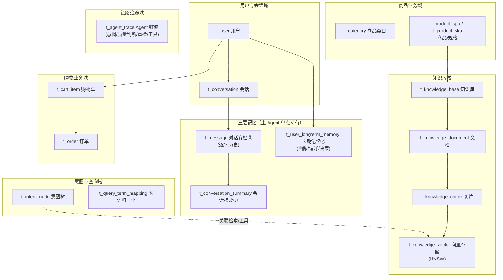
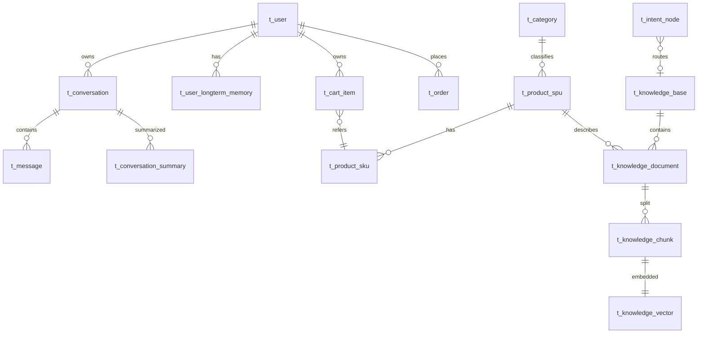

# 数据库设计

> 版本：v1.0 ｜ 定稿日期：2026-06-21
> 数据库：**PostgreSQL 14+ + pgvector**
> 文档层级：技术架构层（数据库设计）
> 对应关系：逻辑设计 [架构.md](../../架构.md) ｜ 技术总纲 [技术架构.md](../技术架构.md) ｜ 各 Agent 技术架构
>
> - 设计依据：参考主流 RAG Agent 系统的库表设计（意图树、术语映射、向量与切片分离、会话摘要、链路追踪等成熟模式），结合小米导购业务（约 500 SKU、三层记忆、双路召回、MCP 购物）裁剪与扩展。
> - 建表脚本：[schema.sql](schema.sql)（全量建表）
> - 初始数据：[init.sql](init.sql)（意图树、术语映射、示例商品等）

---

## 0. 设计原则与命名约定

- **存储选型**：PostgreSQL + pgvector 单库双能（结构化业务数据 + 向量），小数据量无需独立向量库。向量索引用 **HNSW**。
- **表前缀**：`t_` 表，`idx_` 普通索引，`uk_` 唯一约束。
- **主键**：业务表统一 `BIGINT` 自增（参考库表用 VARCHAR(20) 雪花 ID；本项目简化为 BIGSERIAL，商品/用户等可用业务编码）。
- **审计字段**：统一 `created_at` / `updated_at`（参考库表用 create_time/update_time，本项目统一为 created_at/updated_at）。
- **软删除**：`deleted SMALLINT DEFAULT 0`（0 正常 / 1 删除）。
- **向量维度**：`vector(1024)`（通义 text-embedding-v3 常用维度，待实测确认；详见 [技术架构.md §8](../技术架构.md) 待确认项）。

### 优先级约定（用于实现排期与 demo 裁剪）

| 优先级 | 含义 | 实现策略 |
|---|---|---|
| **高** | 核心闭环必需，缺则 demo 跑不通 | 必须首批实现 |
| **中** | 业务完整度所需（购物闭环），知识问答 demo 可暂不依赖 | 第二批，跑通问答后再补 |
| **低** | 可观测/增强能力，不影响功能正确性 | 最后补，或仅埋点不深做 |

---

## 1. 库表总览



---

## 2. 库表清单

> 优先级：**高** = 核心闭环必需 ｜ **中** = 业务完整度（购物闭环） ｜ **低** = 可观测增强

| # | 表名 | 所属域 | 优先级 | 说明 | 对应架构 |
|---|---|---|---|---|---|
| 1 | t_user | 用户与会话域 | **高** | 用户 | 主 Agent 记忆主体 |
| 2 | t_conversation | 用户与会话域 | **高** | 会话列表 | 三层记忆①短期会话 |
| 3 | t_message | 三层记忆域 | **高** | 对话存档（逐字） | 三层记忆③存档 |
| 4 | t_conversation_summary | 三层记忆域 | **中** | 会话摘要 | 三层记忆③（回溯用，长会话才必需） |
| 5 | t_user_longterm_memory | 三层记忆域 | **高** | 长期记忆（提炼） | 三层记忆②长期 |
| 6 | t_category | 商品业务域 | **中** | 商品类目（一级/二级） | 500SKU 10 大品类 |
| 7 | t_product_spu | 商品业务域 | **中** | 商品 SPU（标准产品单元） | 商品主数据 |
| 8 | t_product_sku | 商品业务域 | **中** | 商品 SKU（规格单元） | 购物加购粒度 |
| 9 | t_knowledge_base | 知识库域 | **高** | 知识库 | Knowledge 子节点 |
| 10 | t_knowledge_document | 知识库域 | **高** | 文档（资料来源） | Tika 解析源 |
| 11 | t_knowledge_chunk | 知识库域 | **高** | 切片（分块文本） | 双路召回文本源 |
| 12 | t_knowledge_vector | 知识库域 | **高** | 向量存储（HNSW） | 语义路召回 |
| 13 | t_intent_node | 意图与查询域 | **高** | 意图树（3 一级 / N 二级） | 主 Agent 意图识别 |
| 14 | t_query_term_mapping | 意图与查询域 | **中** | 术语归一化映射 | Knowledge 查询重写（LLM 重写可兜底） |
| 15 | t_cart_item | 购物业务域 | **中** | 购物车项 | Shopping 加购 |
| 16 | t_order | 购物业务域 | **中** | 订单 | Shopping 下单 |
| 17 | t_agent_trace | 链路追踪域 | **低** | Agent 执行链路 | 质量判断/重检/工具调用追踪 |

### 各业务域优先级一览

| 业务域 | 优先级 | 理由 |
|---|---|---|
| 用户与会话域 | **高** | 对话入口，无用户/会话则 Agent 无法运行 |
| 三层记忆域 | **高** | 记忆单点是架构核心，存档③+长期②是 demo 闭环必需（摘要③中优先级） |
| 知识库域 | **高** | Knowledge 双路召回的源，知识问答 demo 的核心 |
| 意图与查询域 | **高**（意图树）/ **中**（术语映射） | 主 Agent 意图识别必需；术语映射可由 LLM 重写兜底 |
| 商品业务域 | **中** | 购物闭环与规格咨询需要，但纯知识问答 demo 可先用 Mock 商品 |
| 购物业务域 | **中** | Shopping MCP 操作主数据，购物闭环需要，问答 demo 可后补 |
| 链路追踪域 | **低** | 可观测增强，不影响功能正确性，最后补或仅埋点 |

> **demo 最小闭环建议**：优先实现所有「高」优先级表（用户/会话/记忆/知识库/意图树），即可跑通「知识问答 + 三层记忆」核心 demo；「中」优先级补齐购物与商品业务；「低」优先级最后做链路追踪。

---

## 3. 详细表设计

### 3.1 用户与会话域　·　优先级：**高**

#### t_user —— 用户表
| 字段 | 类型 | 约束 | 说明 |
|---|---|---|---|
| id | BIGSERIAL | PK | 主键 |
| user_code | VARCHAR(64) | UK | 用户编码（业务唯一） |
| username | VARCHAR(64) | NOT NULL | 用户名 |
| password | VARCHAR(128) | | 密码（哈希） |
| role | VARCHAR(32) | DEFAULT 'user' | 角色：admin/user |
| avatar | VARCHAR(255) | | 头像 |
| created_at | TIMESTAMP | DEFAULT NOW() | |
| updated_at | TIMESTAMP | DEFAULT NOW() | |
| deleted | SMALLINT | DEFAULT 0 | 软删除 |

#### t_conversation —— 会话表（①短期记忆会话维度）
| 字段 | 类型 | 约束 | 说明 |
|---|---|---|---|
| id | BIGSERIAL | PK | |
| conversation_id | VARCHAR(64) | NOT NULL | 会话业务ID |
| user_id | BIGINT | NOT NULL FK | 用户 |
| title | VARCHAR(128) | | 会话标题 |
| last_time | TIMESTAMP | | 最近消息时间 |
| created_at / updated_at / deleted | | | 审计 |

> 索引：`idx_conv_user_time (user_id, last_time)`、`uk (conversation_id, user_id)`。

---

### 3.2 三层记忆域（核心 ★）　·　优先级：**高**（摘要表为中）

> 对齐 [架构.md §6](../../架构.md)：③对话存档逐字落盘、②长期记忆提炼存储、①短期记忆在 Redis（不在 PG）。

#### t_message —— 对话存档表（③逐字历史）
| 字段 | 类型 | 约束 | 说明 |
|---|---|---|---|
| id | BIGSERIAL | PK | |
| conversation_id | VARCHAR(64) | NOT NULL | 会话 |
| user_id | BIGINT | NOT NULL | 用户 |
| role | VARCHAR(16) | NOT NULL | user / assistant / system |
| content | TEXT | NOT NULL | 逐字内容 |
| intent | VARCHAR(32) | | 命中的意图（仅 assistant） |
| quality_verdict | VARCHAR(16) | | 检索质量判定（SUFFICIENT/INCOMPLETE/...） |
| retry_count | SMALLINT | | 本轮重检次数 |
| thinking_content | TEXT | | 模型思考（可选） |
| tokens_used | INTEGER | | token 消耗 |
| created_at / updated_at / deleted | | | 审计 |

> 索引：`idx_msg_conv_time (conversation_id, user_id, created_at)`。
> 设计要点：`intent/quality_verdict/retry_count` 把主 Agent 的决策轨迹落库，支撑质量判断循环的复盘与调参。

#### t_conversation_summary —— 会话摘要表（③回溯用，分离存储）
| 字段 | 类型 | 约束 | 说明 |
|---|---|---|---|
| id | BIGSERIAL | PK | |
| conversation_id | VARCHAR(64) | NOT NULL | 会话 |
| user_id | BIGINT | NOT NULL | |
| last_message_id | BIGINT | | 摘要覆盖到的最后消息 |
| content | TEXT | NOT NULL | 摘要内容 |
| created_at / updated_at / deleted | | | |

> 与存档分离：存档逐字、摘要压缩，避免长会话上下文爆炸。对齐参考库表 `t_conversation_summary`。

#### t_user_longterm_memory —— 长期记忆表（②结构化状态）
| 字段 | 类型 | 约束 | 说明 |
|---|---|---|---|
| id | BIGSERIAL | PK | |
| user_id | BIGINT | NOT NULL | 用户 |
| mem_type | VARCHAR(32) | NOT NULL | 类型：profile/preference/decision/slot |
| content | TEXT | NOT NULL | 提炼内容 |
| weight | FLOAT | DEFAULT 1.0 | 权重（低权重淘汰用） |
| source_conversation | VARCHAR(64) | | 来源会话 |
| created_at | TIMESTAMP | DEFAULT NOW() | 创建时间（兼作时效） |
| updated_at | TIMESTAMP | DEFAULT NOW() | |
| deleted | SMALLINT | DEFAULT 0 | |

> 索引：`idx_ltm_user (user_id)`。
> 设计要点：`mem_type` 区分画像/偏好/决策点/已澄清槽位（对齐 [架构.md §6.2](../../架构.md)）；`weight` 支撑过期淘汰与衰减（[主Agent文档 §5.3](../主Agent-技术架构.md)）。

---

### 3.3 商品业务域（500 SKU 主数据）　·　优先级：**中**

> 双路召回与购物业务的源头。SPU（标准产品，如"小米14"）/ SKU（规格单元，如"小米14 16+512"）分离。

#### t_category —— 商品类目表（10 大品类 / 二级）
| 字段 | 类型 | 约束 | 说明 |
|---|---|---|---|
| id | BIGSERIAL | PK | |
| category_code | VARCHAR(64) | UK | 类目编码 |
| name | VARCHAR(64) | NOT NULL | 类目名（手机/平板/家居...） |
| level | SMALLINT | NOT NULL | 1 一级 / 2 二级 |
| parent_id | BIGINT | | 父类目（二级指向一级） |
| sort_order | INTEGER | DEFAULT 0 | 排序 |
| created_at / updated_at / deleted | | | |

#### t_product_spu —— 商品 SPU 表（标准产品）
| 字段 | 类型 | 约束 | 说明 |
|---|---|---|---|
| id | BIGSERIAL | PK | |
| spu_code | VARCHAR(64) | UK | SPU 编码（如 mi-14） |
| name | VARCHAR(128) | NOT NULL | 商品名 |
| brand | VARCHAR(64) | | 品牌 |
| category_id | BIGINT | FK | 类目 |
| subtitle | VARCHAR(255) | | 副标题/卖点 |
| description | TEXT | | 图文描述 |
| status | SMALLINT | DEFAULT 1 | 1 在售 / 0 下架 |
| created_at / updated_at / deleted | | | |

#### t_product_sku —— 商品 SKU 表（规格单元，加购粒度）
| 字段 | 类型 | 约束 | 说明 |
|---|---|---|---|
| id | BIGSERIAL | PK | |
| sku_code | VARCHAR(64) | UK | SKU 编码 |
| spu_id | BIGINT | NOT NULL FK | 所属 SPU |
| spec_info | VARCHAR(128) | NOT NULL | 规格摘要（如 16GB+512GB 黑色） |
| spec_json | JSONB | | 规格明细（内存/存储/颜色...） |
| price | DECIMAL(10,2) | NOT NULL | 价格 |
| stock | INTEGER | DEFAULT 0 | 库存 |
| status | SMALLINT | DEFAULT 1 | 在售 |
| created_at / updated_at / deleted | | | |

> 索引：`idx_sku_spu (spu_id)`。
> 设计要点：`spec_json` 供"规格对比"意图结构化展示；`stock` 供 Shopping 加购时缺库存判定（NEED_CLARIFY/FAILED 信号）。

---

### 3.4 知识库域（双路召回源）　·　优先级：**高**

> 借鉴参考库表四层结构：base / document / chunk / vector，向量与文本分离存储。

#### t_knowledge_base —— 知识库表
| 字段 | 类型 | 约束 | 说明 |
|---|---|---|---|
| id | BIGSERIAL | PK | |
| name | VARCHAR(128) | NOT NULL | 知识库名 |
| embedding_model | VARCHAR(64) | NOT NULL | embedding 模型标识 |
| collection_name | VARCHAR(64) | UK | collection（对齐参考库表） |
| description | VARCHAR(255) | | |
| created_at / updated_at / deleted | | | |

#### t_knowledge_document —— 知识文档表（Tika 解析源）
| 字段 | 类型 | 约束 | 说明 |
|---|---|---|---|
| id | BIGSERIAL | PK | |
| kb_id | BIGINT | NOT NULL FK | 知识库 |
| spu_id | BIGINT | FK | 关联商品（商品知识场景） |
| doc_name | VARCHAR(256) | NOT NULL | 文档名 |
| file_url | VARCHAR(1024) | NOT NULL | 文件路径 |
| file_type | VARCHAR(16) | NOT NULL | pdf/word/html |
| file_size | BIGINT | | 字节 |
| chunk_strategy | VARCHAR(32) | | 分块策略 |
| chunk_config | JSONB | | 分块配置 |
| chunk_count | INTEGER | DEFAULT 0 | 切片数 |
| status | VARCHAR(16) | DEFAULT 'pending' | pending/running/success/failed |
| source_type | VARCHAR(16) | | file/url |
| source_location | VARCHAR(1024) | | 来源地址 |
| content_hash | VARCHAR(64) | | 内容哈希（增量更新） |
| created_at / updated_at / deleted | | | |

> 索引：`idx_doc_kb (kb_id)`。

#### t_knowledge_chunk —— 知识切片表（关键词路 + 命中判定源）
| 字段 | 类型 | 约束 | 说明 |
|---|---|---|---|
| id | BIGSERIAL | PK | |
| kb_id | BIGINT | NOT NULL | 知识库 |
| doc_id | BIGINT | NOT NULL FK | 文档 |
| spu_id | BIGINT | | 关联商品 |
| chunk_index | INTEGER | NOT NULL | 切片序号 |
| content | TEXT | NOT NULL | 切片文本 |
| title | VARCHAR(255) | | 标题（rerank 字段加权用） |
| spec_text | VARCHAR(255) | | 规格摘要（rerank 字段加权用） |
| content_hash | VARCHAR(64) | | 内容哈希 |
| char_count | INTEGER | | 字符数 |
| token_count | INTEGER | | token 数 |
| tsv | TSVECTOR | | 全文检索向量（关键词路） |
| enabled | SMALLINT | DEFAULT 1 | |
| created_at / updated_at / deleted | | | |

> 索引：
> - `idx_chunk_doc (doc_id)`
> - **`idx_chunk_tsv USING GIN(tsv)`**（关键词路全文检索）
> - 触发器自动维护 tsv：`BEFORE INSERT/UPDATE ... tsvector_update_trigger(tsv, 'pg_catalog.simple', content, title)`

> 设计要点（对齐 [知识库Agent文档 §5](../知识库Agent-技术架构.md)）：`title/spec_text` 独立列，供 rerank 字段加权（metadata 之外）；`content` 用于命中实体判定（§6）。tsv 由触发器维护，关键词路用 `ts_rank`。

#### t_knowledge_vector —— 向量存储表（语义路 HNSW）
| 字段 | 类型 | 约束 | 说明 |
|---|---|---|---|
| id | BIGSERIAL | PK | |
| chunk_id | BIGINT | NOT NULL | 关联切片 |
| kb_id | BIGINT | NOT NULL | 知识库 |
| content | TEXT | | 切片文本冗余（检索直出） |
| metadata | JSONB | | 元数据（sku/类目/价格） |
| embedding | VECTOR(1024) | NOT NULL | 向量 |

> 索引：
> - **`idx_vec_embedding USING hnsw (embedding vector_cosine_ops) WITH (m=16, ef_construction=64)`**（语义路核心）
> - `idx_vec_metadata USING GIN(metadata)`（元数据过滤）
> - `idx_vec_kb (kb_id)`

> 设计要点：向量与 chunk 分离存储（对齐参考库表 `t_knowledge_vector`），便于按 collection 隔离与重建索引；`chunk_id` 回链文本源。

---

### 3.5 意图与查询域（主 Agent 意图识别 + 查询重写）　·　优先级：**高**（术语映射表为中）

#### t_intent_node —— 意图树表（3 一级 / N 二级，对齐 [架构.md §3.1](../../架构.md)）
| 字段 | 类型 | 约束 | 说明 |
|---|---|---|---|
| id | BIGSERIAL | PK | |
| kb_id | BIGINT | | 关联知识库（KNOWLEDGE 类意图） |
| intent_code | VARCHAR(64) | UK | 意图编码 |
| name | VARCHAR(64) | NOT NULL | 名称 |
| level | SMALLINT | NOT NULL | 1 一级 / 2 二级 |
| parent_code | VARCHAR(64) | | 父意图 |
| kind | SMALLINT | DEFAULT 0 | 0 KNOWLEDGE / 1 SHOPPING / 2 SYSTEM |
| description | VARCHAR(512) | | 语义描述 |
| examples | TEXT | | 示例问题（意图分类训练/提示） |
| top_k | INTEGER | | 该意图检索 TopK |
| shopping_action | VARCHAR(32) | | 购物动作（ADD_TO_CART/PLACE_ORDER/...） |
| prompt_snippet | TEXT | | 提示词片段 |
| sort_order | INTEGER | DEFAULT 0 | |
| enabled | SMALLINT | DEFAULT 1 | |
| created_at / updated_at / deleted | | | |

> 设计要点：`kind` 对齐架构三大一级意图（KNOWLEDGE/SHOPPING/SYSTEM）；`shopping_action` 把二级购物意图映射到 ShoppingAction 枚举；`examples` 喂给主 Agent 意图分类。借鉴参考库表 `t_intent_node` 的 level/parent_code 意图树设计。

#### t_query_term_mapping —— 术语归一化映射表（查询重写辅助）
| 字段 | 类型 | 约束 | 说明 |
|---|---|---|---|
| id | BIGSERIAL | PK | |
| domain | VARCHAR(64) | | 领域（如 phone/tv） |
| source_term | VARCHAR(128) | NOT NULL | 源词（口语：打游戏爽） |
| target_term | VARCHAR(128) | NOT NULL | 目标词（规范：高刷新率 高性能GPU） |
| match_type | SMALLINT | DEFAULT 1 | 1 精确 / 2 模糊 |
| priority | INTEGER | DEFAULT 100 | 优先级 |
| enabled | SMALLINT | DEFAULT 1 | |
| created_at / updated_at / deleted | | | |

> 索引：`idx_term_source (source_term)`、`idx_term_domain (domain)`。
> 设计要点：供 Knowledge 查询重写的"口语化转规范术语"环节做规则兜底（LLM 重写之外的确定性映射）。借鉴参考库表 `t_query_term_mapping`。

---

### 3.6 购物业务域（Shopping MCP 操作的主数据）　·　优先级：**中**

#### t_cart_item —— 购物车项表
| 字段 | 类型 | 约束 | 说明 |
|---|---|---|---|
| id | BIGSERIAL | PK | |
| cart_id | VARCHAR(64) | NOT NULL | 购物车ID（用户维度） |
| user_id | BIGINT | NOT NULL | |
| sku_id | BIGINT | NOT NULL FK | 商品 SKU |
| quantity | INTEGER | NOT NULL DEFAULT 1 | 数量 |
| selected | SMALLINT | DEFAULT 1 | 是否勾选 |
| added_at | TIMESTAMP | DEFAULT NOW() | 加入时间 |
| created_at / updated_at / deleted | | | |

> 索引：`idx_cart_user (user_id)`、`uk (cart_id, sku_id)`。

#### t_order —— 订单表
| 字段 | 类型 | 约束 | 说明 |
|---|---|---|---|
| id | BIGSERIAL | PK | |
| order_no | VARCHAR(64) | UK | 订单号 |
| user_id | BIGINT | NOT NULL | |
| total_amount | DECIMAL(10,2) | NOT NULL | 总额 |
| address | VARCHAR(255) | | 收货地址 |
| pay_method | VARCHAR(32) | | 支付方式 |
| status | VARCHAR(16) | DEFAULT 'pending' | pending/paid/shipped/done/cancelled |
| logistics_no | VARCHAR(64) | | 物流单号 |
| created_at / updated_at / deleted | | | |

> Shopping MCP 工具（add_to_cart/place_order/query_logistics）操作的主表。

---

### 3.7 链路追踪域（质量判断/重检/工具调用可观测）　·　优先级：**低**

#### t_agent_trace —— Agent 执行链路表
| 字段 | 类型 | 约束 | 说明 |
|---|---|---|---|
| id | BIGSERIAL | PK | |
| trace_id | VARCHAR(64) | NOT NULL | 全局链路ID |
| conversation_id | VARCHAR(64) | | 会话 |
| user_id | BIGINT | | 用户 |
| node_type | VARCHAR(32) | NOT NULL | intent/judge/retrieve_rerank/tool/shopping |
| node_name | VARCHAR(128) | | 节点名 |
| status | VARCHAR(16) | NOT NULL | running/success/error |
| intent | VARCHAR(32) | | 命中意图 |
| quality_verdict | VARCHAR(16) | | 质量判定 |
| retry_count | SMALLINT | | 重检次数 |
| tool_name | VARCHAR(64) | | 调用的工具（MCP） |
| input_summary | TEXT | | 输入摘要 |
| output_summary | TEXT | | 输出摘要 |
| duration_ms | BIGINT | | 耗时 |
| error_message | TEXT | | 错误 |
| extra_data | JSONB | | 扩展（三信号快照等） |
| start_time | TIMESTAMP | | |
| end_time | TIMESTAMP | | |
| created_at / updated_at / deleted | | | |

> 索引：`uk_trace_id (trace_id)`、`idx_trace_conv (conversation_id)`、`idx_trace_user (user_id)`。
> 设计要点：把主 Agent 的"意图→质量判断→重检→工具"全链路落库，支撑简历亮点的可观测性（"质量判断循环"可量化复盘）。借鉴参考库表 `t_rag_trace_run/node`。

---

## 4. ER 关系图（核心关联）



---

## 5. 与架构组件的映射

| 架构组件 | 主要表 | 说明 |
|---|---|---|
| 主 Agent · ①短期记忆 | Redis（不在 PG） | 最近 N 轮，Redis 承载 |
| 主 Agent · ②长期记忆 | t_user_longterm_memory | 提炼画像/偏好/决策，跨会话注入 |
| 主 Agent · ③对话存档 | t_message / t_conversation_summary | 逐字 + 摘要 |
| 主 Agent · 意图识别 | t_intent_node | 意图树 + examples 驱动分类 |
| 主 Agent · 质量判断/重检 | t_agent_trace + t_message.quality_verdict | 决策轨迹落库 |
| Knowledge · 知识库构建 | t_knowledge_base/document/chunk/vector | Tika→切片→embedding→入库 |
| Knowledge · 语义路召回 | t_knowledge_vector (HNSW) | 向量检索 |
| Knowledge · 关键词路召回 | t_knowledge_chunk.tsv | 全文检索 |
| Knowledge · rerank 字段加权 | t_knowledge_chunk.title/spec_text | 独立列加权 |
| Knowledge · 查询重写 | t_query_term_mapping | 口语→规范映射 |
| Shopping · 加购 | t_cart_item | MCP add_to_cart 操作 |
| Shopping · 下单 | t_order | MCP place_order 操作 |
| Shopping · 库存判定 | t_product_sku.stock | 缺库存→FAILED 信号 |
| 商品业务主数据 | t_category / t_product_spu/sku | 500 SKU 源 |

---

## 6. 向量索引与检索说明

### HNSW 索引（语义路）
```sql
CREATE INDEX idx_vec_embedding ON t_knowledge_vector
    USING hnsw (embedding vector_cosine_ops)
    WITH (m = 16, ef_construction = 64);
```
- `m=16` / `ef_construction=64`：建图参数（详见 [技术架构.md §3 决策三](../技术架构.md)）。
- 查询时 `ef_search`（建议 40~64）通过 `SET hnsw.ef_search = 40` 调。

### 关键词路（全文检索）
```sql
-- 查询示例（对齐知识库Agent文档 §4.2）
SELECT chunk_id, ts_rank(tsv, plainto_tsquery('pg_catalog.simple', $1)) AS score
FROM t_knowledge_chunk
WHERE tsv @@ plainto_tsquery('pg_catalog.simple', $1)
ORDER BY score DESC LIMIT $2;
```
- 中文分词：`pg_catalog.simple` 基础配置，必要时引入 `zhparser` 扩展（详见 [知识库Agent文档 §10](../知识库Agent-技术架构.md)）。

---

## 7. 设计取舍说明

| 决策 | 选择 | 理由 |
|---|---|---|
| 向量与文本分离 | 独立 t_knowledge_vector | 对齐参考库表；便于按 collection 隔离、重建索引，向量重建不影响文本 |
| SPU/SKU 分离 | 两表 | 购物加购粒度是 SKU（规格），咨询粒度常是 SPU，分离符合电商惯例 |
| 意图树 vs 平铺意图 | 意图树(level/parent_code) | 借鉴参考库表成熟设计，支持 3 一级 / N 二级层级 |
| 长期记忆单表多类型 | mem_type 区分 | 画像/偏好/决策/槽位统一管理，weight 支撑淘汰 |
| trace 与 message 分离 | 独立 t_agent_trace | 链路追踪是横切关注点，不污染业务消息表 |
| 软删除 | deleted SMALLINT | 对齐参考库表全表惯例 |
| 字段加权独立列 | title/spec_text 独立于 content | rerank 需多字段加权，独立列比塞 metadata 更高效 |

---

## 8. 待确认项

- [ ] embedding 维度 `vector(1024)` 实测确认（通义 text-embedding-v3）。
- [ ] 中文全文检索是否引入 zhparser。
- [ ] SPU/SKU 在 500 SKU 规模下是否需简化合并（demo 阶段可只建 SKU）。
- [ ] trace 表是否拆 run/node 两表（参考库表拆分；本项目简化单表，待数据量评估）。
- [ ] 商品资料是否全部进知识库，还是仅规格型知识入库（咨询场景）。
