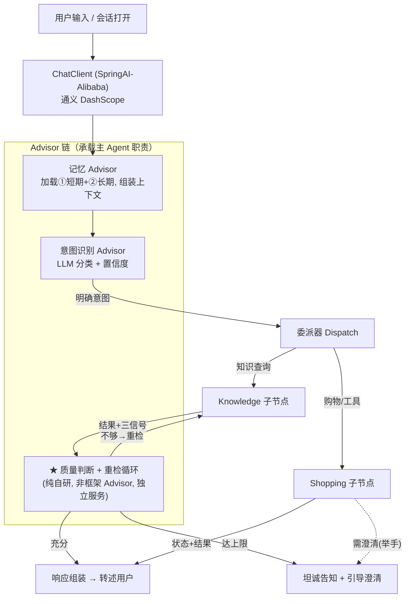
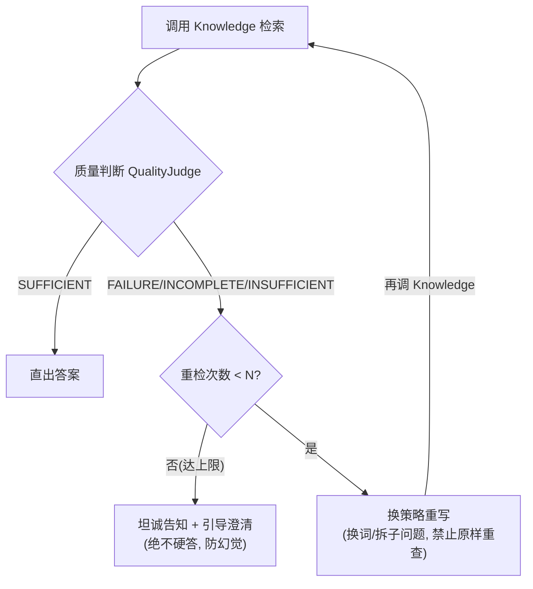
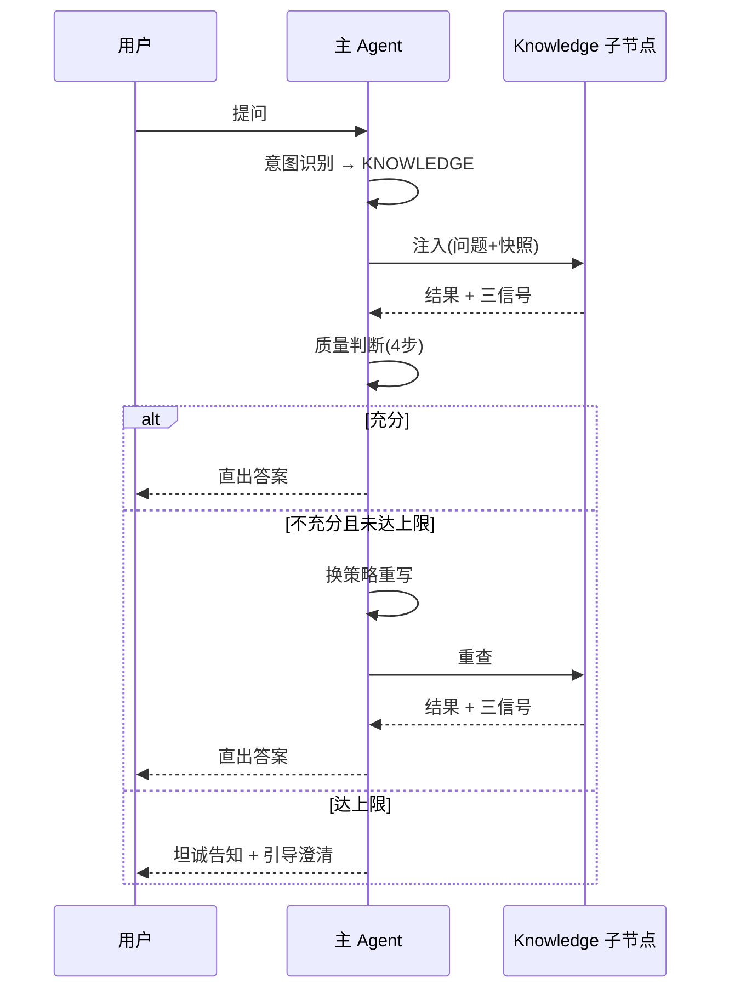
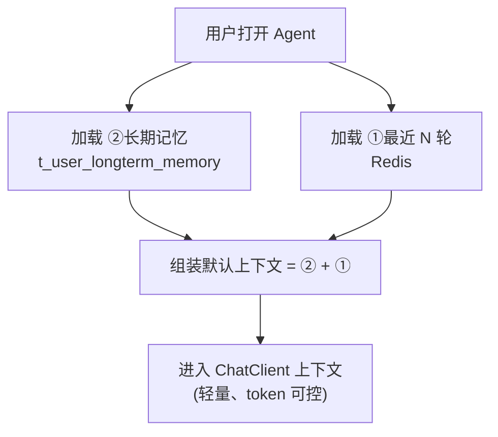

# 主 Agent（Orchestrator）· 技术架构

> 版本：v1.0 ｜ 定稿日期：2026-06-21
> 文档层级：**技术架构层（细化）**
> 对应关系：逻辑设计 [架构.md §3.1 / §5 / §6 / §8](../架构.md) ｜ 技术总纲 [技术架构.md](技术架构.md)

---

## 0. 文档定位

本文落实 **Orchestrator 主 Agent** 的技术实现。主 Agent 是整个系统**唯一具备自主性的真 Agent**——唯一面对用户、唯一持有记忆、唯一做意图识别。

**自研重点（简历亮点）：**
- 检索质量判断（三信号 4 步组合判定）—— §5
- 重检循环状态机控制 —— §5
- 三层记忆（短期/长期/存档）的落地与长期记忆批量提炼 —— §6

---

## 1. 主 Agent 内部组件总览



> 说明：意图识别、记忆用 Advisor 思路承载；**质量判断与重检循环是纯自研的业务逻辑，不做成 Advisor**，而是独立服务（`QualityJudge` + `RetrievalLoop`），由主 Agent 服务显式编排——因为它涉及跨子节点的循环控制， Advisor 单次拦截模型表达不了。

---

## 2. ChatClient 构建（SpringAI-Alibaba）

```java
@Configuration
public class OrchestratorChatClientConfig {

    @Bean
    public DashScopeChatModel dashScopeChatModel() {
        DashScopeApi api = DashScopeApi.builder()
                .apiKey(System.getenv("AI_DASHSCOPE_API_KEY"))
                .build();
        return DashScopeChatModel.builder().dashScopeApi(api).build();
    }

    @Bean
    public ChatClient orchestratorChatClient(DashScopeChatModel model,
                                             ChatMemory chatMemory) {
        return ChatClient.builder(model)
                .defaultSystem("""
                    你是小米商城智能导购助手。请根据用户意图提供商品咨询、规格对比或协助下单。
                    回答须基于检索结果，不得编造规格；信息不足时坦诚告知并引导用户澄清。
                    """)
                .defaultAdvisors(
                        // ① 短期记忆注入（MessageChatMemoryAdvisor，Spring AI 1.0 GA+ 标准写法）
                        MessageChatMemoryAdvisor.builder(chatMemory).build()
                )
                .build();
    }
}
```

- `defaultSystem`：设定主 Agent 人设（导购助手）与「不编造、不足则澄清」的约束。
- `MessageChatMemoryAdvisor`：承载短期记忆（①）注入，后端接 Redis（见 §5）。
- 意图识别、质量判断不在 Advisor 内，由独立服务驱动（见 §4、§5）。

---

## 3. 意图识别实现（对齐 P1 唯一入口）

### 方案
LLM 意图分类，输出「意图标签 + 置信度」，低置信度触发澄清反问。

**一级意图（3 类）：**
- `KNOWLEDGE`：知识库问答（咨询/规格/促销/售后政策）
- `SHOPPING`：工具调用（加购/下单/查物流）
- `SYSTEM`：系统指令（清除记忆/查历史）

### Prompt 设计要点
```
请将用户输入分类为以下意图之一，并给出置信度(0~1)：
- KNOWLEDGE：商品咨询、规格对比、促销/售后政策查询
- SHOPPING：加购、下单、查询订单/物流、改购物车
- SYSTEM：清除记忆、查看历史对话等系统操作

仅返回 JSON：{"intent": "...", "confidence": 0.xx, "reason": "..."}
```

### 代码骨架

```java
@Service
public class IntentRecognizer {

    private final ChatClient chatClient;

    public IntentResult recognize(String userInput, SessionSnapshot snapshot) {
        String json = chatClient.prompt()
                .system(INTENT_PROMPT)
                .user(userInput)
                .call()
                .content();
        IntentResult result = parseJson(json);   // {intent, confidence, reason}

        // 低置信度 → 触发澄清反问（对齐 P2 唯一开口权）
        if (result.confidence() < CONFIDENCE_THRESHOLD) {
            return result.toClarify();           // 标记需澄清
        }
        return result;
    }
}
```

> **原则（P1）**：意图识别只在主 Agent 做，子节点永远不做意图判断。

---

## 4. 检索质量判断 + 重检循环（架构核心 · 纯自研 ★）

### 4.1 质量判断：三信号 4 步组合判定

对齐 [架构.md §5.1](../架构.md)，Knowledge 返回三信号：相关度分数、命中实体、召回数。

```java
public enum QualityVerdict {
    FAILURE,      // 召回 0
    INCOMPLETE,   // 召回非0但实体未命中
    INSUFFICIENT, // 实体命中但分数低于阈值
    SUFFICIENT    // 全满足
}

public class QualityJudge {

    public QualityVerdict judge(KnowledgeResponse resp, Set<String> queryEntities) {
        // 步骤1：召回数为0 → 失败
        if (resp.getRecallCount() == 0) return QualityVerdict.FAILURE;

        // 步骤2：关键实体未命中 → 不全
        if (!resp.getHitEntities().containsAll(queryEntities))
            return QualityVerdict.INCOMPLETE;

        // 步骤3：实体命中但分数低 → 不够
        if (resp.getMaxRelevanceScore() < RELEVANCE_THRESHOLD)
            return QualityVerdict.INSUFFICIENT;

        // 步骤4：全满足 → 充分
        return QualityVerdict.SUFFICIENT;
    }
}
```

### 4.2 重检循环状态机（对齐 [架构.md §5.2](../架构.md)）



### 代码骨架

```java
@Service
public class RetrievalLoop {

    private static final int MAX_RETRIES = 2;   // N=2，对齐 P7 克制原则
    private final KnowledgeClient knowledgeClient;
    private final QualityJudge qualityJudge;
    private final LoopQueryRewriter rewriter;   // 主 Agent 自己的重写能力(LLM),非引用 Knowledge 内部组件

    public KnowledgeResponse retrieveWithLoop(String question,
                                              Set<String> entities,
                                              SessionSnapshot snapshot) {
        KnowledgeResponse resp;
        String currentQuery = question;

        // MAX_RETRIES=2 表示"至多重检 2 次"（含首次正常检索，共调用 Knowledge 3 次）
        for (int attempt = 0; attempt <= MAX_RETRIES; attempt++) {
            resp = knowledgeClient.ask(currentQuery, snapshot, entities);  // 实体显式传入

            QualityVerdict v = qualityJudge.judge(resp, entities);
            if (v == QualityVerdict.SUFFICIENT) return resp;

            if (attempt == MAX_RETRIES) break;   // 达上限，退出循环

            // 换策略重写（禁止原样重查）
            currentQuery = rewriter.rewriteWithNewStrategy(currentQuery, v, attempt);
        }
        // 达上限仍不充分 → 由主 Agent 退化为坦诚告知 + 澄清
        return KnowledgeResponse.degraded();
    }
}
```

**硬性约束（P7）：**
- `MAX_RETRIES = 2`（建议默认）。
- 每轮 `rewriteWithNewStrategy` **必须换策略**，按 `attempt` 切换「换关键词 / 拆子问题」。
- 达上限 → `degraded()` 触发主 Agent 坦诚告知，**绝不硬答**。

### 4.3 整体时序



---

## 5. 三层记忆技术实现（对齐 [架构.md §6](../架构.md)）

### 5.1 三层存储落点

> 表名与 [数据库设计.md §3.2](database/数据库设计.md) 一致；优先级同口径。

| 层 | 存储 / 表 | 优先级 | 内容 | 注入默认上下文 |
|----|----|----|----|----|
| ① 短期记忆 | **Redis** | 高 | 当前会话最近 N 轮原文、当前意图、槽位 | 是 |
| ② 长期记忆 | `t_user_longterm_memory`（PostgreSQL） | 高 | 提炼后的画像/偏好/历史决策点/已澄清槽位 | 是 |
| ③ 对话存档 | `t_message`（逐字）+ `t_conversation_summary`（摘要） | 高 / 中 | 逐字完整历史（存档必需）；摘要表长会话才必需 | **否**（仅按需检索） |

> `t_message` 含 `intent / quality_verdict / retry_count` 列，把主 Agent 的决策轨迹落库，支撑质量判断循环的复盘（对齐 [数据库设计.md t_message](database/数据库设计.md)）。

### 5.2 ① 短期记忆（Redis）

```
Key:   chat:session:{sessionId}:messages
Type:  List（最近 N 轮 User/Assistant）
TTL:   24h
```

由 Spring AI 的 `ChatMemory` 承载（`MessageChatMemoryAdvisor` 注入最近 N 轮进上下文）。注意：Spring AI 内置后端仅 `InMemory/JdbcChatMemoryRepository`，**Redis 后端需自研实现 `ChatMemoryRepository`**（用 RedisTemplate），或退用 `JdbcChatMemoryRepository`（落 PostgreSQL）。

### 5.3 ② 长期记忆（PostgreSQL + 批量提炼 ★）

**写入（会话结束批量提炼）：**

```java
@Service
public class LongTermMemoryDistiller {

    private final ChatClient chatClient;
    private final LongTermMemoryMapper mapper;

    public void distillOnSessionEnd(String sessionId, String userId,
                                    List<Message> archive) {
        // 用 LLM 对本次会话做整体提炼
        String json = chatClient.prompt()
                .system("""
                    从以下对话中提炼结构化记忆（用户画像、偏好、关键购买决策、已澄清的槽位）。
                    仅返回 JSON 数组，每项含 mem_type 与 content。
                    """)
                .user(toTranscript(archive))
                .call()
                .content();

        List<UserLongTermMemory> items = parseMemories(json, userId);
        items.forEach(m -> m.setWeight(1.0));
        mapper.batchUpsert(items);   // 写入 t_user_longterm_memory
    }
}
```

**遗忘（防膨胀）：**
- **过期与低权重淘汰**：定时任务衰减陈旧条目 `weight`，删除低于阈值的条目（如很早浏览、未转化的商品关注度）。
- **用户手动清除**：对外暴露 `DELETE /memory/{userId}` 接口（满足购物隐私）。

```sql
-- 低权重淘汰（定时任务）
DELETE FROM t_user_longterm_memory WHERE weight < 0.2;
-- 权重衰减（每次定时执行）
UPDATE t_user_longterm_memory SET weight = weight * 0.9
WHERE updated_at < NOW() - INTERVAL '30 day';
```

### 5.4 ③ 对话存档（PostgreSQL · 实时落盘）

```java
// 每次 User/Assistant 消息实时写入 t_message，不经提炼
messageMapper.insert(new TMessage(sessionId, userId, role, content));
// （可选）长会话定期压缩为 t_conversation_summary，分离存储
```

存档**不进默认上下文**；用户回看历史时由前端回显，或主 Agent 需要佐证时按需检索（可复用 Knowledge 检索能力）。

### 5.5 加载与注入（会话打开如何"想起"用户）



> 存档 ③ 不进默认上下文——避免 token 爆炸与信噪比塌陷（对齐 [架构.md §6.1 红线](../架构.md)）。

---

## 6. 澄清权与委派（对齐 P2 / P4）

- **澄清权（P2）**：只有主 Agent 开口反问。子节点「举手」返回 `need_clarify + 缺失清单`，由主 Agent 决定如何开口。

```java
// Shopping 返回需澄清时，主 Agent 开口
if (shoppingResp.getStatus() == NEED_CLARIFY) {
    String question = composeClarifyQuestion(shoppingResp.getMissing());
    return askUser(question);   // 主 Agent 唯一开口
}
```

- **委派**：把「明确意图 + 会话快照」注入子节点调用（对齐 [架构.md §8.3](../架构.md)）。

---

## 7. 跨节点编排（混合意图，对齐 [架构.md §4.4](../架构.md)）

混合意图（如「推荐一款手机并加购」）由主 Agent 串联：先 Knowledge 检索确认 → 再 Shopping 执行。子节点彼此不通信。

```java
// 混合意图编排骨架
Set<String> entities = extractEntities(query);
KnowledgeResponse k = retrievalLoop.retrieveWithLoop(query, entities, snapshot);
QualityVerdict v = qualityJudge.judge(k, entities);
if (v == QualityVerdict.SUFFICIENT) {
    // 转述候选 + 引导用户确认机型
    String confirmedSku = awaitUserConfirm(k.getResults());
    // 组装一个 ADD_TO_CART 意图，经 Shopping 契约调用（invoke）
    IntentResult cartIntent = IntentResult.shopping(ShoppingAction.ADD_TO_CART,
            Map.of("skuId", confirmedSku));
    ShoppingResponse s = shoppingClient.invoke(cartIntent, snapshot);
    respondToUser(s);
}
```

---

## 8. 主 Agent 核心服务骨架

```java
@Service
@RequiredArgsConstructor
public class OrchestratorService {

    private final ChatClient chatClient;
    private final IntentRecognizer intentRecognizer;
    private final RetrievalLoop retrievalLoop;
    private final ShoppingClient shoppingClient;
    private final MessageArchiver archiver;
    private final ChatMemory chatMemory;

    public String handle(String sessionId, String userId, String userInput) {
        // 0. 实时存档 ③（不经提炼）
        archiver.archive(sessionId, userId, "user", userInput);

        SessionSnapshot snapshot = buildSnapshot(sessionId, userId);

        // 1. 意图识别（唯一入口 P1）
        IntentResult intent = intentRecognizer.recognize(userInput, snapshot);
        if (intent.needClarify()) {
            return askUser(intent.clarifyQuestion());   // 主 Agent 开口 P2
        }

        // 2. 按意图委派
        return switch (intent.intent()) {
            case KNOWLEDGE -> handleKnowledge(userInput, snapshot, sessionId, userId);
            case SHOPPING  -> handleShopping(intent, snapshot, sessionId, userId);
            case SYSTEM    -> handleSystem(intent, userId);
        };
    }

    private String handleKnowledge(String q, SessionSnapshot snap,
                                   String sid, String uid) {
        Set<String> entities = extractEntities(q);
        KnowledgeResponse resp = retrievalLoop.retrieveWithLoop(q, entities, snap);

        if (resp.isDegraded()) {
            return askUser("抱歉，关于该问题信息不足，能否补充具体型号或参数？");
        }
        // 用 ChatClient 基于检索结果生成答案（不编造）
        String answer = chatClient.prompt()
                .user(q)
                .system("仅依据以下检索结果回答，不可编造：\n" + resp.toContext())
                .call()
                .content();
        archiver.archive(sid, uid, "assistant", answer);
        return answer;
    }

    private String handleShopping(IntentResult intent, SessionSnapshot snap,
                                  String sid, String uid) {
        ShoppingResponse resp = shoppingClient.invoke(intent, snap);
        if (resp.getStatus() == NEED_CLARIFY) {
            return askUser(composeClarifyQuestion(resp.getMissing()));  // 举手→主Agent开口 P4
        }
        String answer = composeShoppingReply(resp);
        archiver.archive(sid, uid, "assistant", answer);
        return answer;
    }
}
```

---

## 9. 与子节点契约对接（对齐 [架构.md §8](../架构.md)）

```java
// 主 Agent 内部的意图识别结果（含置信度、槽位、澄清信息）
public record IntentResult(
        String intent,                   // KNOWLEDGE / SHOPPING / SYSTEM
        double confidence,               // 置信度 0~1
        boolean needClarify,             // 低置信度 → 需澄清
        String clarifyQuestion,          // 澄清反问文案
        ShoppingAction shoppingAction,   // 仅 SHOPPING 意图时有值
        Map<String, Object> slots        // 槽位（skuId/spec/address/...）
) {
    public String intent() { return intent; }
    public String getSlot(String key) { return (String) slots.get(key); }
    public int getIntSlot(String key, int def) {
        Object v = slots.get(key); return v == null ? def : Integer.parseInt(v.toString());
    }
}

// 注入给子节点的会话快照（架构.md §8.3）—— 不含 queryEntities（实体作显式参数传 Knowledge）
public record SessionSnapshot(
        String userId,
        String currentIntent,
        List<String> selectedProducts,
        List<CartItem> cart,
        List<String> browseHistory
) {}

// Knowledge 返回（架构.md §8.1）—— 含三信号，无主观自评（P6）
public record KnowledgeResponse(
        List<DocChunk> results,
        double maxRelevanceScore,
        Set<String> hitEntities,
        int recallCount
) {
    public boolean isDegraded() { return recallCount == 0 && results.isEmpty(); }
    // 注：无 isSufficient()——充分性由主 Agent QualityJudge 判定（P6）
    public String toContext() { /* 拼成检索上下文 */ }
}

// Shopping 返回（架构.md §8.2）
public record ShoppingResponse(
        ShoppingStatus status,           // SUCCESS/FAILED/NEED_CLARIFY
        Map<String, Object> data,
        List<String> missing             // NEED_CLARIFY 时缺失槽位
) {}
```

> **实体传递约定（重要，避免契约歧义）：**
> - 用于质量判断的「命中实体」由主 Agent `EntityExtractor.extract(query)` 抽取，作为**显式参数**传给 Knowledge 与 QualityJudge，**不放进 SessionSnapshot**。
> - Knowledge 的调用签名统一为 `ask(question, snapshot, queryEntities)`——主 Agent 传实体进来，Knowledge 用它生成命中信号。
> - 这样主 Agent 与 Knowledge 两端对实体的来源/传递方式完全一致。

---

## 10. 待确认技术项

- [ ] 意图识别置信度阈值 `CONFIDENCE_THRESHOLD` 具体值。
- [ ] 质量判断相关度阈值 `RELEVANCE_THRESHOLD` 具体值。
- [ ] 短期记忆窗口 N（Redis 保留轮数）。
- [ ] 重检上限 N 默认 2 的最终确认。
- [ ] 长期记忆权重衰减周期与淘汰阈值。
