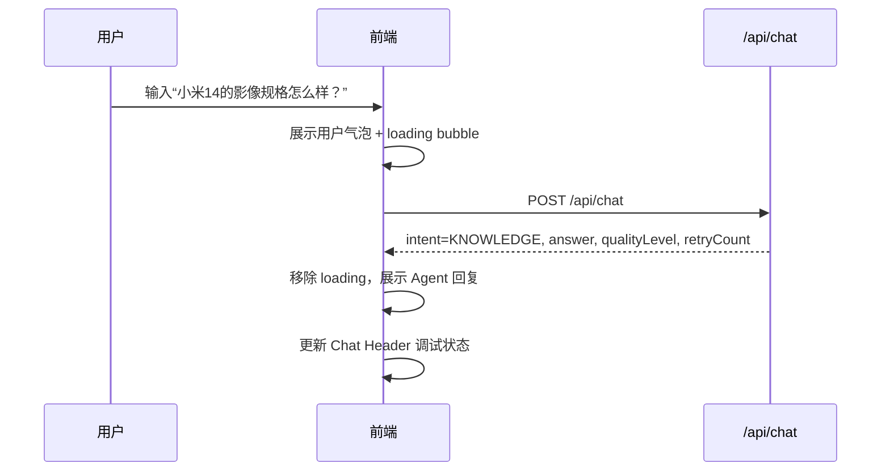
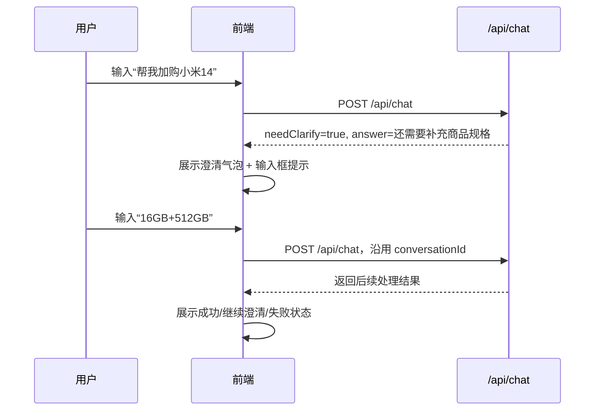
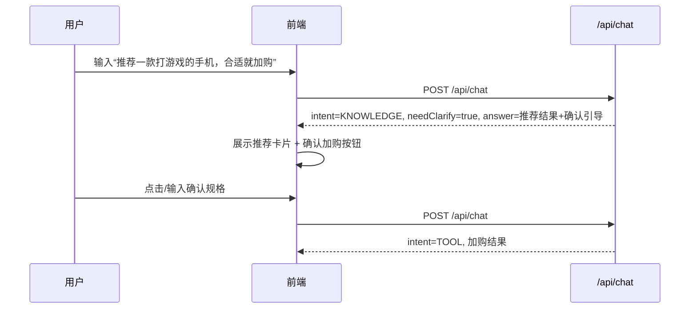

# 小米商城智能导购 Agent · 前端 UI/UX 设计文档

> 版本：v1.0  
> 日期：2026-06-23  
> 阶段：前端 UI/UX 逻辑交互与视觉设计  
> 状态：待用户审核  
> 依据：`doc/前端UIUX需求文档.md`、`doc/接口文档.md`  
> 设计方法：development-process-skills 文档先行流程 + ui-ux-pro-max 设计准则

---

## 1. 文档定位

本文档用于沉淀小米商城智能导购 Agent 前端的 UI/UX 设计方案，覆盖页面结构、交互流程、视觉语言、组件拆分、状态反馈、响应式布局与验收关注点。

当前阶段**只做设计文档，不写代码**。本文档经审核后，后续再进入前端技术架构、测试用例与实现阶段。

---

## 2. 设计目标

前端定位为：**小米商城 × 科技 Agent 混合型导购界面**。

设计目标：

1. **真实可用**：用户可以像使用智能导购客服一样自然对话。
2. **适合演示**：能清晰展示后端 Agent 编排、Knowledge 检索、Shopping 工具、MCP 状态等项目亮点。
3. **视觉专业**：整体采用小米商城式清爽电商风，局部用 AI 光效、状态芯片、渐变卡片表达智能感。
4. **联调友好**：提供后端健康状态、就绪状态、接口降级状态的可视化面板。
5. **可扩展**：当前兼容文本型 `/api/chat` 响应，后续可平滑升级为结构化商品/购物数据渲染。

---

## 3. 设计系统方向

### 3.1 ui-ux-pro-max 推荐摘要

基于 `ui-ux-pro-max` 对 “xiaomi ecommerce AI shopping agent clean technology dashboard chat” 的设计系统推荐，适配本项目后得到以下方向：

| 维度 | 推荐 | 本项目取舍 |
|---|---|---|
| 产品模式 | AI Personalization Landing / AI-Native UI | 采用 AI-Native UI 的聊天、上下文卡片、流式反馈；不做完整 landing |
| 风格关键词 | Chatbot、conversational、assistant、ambient、minimal chrome | 采用“对话中枢 + 上下文卡片 + 低干扰 chrome” |
| 电商气质 | clean、shopping、product、retail、conversion | 卡片、价格/规格、加购状态使用电商表达 |
| 推荐效果 | Typing indicators、streaming text、pulse animations、context cards、smooth reveals | 用于 loading、Agent 回复、状态切换、商品卡片出现 |
| 反模式 | Cluttered data、Poor credibility | 避免状态信息堆砌；状态面板默认收敛展示 |

### 3.2 本项目最终风格定义

**风格名称：小米商城 × AI-Native 导购工作台**

关键词：

- 清爽电商
- 智能导购
- 对话中枢
- 状态可视
- 轻量科技感
- 演示友好

不采用纯深色赛博风，因为会削弱“小米商城”的真实产品感；也不采用纯白商城风，因为会弱化 Agent 项目亮点。

---

## 4. 信息架构

### 4.1 桌面端整体布局

首期采用 **三栏工作台布局**。

```text
┌──────────────────────────────────────────────────────────────┐
│ Top Bar                                                      │
│ 小米智能导购 Agent / 会话状态 / 后端状态摘要 / 刷新状态       │
├─────────────────┬──────────────────────────┬─────────────────┤
│ Left Panel      │ Center Chat Panel         │ Right Panel     │
│ 商品推荐/快捷操作 │ 导购聊天主区域             │ 购物车状态        │
│ 推荐卡片         │ 消息流 / 输入框 / loading   │ 后端状态面板      │
│ 示例问题         │ 澄清提示                    │ 调试信息          │
└─────────────────┴──────────────────────────┴─────────────────┘
```

布局比例建议：

| 区域 | 宽度比例 | 说明 |
|---|---|---|
| 左栏 | 24% | 推荐卡片、快捷操作、示例问题 |
| 中栏 | 48% | 聊天主区域，是视觉中心 |
| 右栏 | 28% | 购物车状态、ready 面板、调试摘要 |

### 4.2 平板端布局

平板端采用两栏：

```text
┌─────────────────────────────┐
│ Top Bar                     │
├──────────────┬──────────────┤
│ Chat Panel   │ Side Panel   │
│              │ 推荐/购物车/状态 tab │
└──────────────┴──────────────┘
```

### 4.3 移动端布局

移动端采用单栏主聊天 + 抽屉/底部 sheet：

```text
┌────────────────────┐
│ Top Bar            │
├────────────────────┤
│ Chat Panel         │
├────────────────────┤
│ Bottom Quick Bar   │
└────────────────────┘

推荐商品 / 购物车 / 状态面板 → 通过底部 Sheet 或 Tab 切换展示
```

移动端优先保证：

1. 聊天可用。
2. 输入框不被遮挡。
3. 快捷操作可横向滑动。
4. 状态面板默认折叠。

---

## 5. 页面模块设计

### 5.1 Top Bar 顶部状态栏

#### 目标

让用户一眼知道当前系统是“小米智能导购 Agent”，并能看到后端总状态。

#### 内容

| 元素 | 说明 |
|---|---|
| Logo / 标题 | `小米智能导购 Agent` |
| 副标题 | `商品咨询 · 智能推荐 · 加购下单 · 物流查询` |
| 会话标识 | 当前 `conversationId` 简短展示，可复制 |
| 聚合状态 | `UP` / `DEGRADED` / `DOWN` 状态芯片 |
| 刷新按钮 | 手动刷新 `/api/ready` |

#### 视觉

- 白色或半透明磨砂背景。
- 底部轻边框。
- 状态芯片使用语义色。
- 不使用 emoji 图标，统一使用 SVG 图标。

---

### 5.2 Center Chat Panel 导购聊天主区域

#### 目标

承载核心 `/api/chat` 对话流程，是页面视觉和交互中心。

#### 结构

```text
┌──────────────────────────────┐
│ Chat Header                  │
│ 当前意图 / 质量等级 / 调用次数 │
├──────────────────────────────┤
│ Message List                 │
│ User Bubble                  │
│ Agent Bubble                 │
│ Clarification Bubble         │
│ Loading Bubble               │
├──────────────────────────────┤
│ Quick Prompt Row             │
├──────────────────────────────┤
│ Input Composer               │
│ textarea + send button       │
└──────────────────────────────┘
```

#### 消息类型

| 类型 | 展示规则 |
|---|---|
| 用户消息 | 右侧气泡，小米橙/浅橙渐变，文本高对比 |
| Agent 普通回复 | 左侧气泡，白色卡片，带 Agent 标识 |
| Agent 澄清回复 | 左侧气泡 + 黄色提示条 + `需要补充信息` 标签 |
| 系统指令回复 | 中性系统卡片样式 |
| 错误消息 | 红色边框/浅红背景，带重试按钮 |
| Loading | 3 点 pulse / “正在思考” / skeleton bubble |

#### Chat Header 状态

可展示最近一轮响应元信息：

| 字段 | 来源 | 展示 |
|---|---|---|
| intent | `/api/chat.intent` | `知识问答` / `工具调用` / `系统指令` |
| qualityLevel | `/api/chat.qualityLevel` | `充分` / `不完整` / `不足` / `失败` |
| retryCount | `/api/chat.retryCount` | `重检 0 次` |
| childCalls | `/api/chat.childCalls` | `子节点调用 1 次` |

调试信息默认轻量展示，不压迫主对话。

---

### 5.3 Left Panel 推荐与快捷操作区

#### 目标

降低演示成本，并补足当前 `/api/chat` 文本响应的视觉表达。

#### 模块组成

1. 快捷操作区。
2. 示例问题区。
3. 商品推荐卡片区。

#### 快捷操作按钮

| 按钮 | 触发输入 |
|---|---|
| 商品咨询 | `小米14的影像规格怎么样？` |
| 游戏手机推荐 | `帮我推荐一款适合打游戏的手机` |
| 加购演示 | `帮我加购一台小米14 16GB+512GB` |
| 查库存 | `查一下 sku-14 有没有库存` |
| 查物流 | `帮我查一下订单 order-12345678 的物流` |
| 清除记忆 | `清除我的记忆` |

交互规则：

- 点击快捷按钮后，可直接填入输入框，也可一键发送。
- 首期建议：点击后填入输入框，用户可编辑后发送。
- 演示模式可提供“一键发送”小按钮。

#### 商品推荐卡片

卡片结构：

```text
┌────────────────────┐
│ 商品名              │
│ 核心标签：影像/性能  │
│ 规格：16GB+512GB    │
│ 推荐理由摘要         │
│ [查库存] [加购]      │
└────────────────────┘
```

视觉规则：

- 白底卡片 + 轻阴影。
- 商品标签使用小米橙/蓝紫渐变小胶囊。
- 鼠标 hover 时轻微上浮，移动端 press 时透明度反馈。
- 不依赖 hover 完成功能，按钮必须可点击。

---

### 5.4 Right Panel 购物车与后端状态区

#### 目标

同时服务用户导购体验和项目联调展示。

右栏分为两个主要卡片：

1. 购物车 / 订单状态卡。
2. 后端就绪状态面板。

#### 购物车状态卡

状态来源：

- `/api/chat.answer` 文本中的购物结果。
- 后续可升级为结构化 `data`。

展示内容：

| 状态 | UI |
|---|---|
| 空状态 | “还没有加购商品，可以先问我推荐一款手机” |
| 加购成功 | 商品名、规格、数量、购物车 ID、成功标识 |
| 需补充 | 缺失槽位提示，例如商品规格/收货地址 |
| 下单成功 | 订单号、状态、物流查询引导 |
| 操作失败 | 失败原因、重试建议 |

#### 后端状态面板

展示 `/api/ready`：

| 分组 | 字段 |
|---|---|
| 核心模块 | bootstrap、orchestrator、knowledgeGateway、shoppingGateway |
| 基础设施 | postgres、redis、mcpserver |
| 模型能力 | chatModel、embeddingModel、rerank |
| 聚合状态 | status |

状态视觉：

| 状态 | 颜色 | 文案 |
|---|---|---|
| `UP` / `CONFIGURED` | 绿色 | 正常 |
| `DEGRADED` / `FALLBACK` | 黄色 | 降级 |
| `DOWN` / `MISSING_KEY` | 红色 | 异常 |

状态面板应支持折叠，避免信息噪音。

---

## 6. 核心交互流程

### 6.1 普通知识问答流程



### 6.2 澄清流程



### 6.3 混合意图流程



设计原则：前端不绕过主 Agent 直接调用 Shopping；所有用户意图仍从 `/api/chat` 进入。

---

## 7. 视觉规范

### 7.1 色彩系统

结合小米品牌和 AI-Native 推荐，采用“白橙主调 + 紫蓝 AI 辅助”。

| Token | 建议值 | 用途 |
|---|---|---|
| `--color-brand` | `#FF6900` | 小米橙，主 CTA、用户消息、重点强调 |
| `--color-brand-soft` | `#FFF3EA` | 浅橙背景、用户消息浅底 |
| `--color-ai-primary` | `#7C3AED` | AI 光效、Agent 标识、智能状态 |
| `--color-ai-secondary` | `#6366F1` | 渐变辅助色、科技标签 |
| `--color-accent` | `#EC4899` | 少量高亮，不大面积使用 |
| `--color-background` | `#F8FAFC` | 页面背景 |
| `--color-surface` | `#FFFFFF` | 卡片/面板背景 |
| `--color-foreground` | `#0F172A` | 主文本 |
| `--color-muted` | `#64748B` | 次级文本 |
| `--color-border` | `#E2E8F0` | 边框/分隔线 |
| `--color-success` | `#16A34A` | UP/成功 |
| `--color-warning` | `#F59E0B` | DEGRADED/澄清 |
| `--color-danger` | `#DC2626` | DOWN/失败 |

无障碍要求：正文文本与背景对比度不低于 4.5:1；状态颜色不能单独传达含义，必须搭配文本或图标。

### 7.2 字体系统

ui-ux-pro-max 推荐：

- Heading：Rubik
- Body：Nunito Sans

本项目可采用：

| 层级 | 字体 | 说明 |
|---|---|---|
| 标题 | Rubik / 系统 sans-serif fallback | 圆润现代，适合电商标题 |
| 正文 | Nunito Sans / 系统 sans-serif fallback | 友好、清晰、适合聊天文本 |
| 数字/状态 | Tabular numbers | 订单号、状态数值、调用次数稳定显示 |

字号建议：

| Token | 大小 | 用途 |
|---|---|---|
| `text-xs` | 12px | 状态标签、辅助说明 |
| `text-sm` | 14px | 次级说明、调试信息 |
| `text-base` | 16px | 正文、聊天内容 |
| `text-lg` | 18px | 卡片标题 |
| `text-xl` | 20px | 面板标题 |
| `text-2xl` | 24px | 页面标题 |
| `text-3xl` | 32px | 大屏主标题 |

### 7.3 圆角与阴影

| Token | 值 | 用途 |
|---|---|---|
| `radius-sm` | 8px | 小按钮、标签 |
| `radius-md` | 12px | 输入框、状态芯片 |
| `radius-lg` | 16px | 消息气泡、普通卡片 |
| `radius-xl` | 24px | 主面板、大卡片 |

阴影保持克制：

- 普通卡片：轻阴影。
- 浮层/sheet：中等阴影。
- 不使用厚重拟物投影。

### 7.4 间距系统

采用 4/8px spacing rhythm：

```text
4 / 8 / 12 / 16 / 24 / 32 / 48 / 64
```

规则：

- 组件内部 padding：12–16px。
- 卡片间距：16px。
- 大区域间距：24px。
- 页面边距：桌面 24–32px，移动端 16px。

---

## 8. 组件设计

### 8.1 MessageBubble

Props 概念：

| 字段 | 说明 |
|---|---|
| role | user / assistant / system / error |
| content | 消息内容 |
| status | normal / loading / clarify / failed |
| meta | intent、qualityLevel、retryCount、childCalls |

设计要点：

- 用户气泡靠右，最大宽度 70%。
- Agent 气泡靠左，最大宽度 78%。
- 长文本行高 1.5–1.7。
- 支持复制文本。
- loading 气泡使用 3 点 pulse 或 skeleton。

### 8.2 PromptChip

用于快捷操作。

状态：

- default
- hover
- pressed
- disabled/loading

要求：

- 点击区域不小于 44×44px。
- 文本不依赖图标理解。
- 支持键盘 focus。

### 8.3 ProductCard

用于商品推荐。

内容：

- 商品名称。
- 卖点标签。
- 规格。
- 推荐理由。
- 操作按钮。

按钮：

- `查库存`
- `加购`

交互：点击按钮不直接调用 Shopping 内部接口，而是将对应自然语言填入输入框或发送到 `/api/chat`。

### 8.4 CartStatusCard

用于购物状态展示。

状态：

- empty
- added
- orderCreated
- needClarify
- failed

设计：

- 成功用绿色状态条。
- 需澄清用黄色状态条。
- 失败用红色状态条。
- 提供“继续下单 / 查物流 / 重试”建议操作。

### 8.5 BackendStatusPanel

用于展示 `/api/ready`。

结构：

```text
聚合状态：UP/DEGRADED/DOWN
核心模块：orchestrator / knowledge / shopping
基础设施：postgres / redis / mcpserver
模型能力：chat / embedding / rerank
```

设计：

- 默认显示聚合状态和核心模块。
- 详细项折叠展示。
- 异常项置顶或高亮。
- 提供刷新按钮和上次刷新时间。

### 8.6 InputComposer

输入区要求：

- 支持多行输入。
- Enter 发送，Shift+Enter 换行。
- 请求中禁用发送按钮。
- 请求中显示 spinner。
- 空输入不可发送。
- 失败后保留用户输入或提供重试。

---

## 9. 状态设计

### 9.1 Loading 状态

| 场景 | UI |
|---|---|
| 发送消息后等待 | Agent loading bubble + 3 点 pulse |
| ready 状态刷新 | 面板按钮 spinner + skeleton rows |
| 商品卡片生成 | 卡片 skeleton |
| 长请求超过 1 秒 | 显示“正在检索商品资料 / 正在调用购物工具”提示 |

### 9.2 错误状态

| 场景 | UI 文案 |
|---|---|
| 网络失败 | `网络连接异常，请检查后重试。` |
| 后端 5xx | `导购服务暂时不可用，请稍后重试。` |
| ready DOWN | `后端核心服务未就绪，部分功能不可用。` |
| 模型 Key 缺失 | `模型配置缺失，AI 能力可能不可用。` |
| MCP DOWN | `购物工具服务不可用，加购/下单能力可能受影响。` |

错误必须提供恢复路径：重试、刷新状态、复制错误信息。

### 9.3 降级状态

当 `/api/ready.status=DEGRADED`：

- 顶部状态芯片显示黄色 `降级运行`。
- 状态面板列出具体降级项。
- 聊天仍可使用，但在调试区域提示“部分能力可能降级”。

### 9.4 空状态

| 区域 | 空状态文案 |
|---|---|
| 聊天区 | `你好，我是小米智能导购。你可以问我商品参数、推荐手机，或让我帮你加购。` |
| 推荐卡片 | `开始对话后，我会在这里整理推荐商品。` |
| 购物车 | `还没有加购商品。试试让导购帮你推荐一款手机。` |
| 状态面板 | `点击刷新，检查后端服务状态。` |

---

## 10. 响应式设计

### 10.1 Breakpoints

| 断点 | 布局 |
|---|---|
| `≤ 480px` | 单栏移动端，聊天优先 |
| `481–767px` | 单栏 + 横向快捷操作 + 底部状态 Sheet |
| `768–1023px` | 两栏布局：聊天 + 侧边 Tab |
| `≥ 1024px` | 三栏工作台布局 |
| `≥ 1440px` | 三栏增加最大宽度和更多留白 |

### 10.2 移动端优先级

移动端内容优先级：

1. Top Bar 简化状态。
2. 聊天消息。
3. 输入框。
4. 快捷操作横滑。
5. 推荐/购物车/状态通过底部 sheet 打开。

避免：

- 横向页面滚动。
- 输入框被键盘遮挡。
- 状态面板占据主屏。
- 只能 hover 才能发现操作。

---

## 11. 无障碍与可用性要求

按 ui-ux-pro-max 高优先级规则执行：

### 11.1 Accessibility

- 正文对比度 ≥ 4.5:1。
- 大文本/图标对比度 ≥ 3:1。
- 所有图标按钮必须有可访问名称。
- focus ring 可见，不移除键盘焦点。
- heading 层级顺序清晰。
- 状态不只靠颜色表达，必须有文本/图标。
- 动效尊重 `prefers-reduced-motion`。

### 11.2 Interaction

- 所有可点击区域 ≥ 44×44px。
- 按钮 loading 时禁用重复提交。
- 点击/按压在 100ms 内有视觉反馈。
- 动画 150–300ms，避免过慢。
- 重要失败状态提供恢复动作。

### 11.3 Performance UX

- 图片资源预留尺寸，避免布局跳动。
- 商品卡片图片使用懒加载。
- loading 超过 300ms 显示反馈。
- loading 超过 1s 使用更明确文案。
- 避免大面积装饰动画。

---

## 12. 前后端接口映射

### 12.1 `/api/chat`

前端发送：

```json
{
  "userId": "u001",
  "conversationId": "c001",
  "message": "小米14的影像规格怎么样？"
}
```

前端使用响应字段：

| 字段 | UI 用途 |
|---|---|
| `answer` | Agent 消息正文 |
| `intent` | Chat Header 意图标签 |
| `needClarify` | 澄清状态样式和输入提示 |
| `qualityLevel` | 检索质量状态标签 |
| `retryCount` | 调试信息 |
| `childCalls` | 调试信息 |

### 12.2 `/api/health`

用于页面初始化时判断主应用是否存活。

### 12.3 `/api/ready`

用于 BackendStatusPanel。

| 字段 | UI 用途 |
|---|---|
| `status` | 顶部聚合状态 |
| `orchestrator` | 核心模块状态 |
| `knowledgeGateway` | 核心模块状态 |
| `shoppingGateway` | 核心模块状态 |
| `postgres` | 基础设施状态 |
| `redis` | 基础设施状态 |
| `mcpserver` | 工具服务状态 |
| `chatModel` | 模型配置状态 |
| `embeddingModel` | 模型配置状态 |
| `rerank` | rerank 配置/降级状态 |

---

## 13. 页面文案规范

### 13.1 语气

- 专业但不生硬。
- 像小米商城导购，不像后台系统。
- 资料不足时坦诚，不编造。

### 13.2 示例文案

| 场景 | 文案 |
|---|---|
| 初始欢迎 | `你好，我是小米智能导购。你可以问我商品参数、让我推荐手机，或帮你加购。` |
| 思考中 | `正在理解你的需求...` |
| 检索中 | `正在检索商品资料...` |
| 工具调用中 | `正在调用购物工具...` |
| 需澄清 | `还需要补充一些信息，我才能继续处理。` |
| 成功 | `已处理成功。` |
| 失败 | `操作失败，请稍后重试或补充更多信息。` |

---

## 14. 设计验收清单

| 编号 | 检查项 | 标准 |
|---|---|---|
| UIUX-001 | 主页面布局 | 桌面端三栏结构清晰，聊天为视觉中心 |
| UIUX-002 | 聊天体验 | 用户消息、Agent 消息、loading、澄清、错误状态区分明确 |
| UIUX-003 | 快捷操作 | 快捷按钮覆盖核心演示链路，触控面积合格 |
| UIUX-004 | 推荐卡片 | 商品信息层级清晰，有操作入口，不喧宾夺主 |
| UIUX-005 | 购物状态 | 加购/下单/物流/需澄清/失败状态均有明确反馈 |
| UIUX-006 | 后端状态 | ready/health 状态可读，异常项明确 |
| UIUX-007 | 视觉风格 | 符合“小米商城 × AI-Native 导购工作台” |
| UIUX-008 | 响应式 | 桌面/平板/移动端布局策略明确，无横向滚动 |
| UIUX-009 | 无障碍 | 对比度、焦点、触控面积、图标标签符合要求 |
| UIUX-010 | 动效 | 动效克制、有意义、150–300ms，支持 reduced-motion |

---

## 15. 后续技术实现建议

本文档不绑定技术栈，但为后续实现预留以下建议：

1. 前端组件拆分建议：
   - `ChatPanel`
   - `MessageBubble`
   - `InputComposer`
   - `PromptChips`
   - `ProductCard`
   - `CartStatusCard`
   - `BackendStatusPanel`
   - `StatusChip`

2. 后端响应增强建议：
   - `/api/chat` 后续可新增 `data` 字段，用于结构化商品、购物车、订单和物流展示。
   - 保留 `answer` 作为文本兜底。

3. 设计资产建议：
   - 使用统一 SVG 图标库。
   - 不使用 emoji 作为结构性图标。
   - 商品图片首期可 mock，后续换真实素材。

---

## 16. 下一步

本 UI/UX 设计文档审核通过后，建议进入：

1. 前端技术架构文档阶段：确定 Vue/React、组件库、状态管理、目录结构、接口封装方式。
2. 前端测试用例文档阶段：基于需求与 UI/UX 设计，覆盖聊天、澄清、快捷操作、状态面板、响应式和异常状态。
3. 审核通过后再进入前端代码实现。
