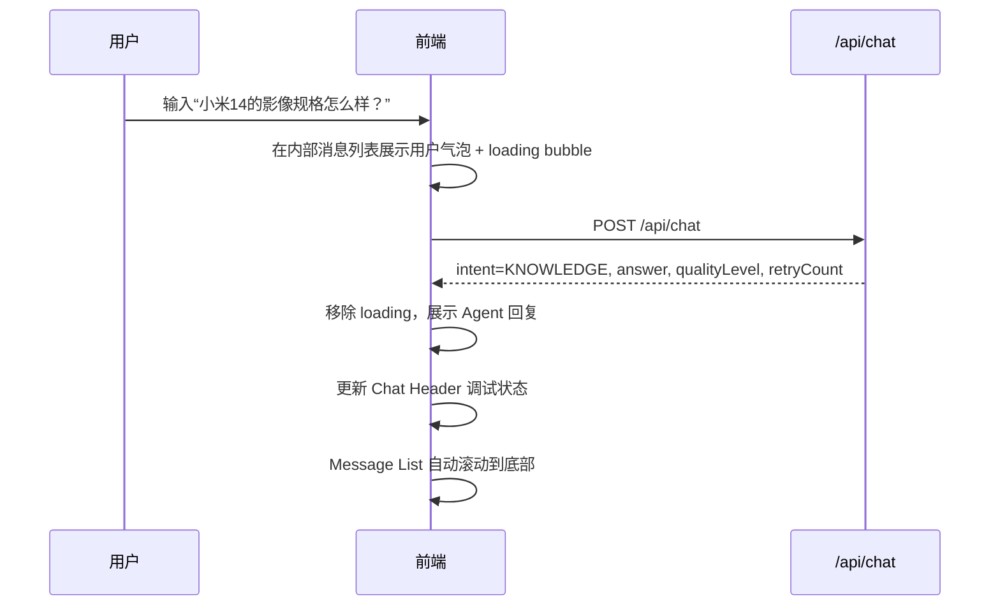
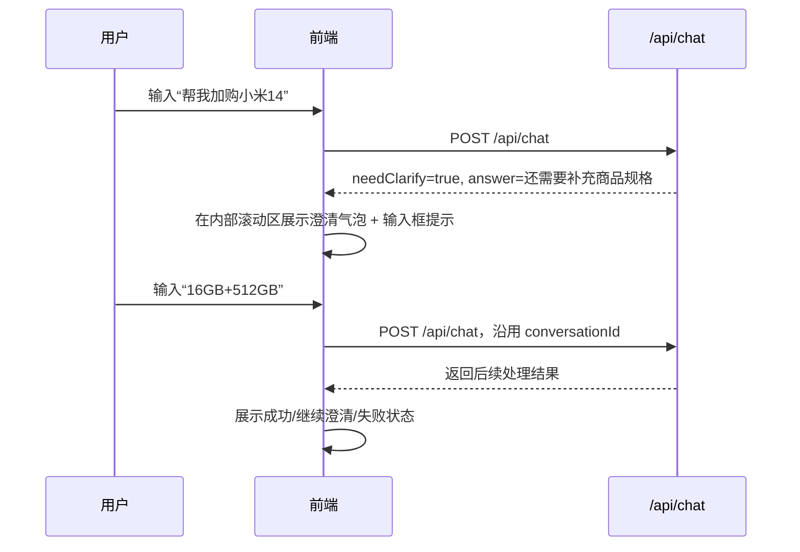
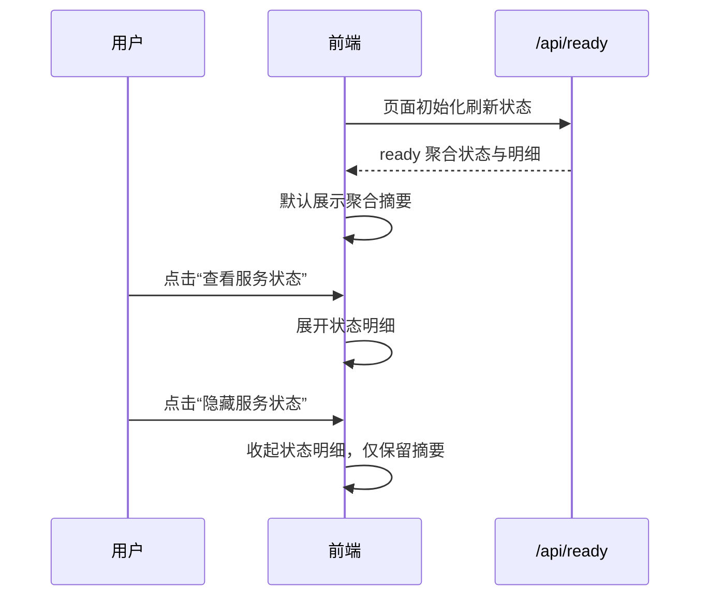
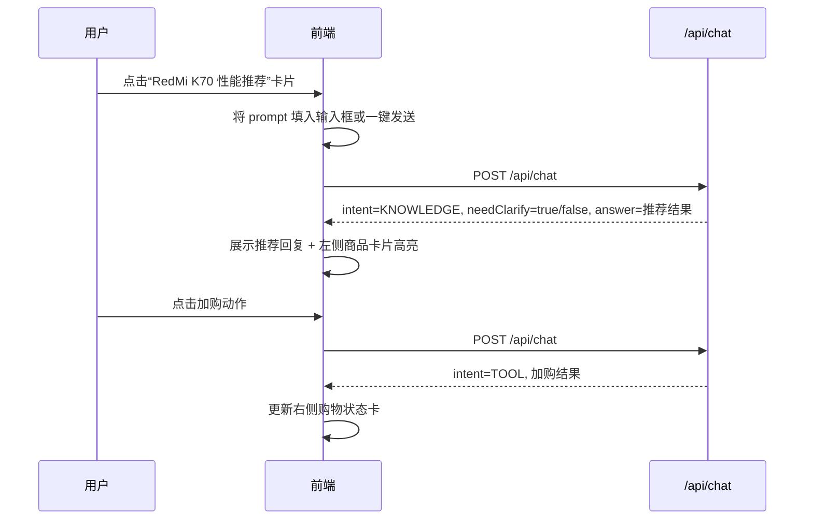

# 小米商城智能导购 Agent · 前端 UI/UX 设计文档

> 版本：v1.1  
> 日期：2026-06-28  
> 阶段：前端 UI/UX 逻辑交互与视觉设计变更  
> 状态：待用户审核  
> 依据：`doc/前端UIUX需求文档.md`、`doc/接口文档.md`  
> 设计方法：development-process-skills 文档先行流程 + frontend-design 视觉准则

---

## 1. 文档定位

本文档用于沉淀小米商城智能导购 Agent 前端的 UI/UX 设计方案，覆盖页面结构、交互流程、视觉语言、组件拆分、状态反馈、响应式布局与验收关注点。

本次 v1.1 设计变更重点解决以下问题：

1. 首版纯白配色不够炫酷，缺少科技感与 Agent 个性。
2. 顶部默认图片缺少角色识别，需要替换为二次元智能导购头像/插画。
3. 右上角 `conv-axxxx` 会话 ID 干扰演示观感，需要默认隐藏。
4. 页面中心对话空间不足，左右栏不应喧宾夺主。
5. 对话越长导致聊天卡片或页面越长，必须改为聊天内部滚动。
6. 左右侧辅助栏需要贴合页面边缘并采用弹性布局。
7. 快捷演示、商品卡片需要更有层次的渐进式 hover 效果。
8. 后端状态面板需要可点击展开/隐藏，降低信息噪音。

当前阶段**只做设计文档，不写代码**。本文档经审核后，后续再进入前端技术架构文档同步修改、测试用例同步修改与代码实现阶段。

---

## 2. 设计目标

前端定位升级为：**小米商城 × 科技风二次元智能导购工作台**。

设计目标：

1. **真实可用**：用户可以像使用智能导购客服一样自然对话。
2. **中心优先**：导购对话是页面核心，占据更多中心空间。
3. **科技炫酷**：从纯白商城风升级为深色科技、霓虹渐变、玻璃拟态、能量边框的视觉方向。
4. **角色鲜明**：顶部使用二次元 Agent 头像/插画，建立“智能导购角色”认知。
5. **适合演示**：清晰展示后端 Agent 编排、Knowledge 检索、Shopping 工具、MCP 状态等项目亮点。
6. **布局稳定**：聊天消息增加时只在消息列表内部滚动，不改变页面整体结构。
7. **联调友好**：后端健康状态可查看，但默认收敛，不干扰用户体验。
8. **可扩展**：当前兼容文本型 `/api/chat` 响应，后续可平滑升级为结构化商品/购物数据渲染。

---

## 3. 设计系统方向

### 3.1 frontend-design 设计摘要

本次不再采用通用“白底 + 浅阴影 + 橙色按钮”的电商模板，而是围绕“AI 导购驾驶舱”建立更强识别度。

| 维度 | 设计选择 | 理由 |
|---|---|---|
| 产品模式 | AI-Native Shopping Cockpit | 页面核心是对话和智能推荐，不是传统商城列表 |
| 风格关键词 | neon、glass、anime guide、agent cockpit、elastic panels | 对应科技风、二次元头像、弹性三栏、状态可视 |
| 视觉风险点 | 使用深色星云背景 + 小米橙能量线 | 相比纯白更炫酷，但保留小米品牌识别 |
| 克制点 | 只把“能量光效”集中用于头像、主聊天边框、卡片 hover | 避免全页面花哨导致信息不可读 |
| 交互重点 | 中心聊天固定高度 + 内部滚动 | 解决对话越长页面越长的问题 |

### 3.2 本项目最终风格定义

**风格名称：Mi Cyber Guide · 小米赛博导购舱**

关键词：

- 科技风炫酷配色
- 二次元智能导购角色
- 中心对话驾驶舱
- 左右弹性贴边辅助栏
- 霓虹商品卡片
- 后端状态按需展开
- 内部滚动消息流

不采用大面积纯白商城风；不做复杂后台管理面板；不让状态调试信息压过导购对话。

---

## 4. 视觉设计系统

### 4.1 色彩系统

色彩方向：**深蓝紫宇宙底 + 电光青扫描线 + 小米橙能量强调 + 少量玫红高光**。

| Token | 建议值 | 用途 |
|---|---|---|
| `--color-bg-deep` | `#070A1A` | 页面最底层深色背景 |
| `--color-bg-radial` | `#10163A` | 背景径向渐变、中心光晕 |
| `--color-panel` | `rgba(13, 18, 42, 0.78)` | 主面板玻璃底色 |
| `--color-panel-strong` | `rgba(17, 24, 54, 0.92)` | 高信息密度卡片背景 |
| `--color-border-cyan` | `rgba(34, 211, 238, 0.42)` | 科技边框、聚焦线 |
| `--color-brand` | `#FF6900` | 小米橙，主 CTA、用户消息、能量线 |
| `--color-brand-hot` | `#FF8A1F` | 小米橙 hover/高光 |
| `--color-ai-cyan` | `#22D3EE` | AI 扫描光、状态正常 |
| `--color-ai-violet` | `#8B5CF6` | Agent 光效、渐变辅助 |
| `--color-ai-pink` | `#F472B6` | 二次元角色高光、少量点缀 |
| `--color-text` | `#EAF2FF` | 深色背景主文本 |
| `--color-muted` | `#91A4C7` | 次级文本 |
| `--color-subtle` | `#53617F` | 弱信息、辅助说明 |
| `--color-success` | `#34D399` | UP/成功 |
| `--color-warning` | `#FBBF24` | DEGRADED/澄清 |
| `--color-danger` | `#FB7185` | DOWN/失败 |

使用规则：

1. 页面背景必须使用深色渐变或暗色科技纹理，不使用纯白背景作为主体。
2. 卡片使用半透明深色玻璃，边框采用低透明青色/紫色描边。
3. 小米橙只用于主操作、用户气泡、关键能量线，不大面积铺满。
4. 电光青用于 AI 状态、聚焦边框、扫描线。
5. 玫红只用于二次元头像高光或少量装饰，避免过度。
6. 正文与背景对比度不低于 4.5:1；状态颜色必须配文字。

### 4.2 背景与氛围

页面背景采用“三层结构”：

```text
底层：深蓝黑背景
中层：中心区域蓝紫径向光晕
上层：极淡网格 / 星点 / 扫描线纹理
```

要求：

1. 背景服务科技感，但不能影响文字阅读。
2. 光晕集中在中心聊天区背后，强化“对话驾驶舱”主视觉。
3. 页面四角可有弱化的霓虹色块，但不干扰内容。
4. 支持低动效模式：关闭背景漂移动效，仅保留静态渐变。

### 4.3 字体系统

| 层级 | 字体 | 说明 |
|---|---|---|
| 标题 / 品牌 | Orbitron / Rubik / 系统 sans-serif fallback | 科技感强，用于顶部标题和少量强调 |
| 正文 / 聊天 | Inter / Nunito Sans / 系统 sans-serif fallback | 清晰可读，适合长对话 |
| 数字 / 状态 | JetBrains Mono / tabular numbers | 会话元信息、状态码、订单号稳定显示 |

使用规则：

1. 标题字体不用于大段正文，避免可读性下降。
2. 聊天正文使用 15–16px，行高 1.55–1.7。
3. 状态、库存、订单号使用等宽数字增强工程感。
4. 中文字体 fallback 使用系统无衬线，保证 Windows 下稳定显示。

### 4.4 圆角、边框与阴影

| Token | 值 | 用途 |
|---|---|---|
| `radius-sm` | 10px | 小按钮、标签 |
| `radius-md` | 14px | 输入框、状态芯片 |
| `radius-lg` | 18px | 消息气泡、普通卡片 |
| `radius-xl` | 26px | 主聊天面板、大卡片 |
| `radius-orbit` | 999px | 头像光环、胶囊按钮 |

阴影与光效：

1. 普通卡片：低透明青色外发光。
2. 主聊天面板：蓝紫外发光 + 内部 1px 高光边。
3. Hover 卡片：增强青色/橙色 glow，并轻微平移。
4. 不使用厚重拟物阴影。

### 4.5 动效原则

| 场景 | 动效 | 时长 |
|---|---|---|
| 商品/快捷卡片 hover | 光晕增强 + 边框亮度提升 + `translateX/Y` 微位移 | 180–320ms |
| 消息出现 | 轻微上浮 + fade in | 180–240ms |
| 后端状态展开/隐藏 | 高度/透明度渐变 | 180–260ms |
| Loading | 三点 pulse 或扫描条 | 900–1400ms 循环 |
| 顶部头像 | 可选弱光环呼吸 | 1800–2400ms 循环 |

要求：

1. 动效集中用于“智能感”和“层级反馈”，不要到处闪烁。
2. `prefers-reduced-motion` 下关闭循环动效与位移动效。
3. Hover 不是功能发现的唯一方式，按钮文本必须清晰。

---

## 5. 信息架构

### 5.1 桌面端整体布局

采用 **中心优先三栏弹性工作台布局**。

```text
┌─────────────────────────────────────────────────────────────────────┐
│ Top Bar: 二次元 Agent 头像 / 小米智能导购 Agent / 聚合状态 / 操作    │
├───────────────┬─────────────────────────────────────┬───────────────┤
│ Left Rail     │ Center Chat Cockpit                 │ Right Rail     │
│ 快捷演示       │ Chat Header                         │ 购物状态         │
│ 小米14/K70卡片 │ Message List（内部滚动）             │ 后端状态摘要       │
│ 商品推荐       │ Fixed Input Composer                │ 可展开/隐藏详情    │
└───────────────┴─────────────────────────────────────┴───────────────┘
```

布局比例建议：

| 区域 | 宽度规则 | 说明 |
|---|---|---|
| 左栏 | `clamp(240px, 20vw, 320px)` | 快捷演示、商品卡片，贴合左侧 |
| 中栏 | `minmax(520px, 1fr)` | 聊天主区域，优先获得剩余空间 |
| 右栏 | `clamp(240px, 22vw, 340px)` | 购物车状态、后端状态，贴合右侧 |

关键规则：

1. 页面主体高度建议使用 `calc(100vh - topbarHeight)` 或同等约束。
2. 中心聊天卡片高度固定在可视区内，不随消息数量增长。
3. `Message List` 使用内部滚动。
4. 左右栏可各自内部滚动或折叠，但不能拉长全局页面。
5. 大屏下内容应贴近左右边缘，中间聊天更宽，不出现所有卡片挤在中心的问题。

### 5.2 平板端布局

平板端采用两栏：聊天优先 + 侧边 Tab。

```text
┌───────────────────────────────┐
│ Top Bar                       │
├──────────────────┬────────────┤
│ Chat Cockpit     │ Side Tabs   │
│ 内部滚动消息区     │ 推荐/购物/状态 │
└──────────────────┴────────────┘
```

规则：

1. 聊天区保持最大宽度。
2. 左右辅助内容合并为 Side Tabs。
3. 后端状态默认折叠。

### 5.3 移动端布局

移动端采用单栏主聊天 + 横滑快捷卡 + 抽屉。

```text
┌────────────────────┐
│ Top Bar            │
├────────────────────┤
│ Chat Cockpit       │
│ Message Scroll     │
│ Fixed Composer     │
├────────────────────┤
│ Quick Cards 横滑    │
└────────────────────┘

推荐商品 / 购物车 / 状态面板 → 通过底部 Sheet 或 Tab 打开
```

移动端优先保证：

1. 聊天可用。
2. 输入框不被遮挡。
3. 快捷操作可横向滑动。
4. 状态面板默认折叠。
5. 不出现横向页面滚动。

---

## 6. 页面模块设计

### 6.1 Top Bar 顶部状态栏

#### 目标

建立“小米智能导购 Agent”的产品身份，同时减少调试信息干扰。

#### 内容

| 元素 | 说明 | v1.1 规则 |
|---|---|---|
| 二次元 Agent 头像 | 顶部左侧头像/插画 | 替换首版普通图片，使用科技感头像容器 |
| 标题 | `小米智能导购 Agent` | 保持醒目，但不占过高空间 |
| 副标题 | `商品咨询 · 智能推荐 · 加购下单 · 物流查询` | 可保留为弱文本 |
| 会话标识 | `conversationId` | 默认隐藏，不在右上角展示 `conv-axxxx` |
| 聚合状态 | `UP` / `DEGRADED` / `DOWN` | 以状态芯片显示 |
| 刷新按钮 | 手动刷新 `/api/ready` | 与状态芯片靠近 |

#### 二次元头像规范

1. 头像风格：二次元智能导购、未来感耳机/光环/透明屏元素。
2. 头像容器：圆形或圆角方形，带蓝紫/橙色渐变光环。
3. 素材来源：项目本地静态图、开源素材或生成式占位资产，需避免版权风险。
4. 图片尺寸预留，避免加载后布局跳动。
5. 若图片加载失败，回退为字母/图标型 Agent 标识。

#### 视觉

- 深色半透明磨砂背景。
- 底部使用电光青细线或渐变线。
- 状态芯片使用语义色。
- 不使用 emoji 图标，统一使用 SVG 图标或图片资产。

---

### 6.2 Center Chat Cockpit 导购聊天主区域

#### 目标

承载核心 `/api/chat` 对话流程，是页面视觉和交互中心。

#### 结构

```text
┌────────────────────────────────────┐
│ Chat Header                        │
│ 当前意图 / 质量等级 / 调用次数       │
├────────────────────────────────────┤
│ Message List                       │
│ 独立滚动区域                        │
│ User Bubble                        │
│ Agent Bubble                       │
│ Clarification Bubble               │
│ Loading Bubble                     │
├────────────────────────────────────┤
│ Quick Prompt Row / Context Hints    │
├────────────────────────────────────┤
│ Input Composer                     │
│ textarea + send button             │
└────────────────────────────────────┘
```

#### 核心布局规则

1. `Chat Cockpit` 是一个固定在可视区域内的弹性容器。
2. 内部使用纵向 flex：Header 固定高度、Message List `flex: 1`、Composer 固定底部。
3. `Message List` 必须设置 `overflow-y: auto`。
4. 消息增多时，只滚动 `Message List`，不改变 `Chat Cockpit` 高度。
5. 输入框始终可见。
6. 主聊天卡片宽度优先扩展，左右栏不能压缩到聊天不可用。

#### 消息类型

| 类型 | 展示规则 |
|---|---|
| 用户消息 | 右侧气泡，小米橙到热橙渐变，文本高对比 |
| Agent 普通回复 | 左侧深色玻璃气泡，带 Agent 小标识和青色边线 |
| Agent 澄清回复 | 左侧气泡 + 黄色提示条 + `需要补充信息` 标签 |
| 系统指令回复 | 中性深色系统卡片样式 |
| 错误消息 | 红/粉色边框，带重试按钮 |
| Loading | 3 点 pulse / “正在理解需求” / 扫描条 skeleton |

#### Chat Header 状态

可展示最近一轮响应元信息：

| 字段 | 来源 | 展示 |
|---|---|---|
| intent | `/api/chat.intent` | `知识问答` / `工具调用` / `系统指令` |
| qualityLevel | `/api/chat.qualityLevel` | `充分` / `不完整` / `不足` / `失败` |
| retryCount | `/api/chat.retryCount` | `重检 0 次` |
| childCalls | `/api/chat.childCalls` | `子节点调用 1 次` |

调试信息默认轻量展示，不压迫主对话；`conversationId` 不在 Header 外显。

---

### 6.3 Left Rail 推荐与快捷演示区

#### 目标

降低演示成本，提供小米 14、RedMi K70 等卡片式快捷入口，并增强视觉表达。

#### 模块组成

1. 快捷演示卡片区。
2. 商品推荐卡片区。
3. 示例问题/快捷 chip 区。

#### 快捷演示卡片

| 卡片 | 触发输入 | 视觉重点 |
|---|---|---|
| 小米 14 影像旗舰 | `小米14的影像规格怎么样？` | 橙色能量线 + 影像标签 |
| RedMi K70 性能推荐 | `RedMi K70适合打游戏吗？` | 青紫性能光效 + 游戏标签 |
| 加购演示 | `帮我加购一台小米14 16GB+512GB` | 主 CTA 卡片，橙色按钮 |
| 查库存 | `查一下 sku-14 有没有库存` | 小型功能卡或 chip |

#### 布局规则

1. 左栏贴合页面左侧，不漂浮到中心。
2. 卡片宽度随左栏弹性变化。
3. 卡片组内部可纵向滚动。
4. 窄屏下转为横向滑动卡片。

#### 渐进式 hover

Hover 分三层：

1. **靠近反馈**：边框从低透明变为青色/橙色高亮。
2. **光晕增强**：卡片背后出现柔和 glow。
3. **轻微位移**：卡片向中心方向移动 2–4px 或上浮 2px。

过渡要求：

- 使用 `transition` 统一控制。
- 动画时长 180–320ms。
- 不使用突兀闪烁。
- 支持 reduced-motion。

---

### 6.4 Right Rail 购物车与后端状态区

#### 目标

同时服务用户导购体验和项目联调展示，但不挤压中心聊天。

右栏分为两个主要卡片：

1. 购物车 / 订单状态卡。
2. 后端服务状态卡。

#### 购物车状态卡

状态来源：

- `/api/chat.answer` 文本中的购物结果。
- 后续可升级为结构化 `data`。

展示内容：

| 状态 | UI |
|---|---|
| 空状态 | “还没有加购商品，可以先问我推荐一款手机” |
| 加购成功 | 商品名、规格、数量、购物车 ID、成功标识 |
| 需补充 | 缺失槽位提示，例如商品规格/收货地址 |
| 下单成功 | 订单号、状态、物流查询引导 |
| 操作失败 | 失败原因、重试建议 |

#### 后端状态面板

展示 `/api/ready`：

| 分组 | 字段 |
|---|---|
| 核心模块 | bootstrap、orchestrator、knowledgeGateway、shoppingGateway |
| 基础设施 | postgres、redis、mcpserver |
| 模型能力 | chatModel、embeddingModel、rerank |
| 聚合状态 | status |

交互规则：

1. 默认折叠，只展示聚合状态摘要。
2. 提供清晰按钮：`查看服务状态` / `隐藏服务状态`。
3. 展开后显示全部明细。
4. 异常项在摘要中突出显示。
5. 刷新按钮与上次刷新时间保留。
6. 详情内容过多时在面板内部滚动，不拉长整页。

状态视觉：

| 状态 | 颜色 | 文案 |
|---|---|---|
| `UP` / `CONFIGURED` | 绿色/青色 | 正常 |
| `DEGRADED` / `FALLBACK` | 黄色 | 降级 |
| `DOWN` / `MISSING_KEY` | 红/粉色 | 异常 |

---

## 7. 核心交互流程

### 7.1 普通知识问答流程



### 7.2 澄清流程



### 7.3 后端状态展开/隐藏流程



### 7.4 混合意图流程



设计原则：前端不绕过主 Agent 直接调用 Shopping；所有用户意图仍从 `/api/chat` 进入。

---

## 8. 组件设计

### 8.1 TopBar

职责：

- 展示二次元 Agent 头像。
- 展示产品标题和副标题。
- 展示聚合服务状态芯片。
- 提供刷新状态按钮。
- 默认隐藏 `conversationId`。

状态：

- normal
- degraded
- down
- refreshing

可访问性：

- 头像必须有 `alt` 或作为装饰图时 `aria-hidden`。
- 刷新按钮必须有可见文本或 `aria-label`。

### 8.2 ChatCockpit

职责：

- 承载聊天主卡片布局。
- 保证 Header / MessageList / InputComposer 纵向弹性布局。
- 控制内部滚动边界。

关键要求：

- 自身高度受页面主体约束。
- `MessageList` 是唯一主要滚动区。
- 输入区固定在底部。

### 8.3 MessageBubble

Props 概念：

| 字段 | 说明 |
|---|---|
| role | user / assistant / system / error |
| content | 消息内容 |
| status | normal / loading / clarify / failed |
| meta | intent、qualityLevel、retryCount、childCalls |

设计要点：

- 用户气泡靠右，最大宽度 72%。
- Agent 气泡靠左，最大宽度 80%。
- 长文本行高 1.5–1.7。
- 支持复制文本。
- loading 气泡使用 3 点 pulse 或扫描条。

### 8.4 PromptCard / ProductCard

用于快捷演示和商品推荐。

内容：

- 商品名称。
- 卖点标签。
- 规格。
- 推荐理由。
- 操作按钮。

按钮：

- `查库存`
- `加购`
- `问问导购`

交互：

- 点击按钮不直接调用 Shopping 内部接口，而是将对应自然语言填入输入框或发送到 `/api/chat`。
- Hover 使用渐进式光效，不突兀。
- 卡片必须可键盘 focus。

### 8.5 CartStatusCard

用于购物状态展示。

状态：

- empty
- added
- orderCreated
- needClarify
- failed

设计：

- 成功用绿色/青色状态条。
- 需澄清用黄色状态条。
- 失败用红粉色状态条。
- 提供“继续下单 / 查物流 / 重试”建议操作。

### 8.6 BackendStatusPanel

用于展示 `/api/ready`。

结构：

```text
摘要行：聚合状态 + 刷新 + 查看/隐藏按钮
详情区：
  核心模块：orchestrator / knowledge / shopping
  基础设施：postgres / redis / mcpserver
  模型能力：chat / embedding / rerank
```

设计：

- 默认只显示摘要。
- 详情项折叠展示。
- 异常项置顶或高亮。
- 提供刷新按钮和上次刷新时间。
- 详情区内部可滚动。

### 8.7 InputComposer

输入区要求：

- 支持多行输入。
- Enter 发送，Shift+Enter 换行。
- 请求中禁用发送按钮。
- 请求中显示 spinner。
- 空输入不可发送。
- 失败后保留用户输入或提供重试。
- 始终固定在聊天卡片底部。

---

## 9. 状态设计

### 9.1 Loading 状态

| 场景 | UI |
|---|---|
| 发送消息后等待 | Agent loading bubble + 3 点 pulse + “正在理解你的需求” |
| ready 状态刷新 | 面板按钮 spinner + skeleton rows |
| 商品卡片生成 | 卡片 skeleton 或扫描线 |
| 长请求超过 1 秒 | 显示“正在检索商品资料 / 正在调用购物工具”提示 |

### 9.2 错误状态

| 场景 | UI 文案 |
|---|---|
| 网络失败 | `网络连接异常，请检查后重试。` |
| 后端 5xx | `导购服务暂时不可用，请稍后重试。` |
| ready DOWN | `后端核心服务未就绪，部分功能不可用。` |
| 模型 Key 缺失 | `模型配置缺失，AI 能力可能不可用。` |
| MCP DOWN | `购物工具服务不可用，加购/下单能力可能受影响。` |

错误必须提供恢复路径：重试、刷新状态、复制错误信息。

### 9.3 降级状态

当 `/api/ready.status=DEGRADED`：

- 顶部状态芯片显示黄色 `降级运行`。
- 折叠状态下摘要提示“部分能力降级”。
- 展开状态下列出具体降级项。
- 聊天仍可使用，但在调试区域提示“部分能力可能降级”。

### 9.4 空状态

| 区域 | 空状态文案 |
|---|---|
| 聊天区 | `你好，我是小米智能导购。你可以问我商品参数、让我推荐手机，或帮你加购。` |
| 推荐卡片 | `选择左侧演示卡片，我会整理推荐理由。` |
| 购物车 | `还没有加购商品。试试让导购帮你推荐一款手机。` |
| 状态面板 | `点击查看服务状态，检查后端联调情况。` |

---

## 10. 响应式设计

### 10.1 Breakpoints

| 断点 | 布局 |
|---|---|
| `≤ 480px` | 单栏移动端，聊天优先，快捷卡横滑 |
| `481–767px` | 单栏 + 横向快捷操作 + 底部状态 Sheet |
| `768–1023px` | 两栏布局：聊天 + 侧边 Tab |
| `≥ 1024px` | 三栏弹性工作台布局 |
| `≥ 1440px` | 三栏增加中心聊天空间，左右栏贴边 |

### 10.2 移动端优先级

移动端内容优先级：

1. Top Bar 简化状态。
2. 聊天消息。
3. 输入框。
4. 快捷操作横滑。
5. 推荐/购物车/状态通过底部 sheet 打开。

避免：

- 横向页面滚动。
- 输入框被键盘遮挡。
- 状态面板占据主屏。
- 只能 hover 才能发现操作。
- 聊天消息拉长整个页面。

---

## 11. 无障碍与可用性要求

### 11.1 Accessibility

- 正文对比度 ≥ 4.5:1。
- 大文本/图标对比度 ≥ 3:1。
- 所有图标按钮必须有可访问名称。
- focus ring 可见，不移除键盘焦点。
- heading 层级顺序清晰。
- 状态不只靠颜色表达，必须有文本/图标。
- 动效尊重 `prefers-reduced-motion`。
- 展开/隐藏后端状态按钮可键盘操作，并通过 `aria-expanded` 表达状态。

### 11.2 Interaction

- 所有可点击区域 ≥ 44×44px。
- 按钮 loading 时禁用重复提交。
- 点击/按压在 100ms 内有视觉反馈。
- 动画 150–320ms，避免过慢。
- 重要失败状态提供恢复动作。
- 聊天输入区始终可见。

### 11.3 Performance UX

- 图片资源预留尺寸，避免布局跳动。
- 二次元头像加载失败需要 fallback。
- 商品卡片图片使用懒加载。
- loading 超过 300ms 显示反馈。
- loading 超过 1s 使用更明确文案。
- 避免大面积高频装饰动画。

---

## 12. 前后端接口映射

### 12.1 `/api/chat`

前端发送：

```json
{
  "userId": "u001",
  "conversationId": "c001",
  "message": "小米14的影像规格怎么样？"
}
```

前端使用响应字段：

| 字段 | UI 用途 |
|---|---|
| `answer` | Agent 消息正文，渲染到内部滚动消息区 |
| `intent` | Chat Header 意图标签 |
| `needClarify` | 澄清状态样式和输入提示 |
| `qualityLevel` | 检索质量状态标签 |
| `retryCount` | 调试信息 |
| `childCalls` | 调试信息 |

`conversationId` 仍需在本地状态中维护，但默认不在顶部栏外显。

### 12.2 `/api/health`

用于页面初始化时判断主应用是否存活。

### 12.3 `/api/ready`

用于 BackendStatusPanel。

| 字段 | UI 用途 |
|---|---|
| `status` | 顶部聚合状态和后端状态摘要 |
| `orchestrator` | 核心模块状态 |
| `knowledgeGateway` | 核心模块状态 |
| `shoppingGateway` | 核心模块状态 |
| `postgres` | 基础设施状态 |
| `redis` | 基础设施状态 |
| `mcpserver` | 工具服务状态 |
| `chatModel` | 模型配置状态 |
| `embeddingModel` | 模型配置状态 |
| `rerank` | rerank 配置/降级状态 |

---

## 13. 页面文案规范

### 13.1 语气

- 专业但不生硬。
- 像小米商城导购，不像后台系统。
- 资料不足时坦诚，不编造。
- 控件文案直接说明动作。

### 13.2 示例文案

| 场景 | 文案 |
|---|---|
| 初始欢迎 | `你好，我是小米智能导购。你可以问我商品参数、让我推荐手机，或帮你加购。` |
| 思考中 | `正在理解你的需求...` |
| 检索中 | `正在检索商品资料...` |
| 工具调用中 | `正在调用购物工具...` |
| 需澄清 | `还需要补充一些信息，我才能继续处理。` |
| 成功 | `已处理成功。` |
| 失败 | `操作失败，请稍后重试或补充更多信息。` |
| 展开状态 | `查看服务状态` |
| 收起状态 | `隐藏服务状态` |

---

## 14. 设计验收清单

| 编号 | 检查项 | 标准 |
|---|---|---|
| UIUX-001 | 主页面布局 | 桌面端三栏结构清晰，中心聊天为视觉和交互核心 |
| UIUX-002 | 聊天体验 | 用户消息、Agent 消息、loading、澄清、错误状态区分明确 |
| UIUX-003 | 聊天内部滚动 | 对话消息增多时，消息列表内部滚动，主卡片和整页不无限变长 |
| UIUX-004 | 快捷操作 | 快捷按钮/卡片覆盖核心演示链路，触控面积合格 |
| UIUX-005 | 左侧卡片贴边 | 小米 14、RedMi K70、加购演示等卡片贴合左侧并弹性布局 |
| UIUX-006 | 推荐卡片 | 商品信息层级清晰，有操作入口，hover 有渐进式科技光效 |
| UIUX-007 | 购物状态 | 加购/下单/物流/需澄清/失败状态均有明确反馈 |
| UIUX-008 | 后端状态 | ready/health 状态可读，支持点击展开/隐藏，异常项明确 |
| UIUX-009 | 顶部信息 | 顶部使用二次元 Agent 头像，不默认展示 `conv-axxxx` |
| UIUX-010 | 视觉风格 | 符合“Mi Cyber Guide · 小米赛博导购舱”，避免大面积纯白 |
| UIUX-011 | 响应式 | 桌面/平板/移动端布局策略明确，无横向滚动 |
| UIUX-012 | 无障碍 | 对比度、焦点、触控面积、图标标签、aria-expanded 符合要求 |
| UIUX-013 | 动效 | 动效有意义、150–320ms，支持 reduced-motion |
| UIUX-014 | 中心空间 | 中心聊天区获得更多页面空间，左右栏不挤压主体验 |

---

## 15. 后续技术实现建议

本文档不改变既有前后端职责边界，但对技术实现提出以下同步要求：

1. 前端组件拆分建议：
   - `AppShell`
   - `TopBar`
   - `AgentAvatar`
   - `ChatCockpit`
   - `MessageList`
   - `MessageBubble`
   - `InputComposer`
   - `PromptCard`
   - `ProductCard`
   - `CartStatusCard`
   - `BackendStatusPanel`
   - `StatusChip`

2. 样式实现建议：
   - 使用深色设计 token 替换纯白背景 token。
   - 主体布局使用 CSS Grid 或 Flex 混合方案。
   - 聊天内部使用 `min-height: 0` + `overflow-y: auto` 解决滚动容器问题。
   - 后端状态面板使用本地 UI 状态控制展开/隐藏。
   - `conversationId` 保留在 store 中，不默认渲染到 TopBar。

3. 设计资产建议：
   - 二次元 Agent 头像放入前端静态资产目录。
   - 若暂缺图片，可先用本地 SVG/渐变头像占位。
   - 不使用 emoji 作为结构性图标。
   - 商品图片首期可 mock，后续换真实素材。

---

## 16. 下一步

本 UI/UX 设计文档审核通过后，建议进入：

1. 同步修改 `doc/前端技术架构文档.md`：确定组件结构、样式 token、滚动布局、状态面板展开隐藏、头像资源路径等技术落地方案。
2. 同步修改前端测试用例文档：覆盖聊天内部滚动、科技风视觉、左右弹性布局、后端状态隐藏、会话 ID 隐藏等新增验收点。
3. 审核通过后再进入前端代码实现。
