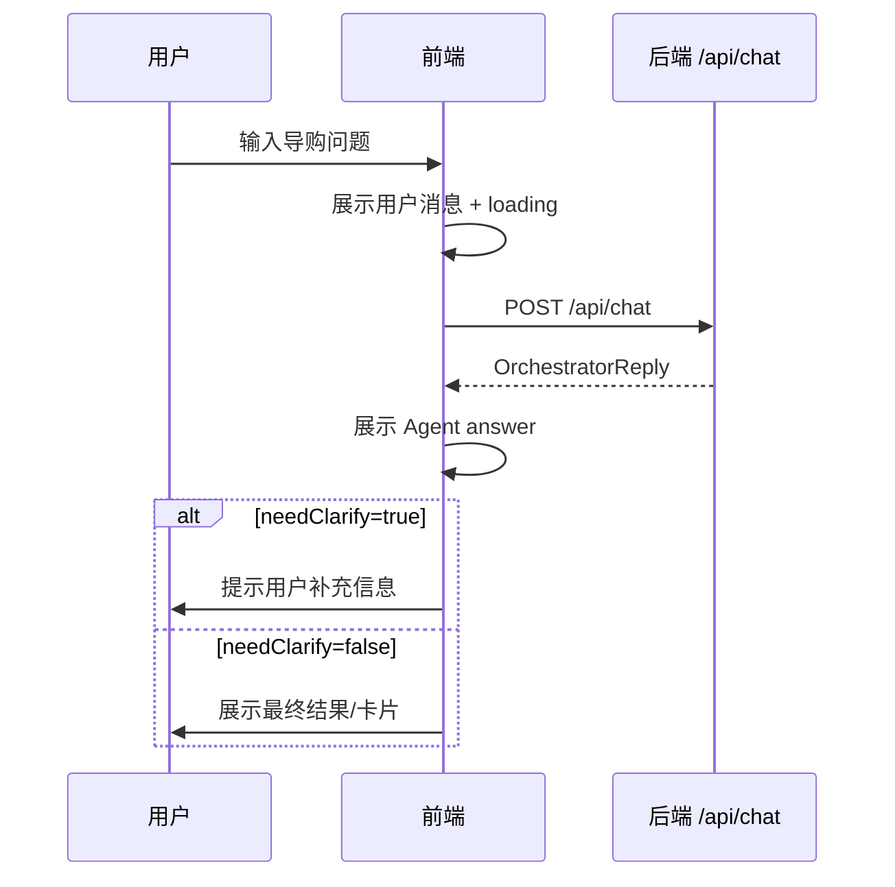

# 小米商城智能导购 Agent · 前端 UI/UX 需求文档

> 版本：v1.0  
> 日期：2026-06-23  
> 阶段：前端 UI/UX 需求澄清沉淀  
> 状态：待用户审核  
> 后续流程：审核通过后进入前端逻辑/交互设计与 UI/UX 细化设计文档阶段

---

## 1. 背景与目标

小米商城智能导购 Agent 后端已具备主 Agent 对话入口、Knowledge 检索子节点、Shopping 工具子节点、MCP 工具服务与聚合就绪检查能力。前端需要围绕这些后端能力，构建一个既能体现真实商城导购体验，又能展示 AI Agent 工程亮点的交互界面。

本阶段前端定位为：**小米商城 × 科技 Agent 混合型前端**。

核心目标：

1. 为用户提供自然语言导购聊天入口。
2. 支持商品咨询、推荐、加购、下单、查物流、查库存、清除记忆等典型演示流程。
3. 以清爽电商风为主体，结合 AI 光效、状态面板、渐变卡片体现智能导购特征。
4. 提供后端联调状态展示，方便课程答辩、项目展示和开发调试。
5. 首期控制范围，优先完成标准联调版，而不是完整商城系统。

---

## 2. 用户角色

| 角色 | 说明 | 主要诉求 |
|---|---|---|
| 普通用户 | 模拟小米商城消费者 | 通过自然语言咨询商品、获得推荐、执行加购/下单等操作 |
| 项目演示者 | 项目作者/答辩者 | 快速展示 Agent 导购能力、接口联调状态和技术亮点 |
| 开发调试者 | 前后端联调人员 | 查看 `/api/health`、`/api/ready`、`/api/chat` 调用状态和错误信息 |

---

## 3. 页面范围

首期采用 **标准联调版**，包含以下页面/区域：

| 页面/区域 | 是否首期实现 | 说明 |
|---|---|---|
| 导购聊天主页面 | 是 | 核心页面，承载 `/api/chat` 对话能力 |
| 商品推荐卡片区 | 是 | 展示 Agent 推荐/咨询相关商品卡片，首期可轻量模拟/半结构化展示 |
| 购物车状态区 | 是 | 展示加购成功、购物车状态、下单引导等结果 |
| 后端状态面板 | 是 | 展示 `/api/health`、`/api/ready` 返回状态 |
| 首页 | 否 | 暂不做完整商城首页 |
| 商品列表页 | 否 | 暂不做完整商品列表浏览 |
| 商品详情页 | 否 | 暂不做独立详情页 |
| 订单中心页 | 否 | 暂不做完整订单中心，仅在聊天/卡片中展示物流结果 |

---

## 4. 核心功能需求

### 4.1 导购聊天

前端应提供类似智能助手的聊天界面。

功能要求：

1. 用户可以输入自然语言问题。
2. 前端调用 `POST /api/chat`。
3. 前端展示用户消息和 Agent 回复。
4. 请求过程中展示 loading 状态。
5. 请求失败时展示错误提示。
6. 保持同一会话的 `conversationId`，支持多轮澄清。
7. 当响应 `needClarify=true` 时，前端应将 `answer` 作为澄清问题展示，并等待用户补充。

示例场景：

- “小米14的影像规格怎么样？”
- “帮我推荐一款适合打游戏的手机。”
- “帮我加购一台小米14 16GB+512GB。”
- “查一下订单 order-12345678 的物流。”
- “清除我的记忆。”

### 4.2 快捷操作

聊天输入区应提供快捷操作按钮，降低演示成本。

首期快捷操作建议：

| 快捷操作 | 生成的用户输入示例 |
|---|---|
| 商品咨询 | `小米14的影像规格怎么样？` |
| 游戏手机推荐 | `帮我推荐一款适合打游戏的手机` |
| 加购演示 | `帮我加购一台小米14 16GB+512GB` |
| 查询库存 | `查一下 sku-14 有没有库存` |
| 查询物流 | `帮我查一下订单 order-12345678 的物流` |
| 清除记忆 | `清除我的记忆` |
| 查看历史 | `查看当前会话历史` |

### 4.3 商品推荐卡片区

前端应提供轻量商品推荐/展示卡片，用于增强视觉表达。

首期不要求后端返回完整结构化商品 JSON。可以采用以下策略：

1. Agent 回复文本正常展示。
2. 前端根据当前示例场景或关键词展示轻量商品卡片。
3. 卡片内容可以先使用 mock 数据或从答案中提取关键字段。
4. 后续若后端新增结构化 `data` 字段，再切换为真实数据渲染。

商品卡片建议字段：

| 字段 | 说明 |
|---|---|
| 商品名称 | 如“小米14” |
| 核心卖点 | 如“影像旗舰 / 高性能 / 长续航” |
| 规格 | 如“16GB+512GB” |
| 推荐理由 | Agent 推荐摘要 |
| 操作按钮 | 加购 / 查库存 / 查看详情 |

### 4.4 购物车状态区

前端应展示 Shopping 工具调用后的结果状态。

首期可从 Agent `answer` 中直接展示文本结果，同时在 UI 上提供状态卡片：

| 状态 | 展示方式 |
|---|---|
| 加购成功 | 显示成功图标、商品名、规格、数量、购物车 ID |
| 下单成功 | 显示订单号、订单状态 |
| 需补充信息 | 显示澄清提示，例如缺商品规格、收货地址、订单号 |
| 操作失败 | 显示失败原因和重试建议 |

### 4.5 后端联调状态面板

前端应提供一个调试/演示面板，展示后端健康状态。

调用接口：

- `GET /api/health`
- `GET /api/ready`

展示字段建议：

| 状态项 | 来源 |
|---|---|
| 主应用状态 | `/api/health.status` |
| Orchestrator 状态 | `/api/ready.orchestrator` |
| KnowledgeGateway 状态 | `/api/ready.knowledgeGateway` |
| ShoppingGateway 状态 | `/api/ready.shoppingGateway` |
| PostgreSQL 状态 | `/api/ready.postgres` |
| Redis 状态 | `/api/ready.redis` |
| MCP Server 状态 | `/api/ready.mcpserver` |
| Chat 模型配置 | `/api/ready.chatModel` |
| Embedding 模型配置 | `/api/ready.embeddingModel` |
| Rerank 状态 | `/api/ready.rerank` |
| 聚合状态 | `/api/ready.status` |

---

## 5. 交互需求

### 5.1 主流程



### 5.2 澄清交互

当后端返回 `needClarify=true` 时：

1. 前端不结束会话。
2. 前端展示 `answer`。
3. 输入框 placeholder 可变为“请补充上述信息...”。
4. 用户补充后，沿用同一个 `conversationId` 再次调用 `/api/chat`。

### 5.3 状态面板交互

1. 页面初始化时自动调用一次 `/api/health` 和 `/api/ready`。
2. 提供手动刷新按钮。
3. `UP` 使用绿色状态。
4. `DEGRADED` / `FALLBACK` 使用黄色状态。
5. `DOWN` / `MISSING_KEY` 使用红色状态。

---

## 6. 视觉风格需求

视觉方向：**小米商城 × 科技 Agent 混合风**。

### 6.1 总体风格

| 维度 | 要求 |
|---|---|
| 主基调 | 清爽、现代、电商产品感 |
| 品牌感 | 可使用小米橙作为强调色 |
| 科技感 | 使用轻量渐变、AI 光效、状态芯片、玻璃拟态面板 |
| 信息密度 | 中等，既适合真实使用，也适合演示讲解 |
| 动效 | 克制，重点用于 loading、状态切换、消息出现 |

### 6.2 推荐布局

首期建议采用三栏或两栏增强布局：

```text
┌──────────────────────────────────────────────┐
│ 顶部：项目名 / 会话状态 / 后端状态摘要        │
├───────────────┬────────────────┬─────────────┤
│ 商品/推荐卡片  │ 导购聊天主区域   │ 状态/购物车  │
│               │                │ 联调面板     │
└───────────────┴────────────────┴─────────────┘
```

移动端可折叠为：

```text
顶部状态
聊天主区域
推荐卡片横滑
购物车/联调面板抽屉
```

---

## 7. 非功能需求

| 类型 | 需求 |
|---|---|
| 响应体验 | `/api/chat` 请求期间必须有 loading / thinking 状态 |
| 错误处理 | 网络错误、后端 5xx、ready 降级均需有明确提示 |
| 可演示性 | 快捷操作可一键触发核心演示链路 |
| 可维护性 | 页面组件应按聊天区、推荐卡、购物车状态、联调面板拆分 |
| 可扩展性 | 后续支持后端结构化 `data` 字段时，前端能平滑切换 |
| 响应式 | 至少适配桌面端；移动端可作为次级目标 |

---

## 8. 数据与接口需求

### 8.1 必接接口

| 接口 | 用途 |
|---|---|
| `POST /api/chat` | 主对话入口 |
| `GET /api/health` | 主应用存活检查 |
| `GET /api/ready` | 聚合就绪检查 |

### 8.2 前端本地状态

前端至少维护：

| 状态 | 说明 |
|---|---|
| `userId` | 用户 ID，未登录可本地生成或使用默认值 |
| `conversationId` | 会话 ID，同一轮澄清必须保持一致 |
| `messages` | 当前会话消息列表 |
| `loading` | 当前是否等待 Agent 响应 |
| `readyStatus` | 后端就绪状态 |
| `cartPreview` | 购物车预览状态，首期可由文本/示例数据生成 |
| `recommendations` | 推荐商品卡片数据，首期可 mock 或半结构化提取 |

---

## 9. 边界与非目标

首期不做：

1. 不做完整小米商城首页。
2. 不做完整商品列表和筛选系统。
3. 不做独立商品详情页。
4. 不做真实登录注册。
5. 不做真实支付流程。
6. 不直接调用 MCP Server。
7. 不要求后端立即改造结构化商品返回。
8. 不把前端做成复杂后台管理系统。

---

## 10. 验收标准

首期前端 UI/UX 验收重点：**演示完整性优先，同时兼顾视觉完成度和接口联调稳定性**。

| 编号 | 验收点 | 标准 |
|---|---|---|
| FE-ACC-001 | 聊天主流程 | 用户输入后能调用 `/api/chat` 并展示 Agent 回复 |
| FE-ACC-002 | 澄清流程 | `needClarify=true` 时能正确展示澄清问题，并保持会话继续 |
| FE-ACC-003 | 快捷操作 | 至少提供商品咨询、推荐、加购、查库存、查物流、清记忆快捷入口 |
| FE-ACC-004 | 商品推荐展示 | 能展示推荐/商品卡片区域，支持基础商品信息呈现 |
| FE-ACC-005 | 购物结果展示 | 加购/下单/物流结果能以文本或状态卡片形式展示 |
| FE-ACC-006 | 后端状态面板 | 能展示 `/api/health` 和 `/api/ready` 的核心状态 |
| FE-ACC-007 | 降级/错误提示 | 后端异常、接口失败、ready 降级时有明确 UI 提示 |
| FE-ACC-008 | 视觉风格 | 整体符合“小米商城 × 科技 Agent 混合风” |
| FE-ACC-009 | 演示链路 | 能完整演示：咨询 → 推荐 → 加购/澄清 → 查库存/物流 → 状态面板 |
| FE-ACC-010 | 响应式基础 | 桌面端布局完整可用，窄屏下不出现严重遮挡 |

---

## 11. 待确认问题

当前按推荐方案已默认确认：

1. 前端定位：混合型前端。
2. 页面范围：标准联调版。
3. 交互方式：聊天 + 快捷操作。
4. 商品结果展示：文本 + 轻量卡片。
5. 视觉风格：小米商城 × 科技 Agent 混合风。
6. 技术栈：本阶段暂不绑定。
7. 验收重点：演示完整性优先，兼顾视觉和接口稳定性。

后续进入技术架构阶段前仍需确认：

1. 前端具体技术栈：Vue / React / 其他。
2. 是否需要移动端优先适配。
3. 是否需要后端新增结构化 `data` 字段。
4. 是否需要真实商品图片资源。

---

## 12. 下一步

本需求文档审核通过后，进入下一阶段：

1. 基于本需求文档沉淀前端逻辑/交互设计文档。
2. 调用 `ui-ux-pro-max` 的设计思路，细化页面信息架构、视觉风格、组件方案和交互动效。
3. 设计文档完成后继续等待用户审核，再进入测试文档或技术实现阶段。
