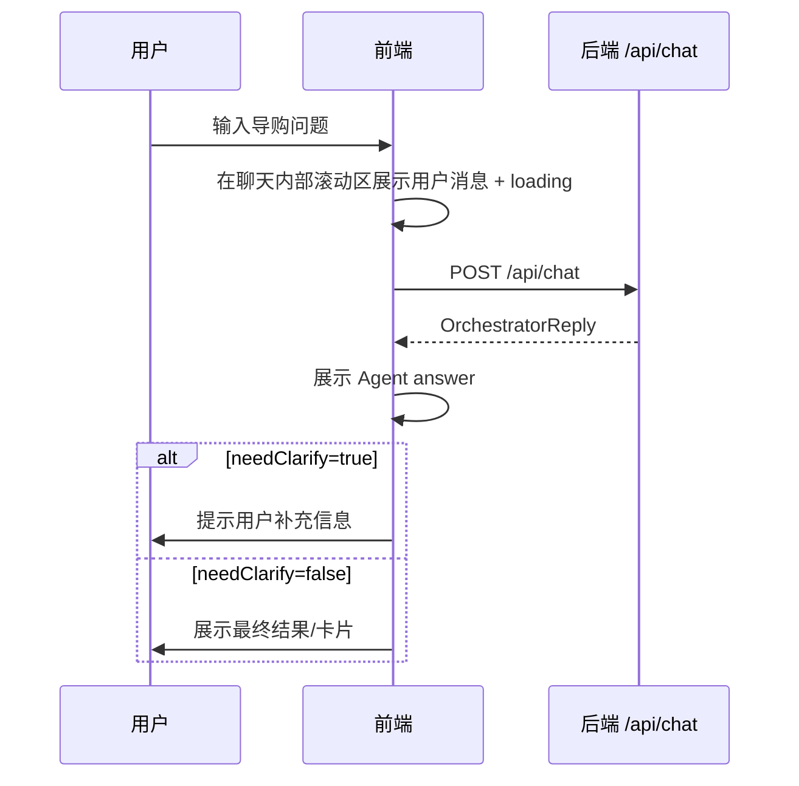

# 小米商城智能导购 Agent · 前端 UI/UX 需求文档

> 版本：v1.1  
> 日期：2026-06-28  
> 阶段：前端 UI/UX 需求变更沉淀  
> 状态：待用户审核  
> 后续流程：审核通过后进入前端 UI/UX 设计文档同步修改阶段

---

## 1. 背景与目标

小米商城智能导购 Agent 后端已具备主 Agent 对话入口、Knowledge 检索子节点、Shopping 工具子节点、MCP 工具服务与聚合就绪检查能力。前端需要围绕这些后端能力，构建一个既能体现真实商城导购体验，又能展示 AI Agent 工程亮点的交互界面。

本阶段前端定位调整为：**小米商城 × 科技风二次元智能导购工作台**。

核心目标：

1. 为用户提供自然语言导购聊天入口。
2. 支持商品咨询、推荐、加购、下单、查物流、查库存、清除记忆等典型演示流程。
3. 视觉上从“纯白清爽电商风”升级为**科技风炫酷配色**，以深色渐变、霓虹光效、玻璃拟态、能量边框体现 AI Agent 与智能导购特征。
4. 顶部品牌区强化个性化识别，使用更贴合“智能导购 Agent”的二次元头像/插画资产，而不是普通默认图片。
5. 页面布局必须服务核心对话体验：**聊天主区域占用更多页面中心空间**，左右辅助栏弹性贴边，不挤压主对话。
6. 导购对话必须采用**独立内部滚动容器**，不能随着消息变多导致整页或聊天卡片无限变长。
7. 提供后端联调状态展示，但该区域默认不应造成视觉噪音，必须支持点击展开/隐藏。
8. 首期控制范围，优先完成标准联调版，而不是完整商城系统。

---

## 2. 本次需求变更摘要（v1.1）

本次变更针对已完成的前端首版视觉和布局体验进行优化，重点解决“纯白配色不好看、主区域不突出、对话越长页面越长、辅助栏布局不贴合”的问题。

| 编号 | 变更项 | 新需求 |
|---|---|---|
| FE-CHG-001 | 视觉配色 | 页面整体从纯白/浅色商城风升级为科技风炫酷配色；禁止大面积纯白背景作为主视觉 |
| FE-CHG-002 | 顶部头像 | 顶部“小米智能导购 Agent”旁的图片替换为二次元风格头像/插画，体现 AI 导购角色感 |
| FE-CHG-003 | 会话标识 | 右上角 `conv-axxxx` 这类会话 ID 不再外显，避免干扰用户和演示观感 |
| FE-CHG-004 | 弹性布局 | 页面整体采用弹性布局；中心聊天区优先获得页面空间，左右栏随屏幕宽度自适应 |
| FE-CHG-005 | 左侧卡片 | 快捷演示、小米 14、RedMi K70 等卡片式模块需贴合页面左侧布局；鼠标靠近后有渐进式动效 |
| FE-CHG-006 | 右侧布局 | 右侧购物/状态信息同样采用弹性布局，贴合页面右侧，不压缩中心聊天区 |
| FE-CHG-007 | 后端服务状态 | 后端服务状态需增加点击按钮，可展开/隐藏详情 |
| FE-CHG-008 | 对话滚动 | 导购对话卡片必须固定在主区域内，消息列表独立滚动；不得随对话增长拉长整张卡片或整页 |
| FE-CHG-009 | 中心优先 | 页面栏需占用更多页面中心空间，中心导购对话是核心中的核心 |

---

## 3. 用户角色

| 角色 | 说明 | 主要诉求 |
|---|---|---|
| 普通用户 | 模拟小米商城消费者 | 通过自然语言咨询商品、获得推荐、执行加购/下单等操作，界面要像一个有科技感的智能导购 |
| 项目演示者 | 项目作者/答辩者 | 快速展示 Agent 导购能力、接口联调状态和技术亮点，页面第一眼要有辨识度和高级感 |
| 开发调试者 | 前后端联调人员 | 查看 `/api/health`、`/api/ready`、`/api/chat` 调用状态和错误信息，但调试信息不能干扰主体验 |

---

## 4. 页面范围

首期采用 **标准联调版**，包含以下页面/区域：

| 页面/区域 | 是否首期实现 | 说明 |
|---|---|---|
| 导购聊天主页面 | 是 | 核心页面，承载 `/api/chat` 对话能力；本次要求占用更多中心空间并内部滚动 |
| 商品推荐卡片区 | 是 | 展示 Agent 推荐/咨询相关商品卡片，首期可轻量模拟/半结构化展示；本次要求贴合左侧并支持渐进式 hover |
| 快捷演示区 | 是 | 展示小米 14、RedMi K70 等快捷演示入口，支持卡片化与渐进式动效 |
| 购物车状态区 | 是 | 展示加购成功、购物车状态、下单引导等结果；右侧弹性布局 |
| 后端状态面板 | 是 | 展示 `/api/health`、`/api/ready` 返回状态；本次要求可点击展开/隐藏 |
| 首页 | 否 | 暂不做完整商城首页 |
| 商品列表页 | 否 | 暂不做完整商品列表浏览 |
| 商品详情页 | 否 | 暂不做独立详情页 |
| 订单中心页 | 否 | 暂不做完整订单中心，仅在聊天/卡片中展示物流结果 |

---

## 5. 核心功能需求

### 5.1 导购聊天

前端应提供类似智能助手的聊天界面，且聊天区域是页面的绝对视觉中心。

功能要求：

1. 用户可以输入自然语言问题。
2. 前端调用 `POST /api/chat`。
3. 前端展示用户消息和 Agent 回复。
4. 请求过程中展示 loading 状态。
5. 请求失败时展示错误提示。
6. 保持同一会话的 `conversationId`，支持多轮澄清。
7. 当响应 `needClarify=true` 时，前端应将 `answer` 作为澄清问题展示，并等待用户补充。
8. 消息列表必须放在聊天主卡片内的独立滚动区域中。
9. 对话越长时，只允许消息列表内部滚动，不允许聊天卡片整体越变越长。
10. 输入区应固定在聊天卡片底部，用户始终能看到输入入口。
11. 页面不应依赖浏览器全局滚动来浏览聊天记录。

示例场景：

- “小米14的影像规格怎么样？”
- “帮我推荐一款适合打游戏的手机。”
- “帮我加购一台小米14 16GB+512GB。”
- “查一下订单 order-12345678 的物流。”
- “清除我的记忆。”

### 5.2 快捷操作

聊天输入区或左侧辅助栏应提供快捷操作按钮/卡片，降低演示成本。

首期快捷操作建议：

| 快捷操作 | 生成的用户输入示例 | 展示要求 |
|---|---|---|
| 小米 14 咨询 | `小米14的影像规格怎么样？` | 以左侧贴边卡片展示 |
| RedMi K70 推荐 | `RedMi K70适合打游戏吗？` | 以左侧贴边卡片展示 |
| 游戏手机推荐 | `帮我推荐一款适合打游戏的手机` | 支持渐进式 hover 光效 |
| 加购演示 | `帮我加购一台小米14 16GB+512GB` | 可作为重点演示卡片 |
| 查询库存 | `查一下 sku-14 有没有库存` | 可作为辅助 chip 或小卡片 |
| 查询物流 | `帮我查一下订单 order-12345678 的物流` | 可作为辅助 chip 或小卡片 |
| 清除记忆 | `清除我的记忆` | 保持低强调，避免误触 |
| 查看历史 | `查看当前会话历史` | 若后端支持则展示，否则可隐藏 |

交互要求：

1. 左侧快捷演示区域应贴合页面左侧，不在大屏中漂浮到页面中间。
2. 卡片 hover 应有渐进式效果，例如光晕增强、边框亮度变化、轻微位移、背景渐变推进。
3. hover 动效只用于增强体验，功能不能依赖 hover 才可发现。
4. 动效需支持 `prefers-reduced-motion` 降级。

### 5.3 商品推荐卡片区

前端应提供轻量商品推荐/展示卡片，用于增强视觉表达。

首期不要求后端返回完整结构化商品 JSON。可以采用以下策略：

1. Agent 回复文本正常展示。
2. 前端根据当前示例场景或关键词展示轻量商品卡片。
3. 卡片内容可以先使用 mock 数据或从答案中提取关键字段。
4. 后续若后端新增结构化 `data` 字段，再切换为真实数据渲染。

商品卡片建议字段：

| 字段 | 说明 |
|---|---|
| 商品名称 | 如“小米14”“RedMi K70” |
| 核心卖点 | 如“影像旗舰 / 高性能 / 长续航” |
| 规格 | 如“16GB+512GB” |
| 推荐理由 | Agent 推荐摘要 |
| 操作按钮 | 加购 / 查库存 / 查看详情 |

新增视觉与布局要求：

1. 商品卡片应融入科技风炫酷配色，不使用大面积纯白卡片。
2. 卡片可使用半透明深色玻璃、渐变边框、霓虹描边或局部能量光效。
3. 小米 14、RedMi K70 等演示卡片应成为左侧栏的主要视觉内容。
4. 卡片 hover 时要有连续过渡，不允许突兀闪烁。

### 5.4 购物车状态区

前端应展示 Shopping 工具调用后的结果状态。

首期可从 Agent `answer` 中直接展示文本结果，同时在 UI 上提供状态卡片：

| 状态 | 展示方式 |
|---|---|
| 加购成功 | 显示成功图标、商品名、规格、数量、购物车 ID |
| 下单成功 | 显示订单号、订单状态 |
| 需补充信息 | 显示澄清提示，例如缺商品规格、收货地址、订单号 |
| 操作失败 | 显示失败原因和重试建议 |

右侧布局要求：

1. 购物车状态区和后端状态区采用纵向弹性布局。
2. 右侧栏贴合页面右侧，宽度随屏幕弹性变化。
3. 右侧内容不得挤压中心聊天主区域。
4. 右侧卡片内容过多时，应在自身区域内滚动或折叠，不拉长整页。

### 5.5 后端联调状态面板

前端应提供一个调试/演示面板，展示后端健康状态。

调用接口：

- `GET /api/health`
- `GET /api/ready`

展示字段建议：

| 状态项 | 来源 |
|---|---|
| 主应用状态 | `/api/health.status` |
| Orchestrator 状态 | `/api/ready.orchestrator` |
| KnowledgeGateway 状态 | `/api/ready.knowledgeGateway` |
| ShoppingGateway 状态 | `/api/ready.shoppingGateway` |
| PostgreSQL 状态 | `/api/ready.postgres` |
| Redis 状态 | `/api/ready.redis` |
| MCP Server 状态 | `/api/ready.mcpserver` |
| Chat 模型配置 | `/api/ready.chatModel` |
| Embedding 模型配置 | `/api/ready.embeddingModel` |
| Rerank 状态 | `/api/ready.rerank` |
| 聚合状态 | `/api/ready.status` |

新增交互要求：

1. 后端服务状态必须有明确的展开/隐藏按钮。
2. 默认状态建议只展示聚合状态摘要，详情按需展开。
3. 展开/隐藏按钮文案必须清晰，例如“查看服务状态”“隐藏服务状态”。
4. 异常状态仍需可见：当 `DOWN` 或关键项异常时，即使详情折叠，也应在摘要中提示。
5. 状态面板不应长期占据过多右侧空间。

### 5.6 顶部栏与品牌头像

顶部栏用于建立产品身份，但不能干扰主对话。

需求：

1. 顶部显示 `小米智能导购 Agent`。
2. 标题旁使用二次元风格头像/插画，表达“智能导购角色”。
3. 头像应与科技风配色一致，可带微弱光环、渐变背景或玻璃容器。
4. 右上角不展示 `conv-axxxx` 等内部会话 ID。
5. 如开发调试仍需复制会话 ID，可放入隐藏调试区或折叠面板，不作为默认视觉元素。
6. 顶部栏高度需克制，不能压缩中心聊天区域。

---

## 6. 交互需求

### 6.1 主流程



### 6.2 澄清交互

当后端返回 `needClarify=true` 时：

1. 前端不结束会话。
2. 前端展示 `answer`。
3. 输入框 placeholder 可变为“请补充上述信息...”。
4. 用户补充后，沿用同一个 `conversationId` 再次调用 `/api/chat`。
5. 澄清消息仍在聊天卡片内部滚动区展示，不改变页面整体高度。

### 6.3 状态面板交互

1. 页面初始化时自动调用一次 `/api/health` 和 `/api/ready`。
2. 提供手动刷新按钮。
3. 提供展开/隐藏按钮。
4. `UP` 使用绿色状态。
5. `DEGRADED` / `FALLBACK` 使用黄色状态。
6. `DOWN` / `MISSING_KEY` 使用红色状态。
7. 折叠时保留聚合状态摘要，展开时显示明细。

### 6.4 卡片渐进式 hover

左侧快捷演示卡片和商品卡片需支持渐进式 hover：

1. 鼠标靠近时，卡片边框、背景光晕、阴影或位置逐步变化。
2. 过渡时长建议 180–320ms。
3. 动效应体现科技感，但不影响可读性。
4. 触屏设备使用点击/按压反馈替代 hover。

---

## 7. 视觉风格需求

视觉方向：**科技风炫酷配色 × 小米智能导购 × 二次元 Agent 角色感**。

### 7.1 总体风格

| 维度 | 要求 |
|---|---|
| 主基调 | 深色科技、霓虹渐变、玻璃拟态、AI 光效 |
| 品牌感 | 可保留小米橙作为能量强调色，但不再以纯白商城风为主体 |
| 科技感 | 使用深蓝紫/电光青/小米橙/玫红点缀、光晕、状态芯片、渐变卡片 |
| 二次元感 | 顶部头像/插画体现智能导购角色，不使用普通默认图片 |
| 信息密度 | 中等偏高，但核心聊天区必须清晰 |
| 动效 | 用于 hover、loading、状态展开/收起、消息出现；动效需有意义 |
| 禁止项 | 禁止大面积纯白背景、普通后台模板感、聊天卡片随内容无限变长 |

### 7.2 推荐布局

首期采用中心优先的三栏弹性工作台：

```text
┌──────────────────────────────────────────────────────────────┐
│ 顶部：二次元 Agent 头像 / 小米智能导购 Agent / 状态摘要       │
├──────────────┬──────────────────────────────┬───────────────┤
│ 左侧贴边栏    │ 中心导购对话主区域             │ 右侧贴边栏      │
│ 快捷演示卡片  │ 固定高度聊天卡片               │ 购物/状态卡片   │
│ 小米14/K70    │ 消息列表内部滚动 + 固定输入区    │ 状态可隐藏      │
└──────────────┴──────────────────────────────┴───────────────┘
```

布局优先级：

1. 中心导购对话主区域优先级最高。
2. 左侧快捷演示贴左展示，宽度不足时可压缩或变为横向滑动。
3. 右侧购物/状态贴右展示，宽度不足时可折叠。
4. 页面整体避免依赖浏览器全局滚动承载聊天内容。

移动端可折叠为：

```text
顶部状态
聊天主区域（内部滚动）
快捷演示横滑
购物车/联调面板抽屉
```

---

## 8. 非功能需求

| 类型 | 需求 |
|---|---|
| 响应体验 | `/api/chat` 请求期间必须有 loading / thinking 状态 |
| 错误处理 | 网络错误、后端 5xx、ready 降级均需有明确提示 |
| 可演示性 | 快捷操作可一键触发核心演示链路，重点展示小米 14、RedMi K70 等卡片 |
| 可维护性 | 页面组件应按聊天区、推荐卡、购物车状态、联调面板、顶部栏拆分 |
| 可扩展性 | 后续支持后端结构化 `data` 字段时，前端能平滑切换 |
| 响应式 | 桌面端三栏弹性布局完整可用，窄屏下左右栏可折叠/横滑 |
| 可用性 | 聊天输入区固定可见，消息列表内部滚动 |
| 可访问性 | 颜色对比度达标，状态不只靠颜色表达，展开/隐藏按钮可键盘操作 |
| 动效降级 | 支持 `prefers-reduced-motion`，减少或关闭非必要动效 |

---

## 9. 数据与接口需求

### 9.1 必接接口

| 接口 | 用途 |
|---|---|
| `POST /api/chat` | 主对话入口 |
| `GET /api/health` | 主应用存活检查 |
| `GET /api/ready` | 聚合就绪检查 |

### 9.2 前端本地状态

前端至少维护：

| 状态 | 说明 |
|---|---|
| `userId` | 用户 ID，未登录可本地生成或使用默认值 |
| `conversationId` | 会话 ID，同一轮澄清必须保持一致，但默认不在顶部外显 |
| `messages` | 当前会话消息列表，渲染在独立滚动容器中 |
| `loading` | 当前是否等待 Agent 响应 |
| `readyStatus` | 后端就绪状态 |
| `statusPanelVisible` | 后端服务状态详情是否展开/显示 |
| `cartPreview` | 购物车预览状态，首期可由文本/示例数据生成 |
| `recommendations` | 推荐商品卡片数据，首期可 mock 或半结构化提取 |
| `layoutMode` | 响应式布局模式，支持三栏/双栏/单栏切换 |

---

## 10. 边界与非目标

首期不做：

1. 不做完整小米商城首页。
2. 不做完整商品列表和筛选系统。
3. 不做独立商品详情页。
4. 不做真实登录注册。
5. 不做真实支付流程。
6. 不直接调用 MCP Server。
7. 不要求后端立即改造结构化商品返回。
8. 不把前端做成复杂后台管理系统。
9. 不新增真实二次元人物 IP 授权素材；如使用图片，应采用项目可用的本地/开源/生成式占位资产，避免版权风险。
10. 不把 `conversationId` 作为普通用户默认可见信息展示。

---

## 11. 验收标准

首期前端 UI/UX 验收重点：**演示完整性优先，同时兼顾科技风视觉完成度、中心对话体验和接口联调稳定性**。

| 编号 | 验收点 | 标准 |
|---|---|---|
| FE-ACC-001 | 聊天主流程 | 用户输入后能调用 `/api/chat` 并展示 Agent 回复 |
| FE-ACC-002 | 澄清流程 | `needClarify=true` 时能正确展示澄清问题，并保持会话继续 |
| FE-ACC-003 | 快捷操作 | 至少提供商品咨询、推荐、加购、查库存、查物流、清记忆快捷入口 |
| FE-ACC-004 | 商品推荐展示 | 能展示推荐/商品卡片区域，支持小米 14、RedMi K70 等基础商品信息呈现 |
| FE-ACC-005 | 购物结果展示 | 加购/下单/物流结果能以文本或状态卡片形式展示 |
| FE-ACC-006 | 后端状态面板 | 能展示 `/api/health` 和 `/api/ready` 的核心状态，且支持点击展开/隐藏 |
| FE-ACC-007 | 降级/错误提示 | 后端异常、接口失败、ready 降级时有明确 UI 提示 |
| FE-ACC-008 | 视觉风格 | 整体符合“科技风炫酷配色 × 小米智能导购 × 二次元 Agent 角色感”，不再是大面积纯白界面 |
| FE-ACC-009 | 演示链路 | 能完整演示：咨询 → 推荐 → 加购/澄清 → 查库存/物流 → 状态面板 |
| FE-ACC-010 | 响应式基础 | 桌面端布局完整可用，窄屏下不出现严重遮挡 |
| FE-ACC-011 | 中心区域优先 | 中心导购对话区域占据主要页面空间，左右栏不得喧宾夺主 |
| FE-ACC-012 | 聊天内部滚动 | 对话消息增多时，聊天卡片高度不随内容无限增长，消息列表在卡片内独立滚动 |
| FE-ACC-013 | 顶部信息简化 | 顶部展示二次元 Agent 头像与标题，不默认展示 `conv-axxxx` 会话 ID |
| FE-ACC-014 | 左右栏弹性布局 | 左侧快捷演示贴左、右侧状态/购物贴右，整体采用弹性布局 |
| FE-ACC-015 | 卡片渐进式效果 | 快捷演示与商品卡片鼠标靠近后有平滑渐进式 hover 效果 |

---

## 12. 待确认问题

当前按用户本次反馈已确认：

1. 视觉风格：从纯白清爽风改为科技风炫酷配色。
2. 顶部图片：替换为二次元风格头像/插画。
3. 会话 ID：右上角 `conv-axxxx` 默认隐藏。
4. 布局：整体弹性布局，中心聊天区域优先。
5. 左侧：快捷演示、小米 14、RedMi K70 卡片贴左，并支持渐进式 hover。
6. 右侧：购物与状态区域弹性贴右。
7. 后端状态：增加点击按钮，可展开/隐藏。
8. 对话区：消息列表独立滚动，避免对话越长卡片越长。

后续进入 UI/UX 设计文档同步修改阶段前仍需确认：

1. 二次元头像采用哪种来源：本地静态占位图、开源素材、还是生成式占位资产。
2. 科技风主色是否接受“深蓝紫 + 电光青 + 小米橙”的方向。
3. 后端状态默认是否折叠，仅异常时突出显示。

---

## 13. 下一步

本需求文档审核通过后，进入下一阶段：

1. 同步修改 `doc/前端UIUX设计文档.md`，把上述需求落地为信息架构、视觉系统、布局规则、组件交互与动效规范。
2. 设计文档完成后继续等待用户审核。
3. 审核通过后再同步修改前端技术架构文档、测试用例文档，最后进入代码实现。
