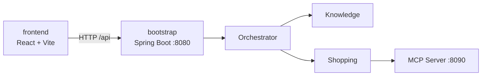
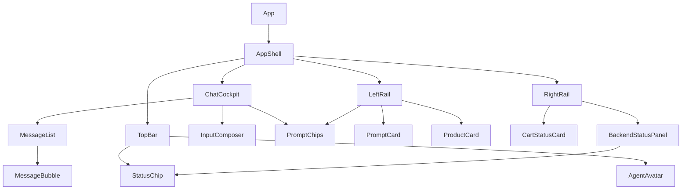
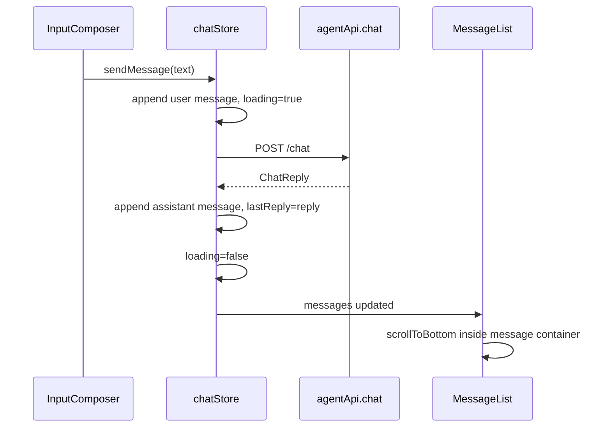

# 小米商城智能导购 Agent · 前端技术架构文档

> 版本：v1.1  
> 日期：2026-06-28  
> 阶段：前端技术架构变更设计  
> 状态：待用户审核  
> 前置文档：`doc/前端UIUX需求文档.md`、`doc/前端UIUX设计文档.md`、`doc/接口文档.md`  
> 技术选型：React + TypeScript + Vite、Tailwind CSS、Zustand、Axios、Lucide Icons

---

## 1. 文档定位

本文档用于将已审核的前端 UI/UX v1.1 需求与设计方案落地为具体技术架构，明确前端工程结构、技术栈、组件拆分、状态管理、接口封装、样式系统、布局滚动策略、异常处理、测试策略与后续实现顺序。

本次 v1.1 技术架构变更重点：

1. 将视觉 token 从浅色商城风升级为深色科技风。
2. 新增 `AgentAvatar`，承载顶部二次元 Agent 头像/插画。
3. 默认隐藏 TopBar 中的 `conversationId`。
4. 将 `ChatPanel` 升级为 `ChatCockpit`，采用固定高度弹性结构。
5. `MessageList` 独立滚动，解决对话越长卡片越长的问题。
6. `AppShell` 采用中心优先三栏弹性布局。
7. 左侧 `LeftRail` 贴边展示快捷演示与商品卡片，并支持渐进式 hover。
8. 右侧 `RightRail` 弹性贴右，后端状态面板支持展开/隐藏。
9. 所有滚动区使用明确的高度约束，避免依赖浏览器全局滚动承载聊天记录。

当前阶段只沉淀技术架构，不进入代码实现。本文档审核通过后，再进入前端测试用例文档同步修改阶段；测试文档审核后再开始前端代码实现。

---

## 2. 技术栈总览

| 分类 | 选型 | 用途 | 选择理由 |
|---|---|---|---|
| 构建工具 | Vite | 前端开发服务器、构建、代理 | React TS 官方模板简洁，HMR 快，适合独立前端目录 |
| UI 框架 | React | 组件化 UI | 聊天、卡片、状态面板等交互组件拆分清晰 |
| 类型系统 | TypeScript | 类型约束 | 与后端接口文档对齐，减少联调字段错误 |
| 样式 | Tailwind CSS | 原子化样式与设计 token | 快速落地深色科技风 token、响应式、动效和状态样式 |
| UI 组件思路 | shadcn/ui 风格 | Button、Card、Sheet、Dialog 等 | 不强绑定大型组件库，可复制组件源码并按项目风格定制 |
| 图标 | Lucide React | SVG 图标 | 满足“不使用 emoji 作为结构图标”的要求 |
| 状态管理 | React state + Zustand | 聊天、ready 状态、推荐卡片、购物车预览、面板展开状态 | Zustand 轻量，支持 selector 和按需持久化 |
| HTTP 客户端 | Axios | REST API 请求 | 支持实例、baseURL、timeout、拦截器、类型化错误处理 |
| 测试 | Vitest + React Testing Library | 单元/组件测试 | 与 Vite 生态匹配，适合组件行为测试 |
| E2E/联调 | Playwright（后续可选） | 浏览器联调测试 | 覆盖真实聊天、澄清、状态面板流程 |

---

## 3. Context7 文档核对摘要

前端技术栈 v1.0 阶段已按全局规则使用 Context7 查询当前文档要点，本次 v1.1 未引入新框架，仅调整样式、布局与组件设计：

1. **Vite**
   - React TS 官方模板使用 `@vitejs/plugin-react`。
   - `server.proxy` 可将 `/api` 代理到后端 `http://localhost:8080`。
   - 自定义环境变量通过 `ImportMetaEnv` 类型增强。

2. **Tailwind CSS**
   - 当前推荐 Vite 集成可使用 `@tailwindcss/vite` 插件。
   - Tailwind v4 支持 CSS-first `@theme` 方式定义设计 token。
   - 设计 token 可沉淀为颜色、字体、断点、动效变量。

3. **Zustand**
   - 推荐使用 `create<T>()` 定义类型化 store。
   - 组件通过 selector 订阅局部状态，避免不必要重渲染。
   - 需要持久化时使用 `persist` 中间件，并通过 `partialize` 只持久化必要字段。

4. **Axios**
   - 推荐使用 `axios.create({ baseURL, timeout })` 创建实例。
   - 请求/响应拦截器可统一处理日志、错误和响应拆包。
   - TypeScript 中通过 `AxiosInstance`、`InternalAxiosRequestConfig` 和 `axios.isAxiosError` 做类型安全处理。

---

## 4. 工程位置与模块边界

### 4.1 目录位置

前端工程放在当前仓库根目录下：

```text
frontend/
```

原因：

1. 当前后端是 Maven 多模块工程，前端独立目录不会污染 Java 模块。
2. 前端可独立安装依赖、启动、构建。
3. 后续可独立部署，也可由后端静态资源托管。

### 4.2 与后端关系



约束：

- 前端只直接调用 Bootstrap REST API。
- 前端不直接调用 Knowledge、Shopping 或 MCP Server。
- 所有用户意图都通过 `/api/chat` 进入主 Agent。
- 前端可以展示 `/api/ready` 中 MCP/模型/数据库状态，但只用于演示与联调可视化。

---

## 5. 前端目录结构

建议结构：

```text
frontend/
├── package.json
├── index.html
├── vite.config.ts
├── tsconfig.json
├── tsconfig.app.json
├── public/
│   └── agent-avatar.svg                  # 二次元 Agent 头像占位资源，可替换为图片
├── src/
│   ├── main.tsx
│   ├── App.tsx
│   ├── styles/
│   │   ├── globals.css                   # Tailwind import + @theme token + 基础背景
│   │   └── tokens.css                    # 可选：语义变量补充
│   ├── assets/
│   │   └── agent-avatar.svg              # 若使用打包资产，可放这里
│   ├── api/
│   │   ├── httpClient.ts                 # Axios 实例、拦截器、错误归一化
│   │   ├── agentApi.ts                   # chat/health/ready API 封装
│   │   └── types.ts                      # API 请求/响应类型
│   ├── stores/
│   │   ├── chatStore.ts                  # messages/loading/conversationId
│   │   ├── statusStore.ts                # health/ready 状态
│   │   └── uiStore.ts                    # panel 展开、移动端 sheet、theme 等 UI 状态
│   ├── components/
│   │   ├── common/
│   │   │   ├── Button.tsx
│   │   │   ├── Card.tsx
│   │   │   ├── StatusChip.tsx
│   │   │   ├── Skeleton.tsx
│   │   │   └── IconButton.tsx
│   │   ├── chat/
│   │   │   ├── ChatCockpit.tsx           # 中心主聊天容器，替代旧 ChatPanel
│   │   │   ├── MessageList.tsx           # 独立滚动消息区
│   │   │   ├── MessageBubble.tsx
│   │   │   ├── InputComposer.tsx
│   │   │   └── PromptChips.tsx
│   │   ├── product/
│   │   │   ├── ProductCard.tsx
│   │   │   └── PromptCard.tsx            # 小米14 / RedMi K70 快捷演示卡
│   │   ├── cart/
│   │   │   └── CartStatusCard.tsx
│   │   ├── status/
│   │   │   └── BackendStatusPanel.tsx    # 支持展开/隐藏
│   │   └── layout/
│   │       ├── AppShell.tsx              # 中心优先三栏弹性布局
│   │       ├── TopBar.tsx
│   │       ├── AgentAvatar.tsx
│   │       ├── LeftRail.tsx              # 替代 LeftPanel，强调贴边栏
│   │       ├── RightRail.tsx             # 替代 RightPanel，强调贴边栏
│   │       └── MobileBottomSheet.tsx
│   ├── data/
│   │   ├── quickPrompts.ts               # 快捷操作配置
│   │   └── mockProducts.ts               # 首期推荐卡片 mock 数据
│   ├── utils/
│   │   ├── ids.ts                        # conversationId/userId 生成
│   │   ├── responseParser.ts             # 从 answer 中提取购物/物流提示
│   │   └── statusMapping.ts              # ready 状态映射文案/颜色
│   └── tests/
│       └── setup.ts
└── README.md
```

---

## 6. Vite 配置设计

### 6.1 基础配置

采用 React + TypeScript 官方模板风格：

```ts
import { defineConfig, loadEnv } from 'vite'
import react from '@vitejs/plugin-react'
import tailwindcss from '@tailwindcss/vite'

export default defineConfig(({ mode }) => {
  const env = loadEnv(mode, process.cwd(), '')

  return {
    plugins: [react(), tailwindcss()],
    server: {
      port: Number(env.VITE_DEV_PORT || 5173),
      proxy: {
        '/api': {
          target: env.VITE_API_PROXY_TARGET || 'http://localhost:8080',
          changeOrigin: true,
        },
      },
    },
  }
})
```

### 6.2 环境变量

`.env.development` 示例：

```text
VITE_DEV_PORT=5173
VITE_API_BASE_URL=/api
VITE_API_PROXY_TARGET=http://localhost:8080
```

`vite-env.d.ts` 类型增强：

```ts
interface ImportMetaEnv {
  readonly VITE_API_BASE_URL: string
  readonly VITE_API_PROXY_TARGET?: string
  readonly VITE_DEV_PORT?: string
}

interface ImportMeta {
  readonly env: ImportMetaEnv
}
```

---

## 7. 样式架构

### 7.1 Tailwind CSS 策略

采用 Tailwind CSS + CSS-first token 方案，将 UI/UX v1.1 设计文档中的 **Mi Cyber Guide · 小米赛博导购舱** 视觉规范沉淀为语义变量。

`globals.css` 示例：

```css
@import "tailwindcss";

@theme {
  --color-bg-deep: #070a1a;
  --color-bg-radial: #10163a;
  --color-panel: rgba(13, 18, 42, 0.78);
  --color-panel-strong: rgba(17, 24, 54, 0.92);
  --color-border-cyan: rgba(34, 211, 238, 0.42);
  --color-brand: #ff6900;
  --color-brand-hot: #ff8a1f;
  --color-ai-cyan: #22d3ee;
  --color-ai-violet: #8b5cf6;
  --color-ai-pink: #f472b6;
  --color-text: #eaf2ff;
  --color-muted: #91a4c7;
  --color-subtle: #53617f;
  --color-success: #34d399;
  --color-warning: #fbbf24;
  --color-danger: #fb7185;

  --radius-sm: 10px;
  --radius-md: 14px;
  --radius-lg: 18px;
  --radius-xl: 26px;
  --radius-orbit: 999px;
}

html,
body,
#root {
  min-height: 100%;
}

body {
  margin: 0;
  color: var(--color-text);
  background:
    radial-gradient(circle at 50% 15%, rgba(139, 92, 246, 0.28), transparent 36rem),
    radial-gradient(circle at 8% 28%, rgba(34, 211, 238, 0.16), transparent 26rem),
    radial-gradient(circle at 92% 72%, rgba(255, 105, 0, 0.18), transparent 24rem),
    var(--color-bg-deep);
}
```

### 7.2 设计 token 规则

- 组件中尽量使用语义 token，不散落随机 hex。
- 状态色必须绑定语义：success/warning/danger。
- 深色面板使用半透明背景 + 低透明边框。
- 小米橙只用于主操作、用户气泡、关键能量线。
- 电光青用于 AI 状态、聚焦边框、扫描线。
- 间距遵循 4/8px rhythm。
- 动效时长统一为 150–320ms。
- `prefers-reduced-motion` 下禁用非必要动效。

### 7.3 全局滚动与布局约束

本项目 v1.1 的关键问题是：聊天内容不能让整页无限变长。因此需在布局层明确约束：

```css
.app-shell {
  min-height: 100vh;
  display: flex;
  flex-direction: column;
  overflow: hidden;
}

.app-main {
  flex: 1;
  min-height: 0;
  display: grid;
  overflow: hidden;
}

.chat-cockpit {
  min-height: 0;
  display: flex;
  flex-direction: column;
  overflow: hidden;
}

.message-list {
  flex: 1;
  min-height: 0;
  overflow-y: auto;
}
```

核心原则：

1. `AppShell` 控制整页高度。
2. `app-main` 不承担聊天滚动。
3. `ChatCockpit` 是固定边界容器。
4. `MessageList` 是聊天记录唯一滚动容器。
5. 左右栏内容过多时在自身内部滚动或折叠。

### 7.4 响应式策略

| 断点 | 布局 |
|---|---|
| `< 768px` | 单栏聊天，快捷演示横滑，推荐/状态通过底部 Sheet 展示 |
| `768px - 1023px` | 双栏：聊天 + 侧边 Tab |
| `>= 1024px` | 三栏中心优先工作台 |
| `>= 1440px` | 左右栏贴边，中心聊天获取更多宽度 |

---

## 8. API 类型与接口封装

### 8.1 类型定义

`src/api/types.ts`：

```ts
export interface ChatRequest {
  userId?: string
  conversationId?: string
  message: string
}

export type AgentIntent = 'KNOWLEDGE' | 'TOOL' | 'SYSTEM' | string

export interface ChatReply {
  answer: string
  intent?: AgentIntent | null
  needClarify?: boolean
  qualityLevel?: string | null
  retryCount?: number | null
  childCalls?: number | null
}

export interface HealthResponse {
  status: string
  project: string
  arch: string
}

export interface ReadyResponse {
  bootstrap: string
  orchestrator: string
  knowledgeGateway: string
  shoppingGateway: string
  postgres: string
  redis: string
  mcpserver: string
  chatModel: string
  embeddingModel: string
  rerank: string
  status: 'UP' | 'DEGRADED' | 'DOWN' | string
}
```

### 8.2 Axios 实例

`src/api/httpClient.ts`：

```ts
import axios, { type AxiosInstance } from 'axios'

export const httpClient: AxiosInstance = axios.create({
  baseURL: import.meta.env.VITE_API_BASE_URL || '/api',
  timeout: 15000,
})

httpClient.interceptors.response.use(
  response => response,
  error => Promise.reject(normalizeApiError(error)),
)
```

错误归一化目标：

```ts
export interface ApiError {
  message: string
  status?: number
  code?: string
  raw?: unknown
}
```

### 8.3 API 封装

`src/api/agentApi.ts`：

```ts
export const agentApi = {
  chat: (body: ChatRequest) =>
    httpClient.post<ChatReply>('/chat', body).then(res => res.data),

  health: () =>
    httpClient.get<HealthResponse>('/health').then(res => res.data),

  ready: () =>
    httpClient.get<ReadyResponse>('/ready').then(res => res.data),
}
```

---

## 9. 状态管理设计

### 9.1 状态边界

| Store | 职责 | 是否持久化 |
|---|---|---|
| `chatStore` | 当前会话 ID、消息列表、loading、最近响应元信息 | conversationId 可持久化，messages 首期可不持久化 |
| `statusStore` | health/ready 状态、刷新时间、刷新 loading/error | 不持久化 |
| `uiStore` | 后端状态展开、移动端 sheet、侧栏 tab、主题偏好 | theme/statusPanelExpanded 可按需持久化 |

### 9.2 chatStore 设计

状态：

```ts
interface ChatMessage {
  id: string
  role: 'user' | 'assistant' | 'system' | 'error'
  content: string
  createdAt: number
  meta?: {
    intent?: string | null
    needClarify?: boolean
    qualityLevel?: string | null
    retryCount?: number | null
    childCalls?: number | null
  }
}

interface ChatState {
  userId: string
  conversationId: string
  messages: ChatMessage[]
  loading: boolean
  lastReply?: ChatReply
  sendMessage: (message: string) => Promise<void>
  resetConversation: () => void
}
```

设计原则：

- `sendMessage` 负责追加用户消息、调用 API、追加 Agent 消息、处理错误。
- 组件通过 selector 读取局部状态。
- 不在组件中散落 API 调用逻辑。
- `conversationId` 继续用于多轮会话，但默认不在 TopBar 渲染。
- 如需调试复制会话 ID，可放入折叠调试区域，而非默认右上角。

### 9.3 statusStore 设计

```ts
interface StatusState {
  health?: HealthResponse
  ready?: ReadyResponse
  loading: boolean
  error?: ApiError
  lastRefreshedAt?: number
  refresh: () => Promise<void>
}
```

页面初始化时调用一次 `refresh()`，用户也可手动刷新。

### 9.4 uiStore 设计

v1.1 新增后端状态展开/隐藏与响应式面板状态：

```ts
interface UiState {
  statusPanelExpanded: boolean
  activeSideTab: 'recommend' | 'cart' | 'status'
  mobileSheetOpen: boolean
  setStatusPanelExpanded: (expanded: boolean) => void
  toggleStatusPanel: () => void
  setActiveSideTab: (tab: UiState['activeSideTab']) => void
  setMobileSheetOpen: (open: boolean) => void
}
```

---

## 10. 组件架构

### 10.1 组件依赖方向



### 10.2 核心组件职责

| 组件 | 职责 |
|---|---|
| `AppShell` | 页面布局、响应式栏位组织、全局高度和滚动边界控制 |
| `TopBar` | 标题、二次元 Agent 头像、聚合状态、刷新按钮；默认不展示 conversationId |
| `AgentAvatar` | 展示二次元头像/插画，处理加载失败 fallback |
| `LeftRail` | 左侧贴边快捷演示、推荐商品卡片、示例问题 |
| `ChatCockpit` | 聊天主区域容器，负责 Header/MessageList/InputComposer 弹性布局 |
| `MessageList` | 消息流、独立滚动、自动滚动到底部 |
| `MessageBubble` | 不同角色/状态消息展示 |
| `InputComposer` | 输入框、发送按钮、快捷键、loading 禁用 |
| `PromptChips` | 快捷操作 chips |
| `PromptCard` | 小米14/RedMi K70 等快捷演示卡片 |
| `ProductCard` | 推荐商品卡片 |
| `RightRail` | 右侧贴边购物状态和后端状态面板 |
| `CartStatusCard` | 购物车/订单/澄清/失败状态 |
| `BackendStatusPanel` | health/ready 状态展示，支持展开/隐藏 |
| `StatusChip` | UP/DEGRADED/DOWN 等语义状态 |

### 10.3 组件约束

- 组件不直接硬编码接口路径。
- 组件不直接处理 Axios 错误细节。
- 结构图标统一 Lucide，不使用 emoji。
- 可点击元素必须有 `aria-label` 或可见文本。
- loading/disabled/focus 状态必须完整。
- `BackendStatusPanel` 展开/隐藏按钮必须设置 `aria-expanded`。
- `MessageList` 必须是独立滚动区，不允许消息撑开 `ChatCockpit`。
- `AgentAvatar` 必须预留尺寸，避免图片加载造成布局跳动。

---

## 11. 布局技术方案

### 11.1 AppShell 中心优先三栏布局

桌面端建议使用 CSS Grid：

```css
.app-main {
  display: grid;
  grid-template-columns: clamp(240px, 20vw, 320px) minmax(520px, 1fr) clamp(240px, 22vw, 340px);
  gap: 20px;
  min-height: 0;
  overflow: hidden;
  padding: 20px 24px 24px;
}
```

目标：

1. 左栏宽度可变但有上下限。
2. 中栏吃掉剩余空间，优先保证对话区域。
3. 右栏宽度可变但不挤压中栏。
4. 整个 main 区域不发生聊天级别的全局滚动。

### 11.2 ChatCockpit 内部滚动

React 结构建议：

```tsx
export function ChatCockpit() {
  return (
    <section className="chat-cockpit">
      <ChatHeader />
      <MessageList />
      <PromptChips />
      <InputComposer />
    </section>
  )
}
```

CSS 关键点：

```css
.chat-cockpit {
  min-height: 0;
  height: 100%;
  display: flex;
  flex-direction: column;
  overflow: hidden;
}

.message-list {
  flex: 1;
  min-height: 0;
  overflow-y: auto;
  overscroll-behavior: contain;
}
```

必要约束：

- 父级每一层都要有 `min-height: 0` 或明确高度约束。
- 不能只给 `MessageList` 写 `overflow-y: auto`，否则父级未约束时仍会被内容撑开。
- 输入区不能放在滚动列表内部。

### 11.3 LeftRail / RightRail 内部滚动

```css
.side-rail {
  min-height: 0;
  overflow: hidden;
  display: flex;
  flex-direction: column;
}

.side-rail-scroll {
  min-height: 0;
  overflow-y: auto;
}
```

要求：

1. 左侧卡片多时，左栏内部滚动。
2. 右侧状态详情展开后，右栏内部滚动。
3. 左右栏不得撑高页面。

---

## 12. 关键交互技术方案

### 12.1 发送消息

流程：



异常时：

- 追加 error message。
- 保留输入或提供重试。
- loading 必须复位。
- 错误消息仍进入内部滚动区。

### 12.2 快捷操作 / PromptCard

首期采用“点击填入输入框”策略，降低误触：

1. 点击 `PromptCard` 或 chip。
2. 输入框填入预设 prompt。
3. 用户可编辑。
4. 用户点击发送。

后续可加“一键发送”模式。

PromptCard 配置示例：

```ts
interface QuickPrompt {
  id: string
  title: string
  subtitle: string
  prompt: string
  tone: 'orange' | 'cyan' | 'violet'
  tags: string[]
}
```

### 12.3 澄清流程

前端不做复杂槽位合并，只负责：

- 展示 `needClarify=true` 的澄清气泡。
- 保持 `conversationId`。
- 用户补充后再次调用 `/api/chat`。
- 澄清气泡渲染在 `MessageList` 内部滚动区。

### 12.4 商品卡片和购物状态

首期后端未返回结构化商品数据，因此采用两层策略：

1. `answer` 原文始终展示，保证真实后端结果可见。
2. `responseParser.ts` 做轻量识别：
   - 包含“加购”/`cartId` → 更新购物车卡片。
   - 包含“orderId”/“订单” → 更新订单卡片。
   - 包含“物流”/`logisticsNo` → 展示物流卡片。
   - 知识问答/推荐场景 → 展示 mock 推荐商品卡片。

后续如果 `/api/chat` 增加结构化 `data`，直接替换 parser。

### 12.5 后端状态展开/隐藏

`BackendStatusPanel` 行为：

1. 初始读取 `uiStore.statusPanelExpanded`。
2. 折叠时显示聚合状态、关键异常数量、刷新按钮、展开按钮。
3. 展开时显示分组明细、上次刷新时间、隐藏按钮。
4. 点击按钮调用 `toggleStatusPanel()`。
5. 按钮设置 `aria-expanded={statusPanelExpanded}`。

示例结构：

```tsx
<button
  type="button"
  aria-expanded={statusPanelExpanded}
  onClick={toggleStatusPanel}
>
  {statusPanelExpanded ? '隐藏服务状态' : '查看服务状态'}
</button>
```

### 12.6 顶部隐藏 conversationId

技术规则：

1. `chatStore.conversationId` 继续维护。
2. `TopBar` 不直接展示 `conversationId`。
3. 如果确需调试入口，可在折叠调试区或开发模式中展示。
4. 用户可见顶部只保留产品标题、二次元头像、状态摘要和刷新操作。

---

## 13. 错误、降级与空状态

### 13.1 错误分层

| 层级 | 来源 | UI 处理 |
|---|---|---|
| 网络错误 | Axios timeout/network | 聊天区 error bubble + 重试按钮 |
| HTTP 错误 | 4xx/5xx | 显示状态码和可读文案 |
| 业务澄清 | `needClarify=true` | 黄色澄清气泡 |
| ready 降级 | `/api/ready.status=DEGRADED` | 顶部黄色芯片 + 状态摘要提示 |
| ready DOWN | `/api/ready.status=DOWN` | 红色芯片 + 状态摘要突出异常 |
| 头像加载失败 | 图片资源失败 | `AgentAvatar` fallback 标识 |

### 13.2 空状态

- 初始聊天欢迎卡。
- 推荐卡片空状态。
- 购物车空状态。
- 状态面板未刷新状态。

空状态必须提供下一步动作，例如“试试商品咨询”。

---

## 14. 测试策略

前端代码实现前应先同步修改测试文档；技术层面建议如下。

### 14.1 单元/组件测试

工具：Vitest + React Testing Library。

覆盖：

| 对象 | 测试点 |
|---|---|
| `AgentAvatar` | 图片展示、fallback、alt/aria |
| `TopBar` | 标题、状态芯片、刷新按钮、默认不展示 conversationId |
| `ChatCockpit` | Header/MessageList/InputComposer 结构存在 |
| `MessageList` | 消息渲染、自动滚动触发、滚动容器属性 |
| `MessageBubble` | 不同 role/status 渲染 |
| `InputComposer` | 空输入禁用、Enter 发送、loading 禁用 |
| `PromptCard` | 点击填入 prompt、hover/focus class、键盘可达 |
| `StatusChip` | 不同状态文案和样式 |
| `BackendStatusPanel` | 折叠/展开、aria-expanded、UP/DEGRADED/DOWN 展示 |
| `responseParser` | 购物/订单/物流文本识别 |
| stores | sendMessage 成功/失败流程、toggleStatusPanel |

### 14.2 集成测试

使用 Mock Service Worker 或 API mock：

- `/api/chat` 成功。
- `/api/chat` needClarify。
- `/api/chat` 失败。
- `/api/ready` UP。
- `/api/ready` DEGRADED。
- `/api/ready` DOWN。
- 后端状态展开/隐藏后仍能刷新。
- 长对话消息不会撑开 ChatCockpit。

### 14.3 E2E 测试

后续可用 Playwright：

1. 打开页面。
2. ready 状态加载。
3. 确认顶部不展示 `conv-` 文本。
4. 发送商品咨询。
5. 展示 Agent 回复。
6. 连续发送多条消息，验证聊天内部滚动而非整页增长。
7. 点击左侧小米 14 / RedMi K70 卡片，输入框被填充。
8. 触发加购快捷操作。
9. 展示澄清或成功状态。
10. 点击查看/隐藏后端服务状态。

### 14.4 覆盖目标

按项目流程，测试用例业务覆盖目标 **95%+**。前端代码覆盖率建议：

- 组件/工具函数：尽量 90%+。
- 核心交互路径：必须覆盖。
- 视觉细节不以代码覆盖率衡量，但需有验收 checklist。

---

## 15. 构建与运行脚本

建议 `package.json` scripts：

```json
{
  "scripts": {
    "dev": "vite",
    "build": "tsc -b && vite build",
    "preview": "vite preview",
    "lint": "eslint .",
    "test": "vitest",
    "test:coverage": "vitest --coverage"
  }
}
```

---

## 16. 实现顺序建议

审核通过并完成测试文档同步后，按以下顺序实现：

1. 更新深色科技风全局 token、背景和基础样式。
2. 新增/替换 `AgentAvatar` 资源与组件。
3. 修改 `TopBar`：接入头像、隐藏 `conversationId`、保留状态摘要与刷新按钮。
4. 重构 `AppShell` 为中心优先三栏弹性布局。
5. 将 `LeftPanel`/`RightPanel` 调整为 `LeftRail`/`RightRail` 的贴边弹性布局。
6. 将 `ChatPanel` 调整为 `ChatCockpit`，实现固定高度和内部滚动。
7. 确保 `MessageList` 独立滚动，并保留自动滚动到底部。
8. 实现 `PromptCard` / `ProductCard` 渐进式 hover 效果。
9. 实现 `BackendStatusPanel` 展开/隐藏按钮与 `uiStore.statusPanelExpanded`。
10. 补齐 reduced-motion、focus ring、aria-expanded、fallback 等可访问性细节。
11. 更新组件测试与集成测试。
12. 完成视觉验收和联调验收。

---

## 17. 待确认技术项

当前按用户“继续”已确认：

- React + TypeScript + Vite。
- Tailwind CSS + shadcn/ui 思路。
- Lucide React 图标。
- React state + Zustand。
- Axios + typed API client。
- `frontend/` 独立目录。
- 深色科技风 token 替代纯白主视觉。
- 顶部默认隐藏 `conversationId`。
- 后端状态面板支持展开/隐藏。
- 聊天消息列表内部滚动。

后续可在实现前进一步确认：

1. 二次元头像最终使用本地 SVG 占位、开源图片，还是用户提供图片。
2. 是否需要引入在线字体，或全部使用系统字体以避免网络依赖。
3. 是否启用 Playwright E2E 首期落地。
4. 是否需要后端新增结构化 `data` 字段。

---

## 18. 下一步

本文档审核通过后，按 development-process-skills 进入下一阶段：

```text
前端测试计划/测试用例文档同步修改
```

测试文档审核通过后，才进入 `frontend/` 代码实现。
