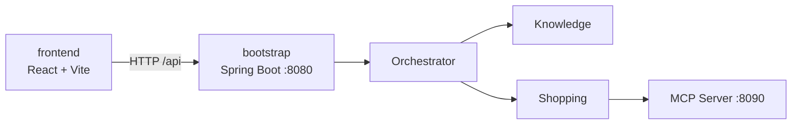
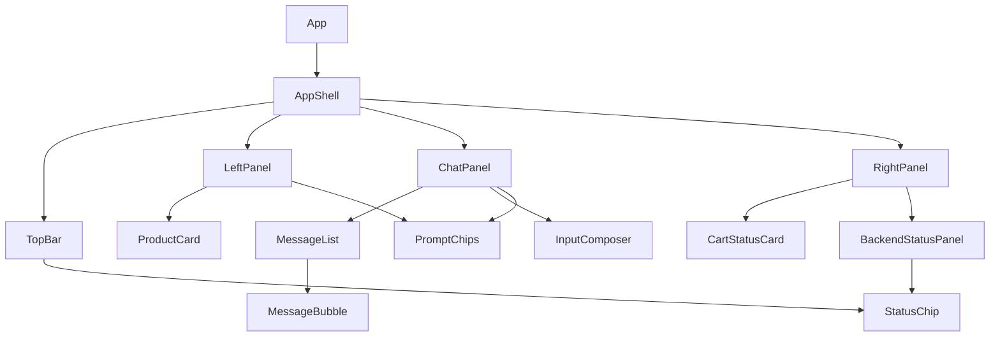
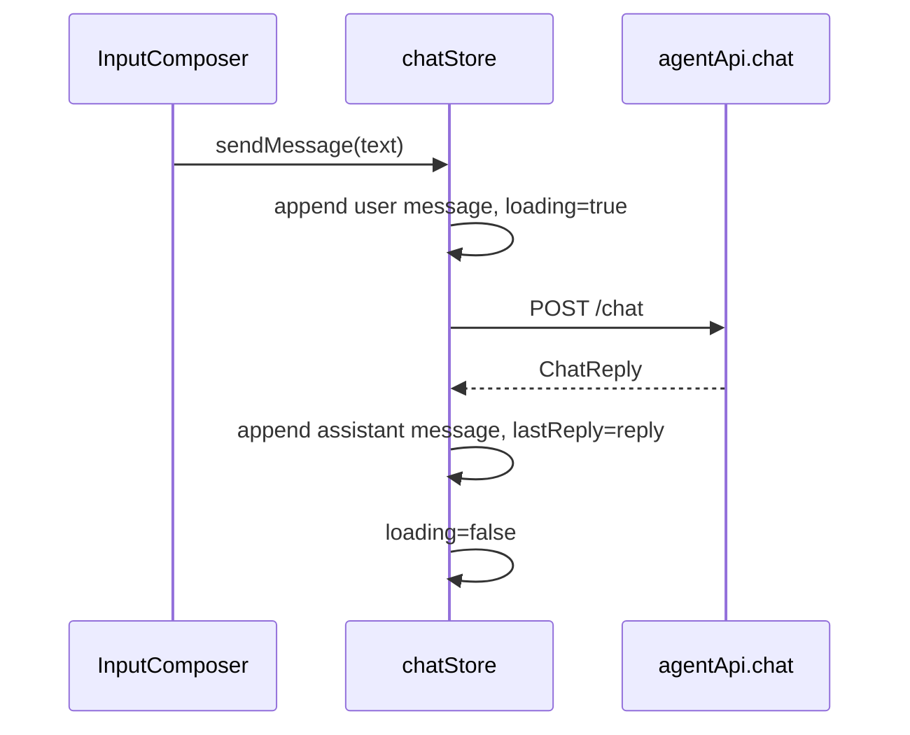

# 小米商城智能导购 Agent · 前端技术架构文档

> 版本：v1.0  
> 日期：2026-06-23  
> 阶段：前端技术架构设计  
> 状态：待用户审核  
> 前置文档：`doc/前端UIUX需求文档.md`、`doc/前端UIUX设计文档.md`、`doc/接口文档.md`  
> 技术选型：React + TypeScript + Vite、Tailwind CSS、Zustand、Axios、Lucide Icons

---

## 1. 文档定位

本文档用于将已审核的前端 UI/UX 需求与设计方案落地为具体技术架构，明确前端工程结构、技术栈、组件拆分、状态管理、接口封装、样式系统、异常处理、测试策略与后续实现顺序。

当前阶段只沉淀技术架构，不进入代码实现。本文档审核通过后，再进入前端测试用例文档阶段；测试文档审核后再开始前端代码实现。

---

## 2. 技术栈总览

| 分类 | 选型 | 用途 | 选择理由 |
|---|---|---|---|
| 构建工具 | Vite | 前端开发服务器、构建、代理 | React TS 官方模板简洁，HMR 快，适合独立前端目录 |
| UI 框架 | React | 组件化 UI | 聊天、卡片、状态面板等交互组件拆分清晰 |
| 类型系统 | TypeScript | 类型约束 | 与后端接口文档对齐，减少联调字段错误 |
| 样式 | Tailwind CSS | 原子化样式与设计 token | 快速落地 UI/UX 文档中的色彩、间距、圆角、响应式 |
| UI 组件思路 | shadcn/ui 风格 | Button、Card、Sheet、Dialog 等 | 不强绑定大型组件库，可复制组件源码并按项目风格定制 |
| 图标 | Lucide React | SVG 图标 | 满足 ui-ux-pro-max “不使用 emoji 作为结构图标”的要求 |
| 状态管理 | React state + Zustand | 聊天、ready 状态、推荐卡片、购物车预览 | Zustand 轻量，支持 selector 和按需持久化 |
| HTTP 客户端 | Axios | REST API 请求 | 支持实例、baseURL、timeout、拦截器、类型化错误处理 |
| 测试 | Vitest + React Testing Library | 单元/组件测试 | 与 Vite 生态匹配，适合组件行为测试 |
| E2E/联调 | Playwright（后续可选） | 浏览器联调测试 | 覆盖真实聊天、澄清、状态面板流程 |

---

## 3. Context7 文档核对摘要

本阶段涉及具体前端库，因此已按全局规则使用 Context7 查询当前文档要点：

1. **Vite**
   - React TS 官方模板使用 `@vitejs/plugin-react`。
   - `server.proxy` 可将 `/api` 代理到后端 `http://localhost:8080`。
   - 自定义环境变量通过 `ImportMetaEnv` 类型增强。

2. **Tailwind CSS**
   - 当前推荐 Vite 集成可使用 `@tailwindcss/vite` 插件。
   - Tailwind v4 支持 CSS-first `@theme` 方式定义设计 token。
   - 设计 token 可沉淀为颜色、字体、断点、动效变量。

3. **Zustand**
   - 推荐使用 `create<T>()` 定义类型化 store。
   - 组件通过 selector 订阅局部状态，避免不必要重渲染。
   - 需要持久化时使用 `persist` 中间件，并通过 `partialize` 只持久化必要字段。

4. **Axios**
   - 推荐使用 `axios.create({ baseURL, timeout })` 创建实例。
   - 请求/响应拦截器可统一处理日志、错误和响应拆包。
   - TypeScript 中通过 `AxiosInstance`、`InternalAxiosRequestConfig` 和 `axios.isAxiosError` 做类型安全处理。

---

## 4. 工程位置与模块边界

### 4.1 目录位置

前端工程放在当前仓库根目录下：

```text
frontend/
```

原因：

1. 当前后端是 Maven 多模块工程，前端独立目录不会污染 Java 模块。
2. 前端可独立安装依赖、启动、构建。
3. 后续可独立部署，也可由后端静态资源托管。

### 4.2 与后端关系



约束：

- 前端只直接调用 Bootstrap REST API。
- 前端不直接调用 Knowledge、Shopping 或 MCP Server。
- 所有用户意图都通过 `/api/chat` 进入主 Agent。

---

## 5. 前端目录结构

建议结构：

```text
frontend/
├── package.json
├── index.html
├── vite.config.ts
├── tsconfig.json
├── tsconfig.app.json
├── src/
│   ├── main.tsx
│   ├── App.tsx
│   ├── styles/
│   │   ├── globals.css              # Tailwind import + @theme token
│   │   └── tokens.css               # 可选：语义变量补充
│   ├── api/
│   │   ├── httpClient.ts            # Axios 实例、拦截器、错误归一化
│   │   ├── agentApi.ts              # chat/health/ready API 封装
│   │   └── types.ts                 # API 请求/响应类型
│   ├── stores/
│   │   ├── chatStore.ts             # messages/loading/conversationId
│   │   ├── statusStore.ts           # health/ready 状态
│   │   └── uiStore.ts               # sheet/tab/theme 等 UI 状态
│   ├── components/
│   │   ├── common/
│   │   │   ├── Button.tsx
│   │   │   ├── Card.tsx
│   │   │   ├── StatusChip.tsx
│   │   │   ├── Skeleton.tsx
│   │   │   └── IconButton.tsx
│   │   ├── chat/
│   │   │   ├── ChatPanel.tsx
│   │   │   ├── MessageList.tsx
│   │   │   ├── MessageBubble.tsx
│   │   │   ├── InputComposer.tsx
│   │   │   └── PromptChips.tsx
│   │   ├── product/
│   │   │   └── ProductCard.tsx
│   │   ├── cart/
│   │   │   └── CartStatusCard.tsx
│   │   ├── status/
│   │   │   └── BackendStatusPanel.tsx
│   │   └── layout/
│   │       ├── AppShell.tsx
│   │       ├── TopBar.tsx
│   │       ├── LeftPanel.tsx
│   │       ├── RightPanel.tsx
│   │       └── MobileBottomSheet.tsx
│   ├── data/
│   │   ├── quickPrompts.ts          # 快捷操作配置
│   │   └── mockProducts.ts          # 首期推荐卡片 mock 数据
│   ├── utils/
│   │   ├── ids.ts                   # conversationId/userId 生成
│   │   ├── responseParser.ts        # 从 answer 中提取购物/物流提示
│   │   └── statusMapping.ts         # ready 状态映射文案/颜色
│   └── tests/
│       └── setup.ts
└── README.md
```

---

## 6. Vite 配置设计

### 6.1 基础配置

采用 React + TypeScript 官方模板风格：

```ts
import { defineConfig, loadEnv } from 'vite'
import react from '@vitejs/plugin-react'
import tailwindcss from '@tailwindcss/vite'

export default defineConfig(({ mode }) => {
  const env = loadEnv(mode, process.cwd(), '')

  return {
    plugins: [react(), tailwindcss()],
    server: {
      port: Number(env.VITE_DEV_PORT || 5173),
      proxy: {
        '/api': {
          target: env.VITE_API_PROXY_TARGET || 'http://localhost:8080',
          changeOrigin: true,
        },
      },
    },
  }
})
```

### 6.2 环境变量

`.env.development` 示例：

```text
VITE_DEV_PORT=5173
VITE_API_BASE_URL=/api
VITE_API_PROXY_TARGET=http://localhost:8080
```

`vite-env.d.ts` 类型增强：

```ts
interface ImportMetaEnv {
  readonly VITE_API_BASE_URL: string
  readonly VITE_API_PROXY_TARGET?: string
  readonly VITE_DEV_PORT?: string
}

interface ImportMeta {
  readonly env: ImportMetaEnv
}
```

---

## 7. 样式架构

### 7.1 Tailwind CSS 策略

采用 Tailwind CSS + CSS-first token 方案，将 UI/UX 设计文档中的视觉规范沉淀为语义变量。

`globals.css` 示例：

```css
@import "tailwindcss";

@theme {
  --color-brand: #ff6900;
  --color-brand-soft: #fff3ea;
  --color-ai-primary: #7c3aed;
  --color-ai-secondary: #6366f1;
  --color-accent: #ec4899;
  --color-background: #f8fafc;
  --color-surface: #ffffff;
  --color-foreground: #0f172a;
  --color-muted: #64748b;
  --color-border: #e2e8f0;
  --color-success: #16a34a;
  --color-warning: #f59e0b;
  --color-danger: #dc2626;

  --radius-sm: 8px;
  --radius-md: 12px;
  --radius-lg: 16px;
  --radius-xl: 24px;
}
```

### 7.2 设计 token 规则

- 组件中尽量使用语义 token，不散落随机 hex。
- 状态色必须绑定语义：success/warning/danger。
- 间距遵循 4/8px rhythm。
- 动效时长统一为 150–300ms。
- `prefers-reduced-motion` 下禁用非必要动效。

### 7.3 响应式策略

| 断点 | 布局 |
|---|---|
| `< 768px` | 单栏聊天，推荐/状态通过底部 Sheet 展示 |
| `768px - 1023px` | 双栏：聊天 + 侧边 Tab |
| `>= 1024px` | 三栏工作台 |
| `>= 1440px` | 增加 max-width 与留白 |

---

## 8. API 类型与接口封装

### 8.1 类型定义

`src/api/types.ts`：

```ts
export interface ChatRequest {
  userId?: string
  conversationId?: string
  message: string
}

export type AgentIntent = 'KNOWLEDGE' | 'TOOL' | 'SYSTEM' | string

export interface ChatReply {
  answer: string
  intent?: AgentIntent | null
  needClarify?: boolean
  qualityLevel?: string | null
  retryCount?: number | null
  childCalls?: number | null
}

export interface HealthResponse {
  status: string
  project: string
  arch: string
}

export interface ReadyResponse {
  bootstrap: string
  orchestrator: string
  knowledgeGateway: string
  shoppingGateway: string
  postgres: string
  redis: string
  mcpserver: string
  chatModel: string
  embeddingModel: string
  rerank: string
  status: 'UP' | 'DEGRADED' | 'DOWN' | string
}
```

### 8.2 Axios 实例

`src/api/httpClient.ts`：

```ts
import axios, { type AxiosInstance } from 'axios'

export const httpClient: AxiosInstance = axios.create({
  baseURL: import.meta.env.VITE_API_BASE_URL || '/api',
  timeout: 15000,
})

httpClient.interceptors.response.use(
  response => response,
  error => Promise.reject(normalizeApiError(error)),
)
```

错误归一化目标：

```ts
export interface ApiError {
  message: string
  status?: number
  code?: string
  raw?: unknown
}
```

### 8.3 API 封装

`src/api/agentApi.ts`：

```ts
export const agentApi = {
  chat: (body: ChatRequest) =>
    httpClient.post<ChatReply>('/chat', body).then(res => res.data),

  health: () =>
    httpClient.get<HealthResponse>('/health').then(res => res.data),

  ready: () =>
    httpClient.get<ReadyResponse>('/ready').then(res => res.data),
}
```

---

## 9. 状态管理设计

### 9.1 状态边界

| Store | 职责 | 是否持久化 |
|---|---|---|
| `chatStore` | 当前会话 ID、消息列表、loading、最近响应元信息 | conversationId 可持久化，messages 首期可不持久化 |
| `statusStore` | health/ready 状态、刷新时间、刷新 loading/error | 不持久化 |
| `uiStore` | 移动端 sheet、侧栏 tab、主题偏好 | theme 可持久化 |

### 9.2 chatStore 设计

状态：

```ts
interface ChatMessage {
  id: string
  role: 'user' | 'assistant' | 'system' | 'error'
  content: string
  createdAt: number
  meta?: {
    intent?: string | null
    needClarify?: boolean
    qualityLevel?: string | null
    retryCount?: number | null
    childCalls?: number | null
  }
}

interface ChatState {
  userId: string
  conversationId: string
  messages: ChatMessage[]
  loading: boolean
  lastReply?: ChatReply
  sendMessage: (message: string) => Promise<void>
  resetConversation: () => void
}
```

设计原则：

- `sendMessage` 负责追加用户消息、调用 API、追加 Agent 消息、处理错误。
- 组件通过 selector 读取局部状态。
- 不在组件中散落 API 调用逻辑。

### 9.3 statusStore 设计

```ts
interface StatusState {
  health?: HealthResponse
  ready?: ReadyResponse
  loading: boolean
  error?: ApiError
  lastRefreshedAt?: number
  refresh: () => Promise<void>
}
```

页面初始化时调用一次 `refresh()`，用户也可手动刷新。

---

## 10. 组件架构

### 10.1 组件依赖方向



### 10.2 核心组件职责

| 组件 | 职责 |
|---|---|
| `AppShell` | 页面布局、响应式栏位组织 |
| `TopBar` | 标题、会话状态、聚合状态、刷新按钮 |
| `ChatPanel` | 聊天主区域容器 |
| `MessageList` | 消息流、自动滚动到底部 |
| `MessageBubble` | 不同角色/状态消息展示 |
| `InputComposer` | 输入框、发送按钮、快捷键、loading 禁用 |
| `PromptChips` | 快捷操作 chips |
| `ProductCard` | 推荐商品卡片 |
| `CartStatusCard` | 购物车/订单/澄清/失败状态 |
| `BackendStatusPanel` | health/ready 状态展示 |
| `StatusChip` | UP/DEGRADED/DOWN 等语义状态 |

### 10.3 组件约束

- 组件不直接硬编码接口路径。
- 组件不直接处理 Axios 错误细节。
- 结构图标统一 Lucide，不使用 emoji。
- 可点击元素必须有 `aria-label` 或可见文本。
- loading/disabled/focus 状态必须完整。

---

## 11. 关键交互技术方案

### 11.1 发送消息

流程：



异常时：

- 追加 error message。
- 保留输入或提供重试。
- loading 必须复位。

### 11.2 快捷操作

首期采用“点击填入输入框”策略，降低误触：

1. 点击 chip。
2. 输入框填入预设 prompt。
3. 用户可编辑。
4. 用户点击发送。

后续可加“一键发送”模式。

### 11.3 澄清流程

前端不做复杂槽位合并，只负责：

- 展示 `needClarify=true` 的澄清气泡。
- 保持 `conversationId`。
- 用户补充后再次调用 `/api/chat`。

### 11.4 商品卡片和购物状态

首期后端未返回结构化商品数据，因此采用两层策略：

1. `answer` 原文始终展示，保证真实后端结果可见。
2. `responseParser.ts` 做轻量识别：
   - 包含“加购”/`cartId` → 更新购物车卡片。
   - 包含“orderId”/“订单” → 更新订单卡片。
   - 包含“物流”/`logisticsNo` → 展示物流卡片。
   - 知识问答/推荐场景 → 展示 mock 推荐商品卡片。

后续如果 `/api/chat` 增加结构化 `data`，直接替换 parser。

---

## 12. 错误、降级与空状态

### 12.1 错误分层

| 层级 | 来源 | UI 处理 |
|---|---|---|
| 网络错误 | Axios timeout/network | 聊天区 error bubble + 重试按钮 |
| HTTP 错误 | 4xx/5xx | 显示状态码和可读文案 |
| 业务澄清 | `needClarify=true` | 黄色澄清气泡 |
| ready 降级 | `/api/ready.status=DEGRADED` | 顶部黄色芯片 + 状态面板详情 |
| ready DOWN | `/api/ready.status=DOWN` | 红色芯片 + 禁用或弱化发送按钮（可配置） |

### 12.2 空状态

- 初始聊天欢迎卡。
- 推荐卡片空状态。
- 购物车空状态。
- 状态面板未刷新状态。

空状态必须提供下一步动作，例如“试试商品咨询”。

---

## 13. 测试策略

前端代码实现前应先写测试文档；技术层面建议如下。

### 13.1 单元/组件测试

工具：Vitest + React Testing Library。

覆盖：

| 对象 | 测试点 |
|---|---|
| `MessageBubble` | 不同 role/status 渲染 |
| `InputComposer` | 空输入禁用、Enter 发送、loading 禁用 |
| `StatusChip` | 不同状态文案和样式 |
| `BackendStatusPanel` | UP/DEGRADED/DOWN 展示 |
| `responseParser` | 购物/订单/物流文本识别 |
| stores | sendMessage 成功/失败流程 |

### 13.2 集成测试

使用 Mock Service Worker 或 API mock：

- `/api/chat` 成功。
- `/api/chat` needClarify。
- `/api/chat` 失败。
- `/api/ready` UP。
- `/api/ready` DEGRADED。
- `/api/ready` DOWN。

### 13.3 E2E 测试

后续可用 Playwright：

1. 打开页面。
2. ready 状态加载。
3. 发送商品咨询。
4. 展示 Agent 回复。
5. 触发加购快捷操作。
6. 展示澄清或成功状态。
7. 手动刷新状态面板。

### 13.4 覆盖目标

按项目流程，测试用例业务覆盖目标 **95%+**。前端代码覆盖率建议：

- 组件/工具函数：尽量 90%+。
- 核心交互路径：必须覆盖。
- 视觉细节不以代码覆盖率衡量，但需有验收 checklist。

---

## 14. 构建与运行脚本

建议 `package.json` scripts：

```json
{
  "scripts": {
    "dev": "vite",
    "build": "tsc -b && vite build",
    "preview": "vite preview",
    "lint": "eslint .",
    "test": "vitest",
    "test:coverage": "vitest --coverage"
  }
}
```

---

## 15. 实现顺序建议

审核通过并完成测试文档后，按以下顺序实现：

1. 初始化 `frontend/` 工程与基础依赖。
2. 配置 Vite、Tailwind、TypeScript、路径别名。
3. 沉淀基础 token 和 common 组件。
4. 封装 API client 与类型。
5. 实现 Zustand stores。
6. 实现 AppShell 三栏/响应式布局。
7. 实现 ChatPanel 消息流与输入区。
8. 接入 `/api/chat`。
9. 实现 BackendStatusPanel 并接入 `/api/health`、`/api/ready`。
10. 实现 ProductCard、CartStatusCard 与轻量 parser。
11. 补齐 loading/error/degraded/empty 状态。
12. 完成组件测试与联调测试。
13. 根据验收 checklist 修正 UI/UX 细节。

---

## 16. 待确认技术项

当前按用户“按推荐继续”已确认：

- React + TypeScript + Vite。
- Tailwind CSS + shadcn/ui 思路。
- Lucide React 图标。
- React state + Zustand。
- Axios + typed API client。
- `frontend/` 独立目录。

后续可在实现前进一步确认：

1. Node.js 版本要求。
2. 是否启用 ESLint/Prettier 严格规则。
3. 是否需要暗色模式首期同步实现。
4. 是否需要 Playwright E2E 首期落地。
5. 是否需要后端新增结构化 `data` 字段。

---

## 17. 下一步

本文档审核通过后，按 development-process-skills 进入下一阶段：

```text
前端测试计划/测试用例文档
```

测试文档审核通过后，才进入 `frontend/` 工程初始化与代码实现。
