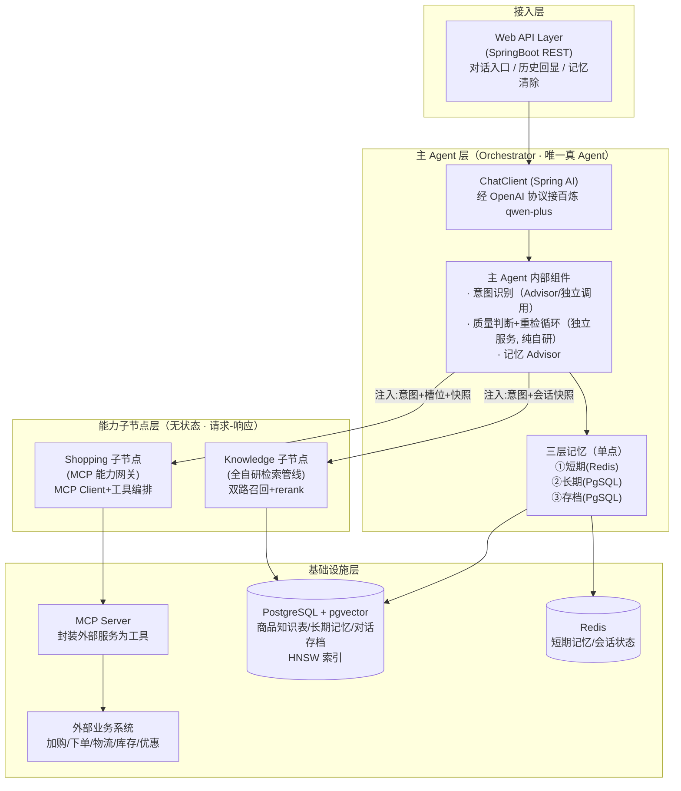
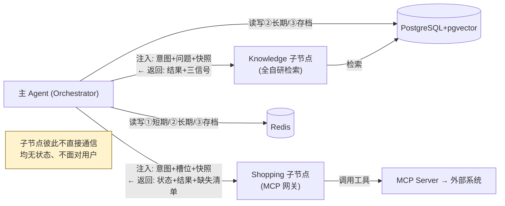
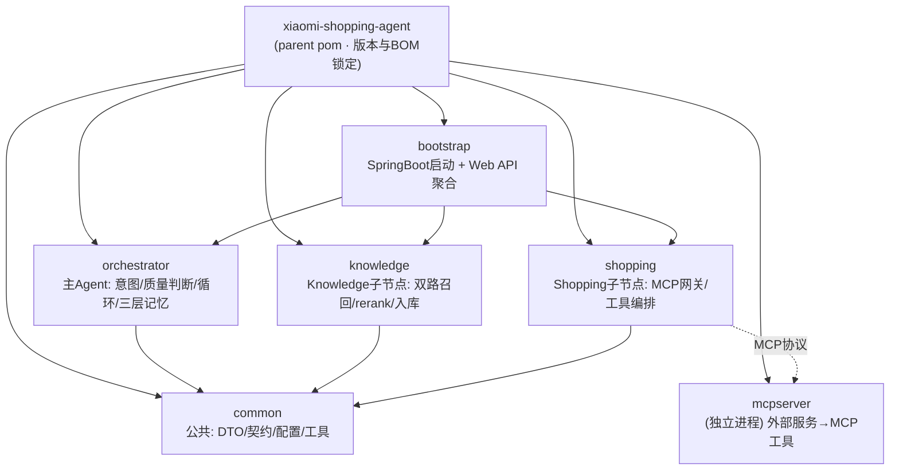

# 小米商城智能导购 Agent · 技术架构总纲

> 版本：v1.0 ｜ 定稿日期：2026-06-21
> 文档层级：**技术架构层（总纲）**
> 对应关系：本文档是逻辑设计文档 [架构.md](../架构.md) 的技术落地总纲；各 Agent 的实现细节见同目录的 3 份细化文档。
>
> - 逻辑设计（做什么/怎么做）：[架构.md](../架构.md)
> - 技术总纲（本文）：技术栈选型、分层架构、公共基础设施、各 Agent 技术落点映射
> - 细化文档：[主Agent-技术架构.md](主Agent-技术架构.md) ｜ [知识库Agent-技术架构.md](知识库Agent-技术架构.md) ｜ [购物Agent-技术架构.md](购物Agent-技术架构.md)

---

## 0. 文档定位

- 本文是**技术架构层的总纲**，回答「用什么技术栈、整体怎么分层、公共基础设施怎么搭、各 Agent 用框架还是自研」。
- **不重复**逻辑设计文档已讲清的职责边界与数据流（那些以 [架构.md](../架构.md) 为准）；本文聚焦技术落地。
- 若技术实现与逻辑设计冲突，**逻辑设计优先**，回头修订本文档。

---

## 1. 技术栈总览

> **约束**：JDK 17（硬性限制）。版本经官方兼容矩阵核对，详见 §6 版本与依赖。

| 分类 | 选型 | 版本 | 用途 | 选型理由 |
|----|----|----|----|----|
| 语言/JDK | **Java** | **17**（LTS） | 全栈实现 | 用户硬性约束；Spring Boot 3.4.x 要求 17+ |
| 构建 | **Maven** | 3.9.x（多模块） | 依赖管理与打包 | 多模块工程标准 |
| 基础框架 | **Spring Boot** | **3.4.5** | Web/配置/自动装配 | Spring AI 1.1.2 兼容 3.4.x，3.4.5 为推荐稳定版 |
| AI 框架 | **Spring AI** | **1.1.2**（BOM 对齐） | ChatClient/Advisor/VectorStore/MCP 抽象 | 标准抽象层；多模型统一接入 |
| AI 模型接入 | **Spring AI OpenAI starter** | 1.1.2 | Chat/Embedding 经 OpenAI 兼容协议接入 | 百炼/硅基流动均提供 OpenAI 兼容端点，统一协议、坑少 |
| Chat 模型 | **阿里云百炼 qwen-plus** | qwen-plus-2025-07-28 | 意图识别、查询重写、答案生成、记忆提炼 | 经百炼 OpenAI 兼容模式接入；原生支持 Spring AI ChatClient |
| Embedding 模型 | **硅基流动 Qwen3-Embedding-8B** | 8B（**1024 维**，dimensions 可选 64~4096） | 商品知识向量化、查询向量化 | 经硅基流动 OpenAI 兼容 `/v1/embeddings` 接入；维度实测 1024（带入参） |
| Rerank 模型 | **硅基流动 Qwen3-Reranker-8B** | 8B | 双路召回后的 cross-encoder 重排序 | 专用 rerank 模型，精度优于自研加权打分；经 `/v1/rerank` 接入 |
| 数据库 + 向量库 | **PostgreSQL + pgvector** | PG 15 / pgvector 0.7+ | 结构化数据 + 向量存储（单库双能） | 一库双能，500 SKU 够用；与 Docker 镜像一致 |
| 向量索引 | **HNSW** | pgvector 内置 | 向量近似最近邻检索 | 小数据量高召回低延迟，优于 IVF |
| 缓存 | **Redis** | 7.x | ①短期记忆、会话状态、热点缓存 | 低延迟，天然适合工作记忆 |
| ORM | **MyBatis-Plus** | 3.5.x | 操作 PostgreSQL 结构化数据 | 主流 ORM，支持原生 SQL（关键词路必需） |
| 文档解析 | **Apache Tika** | 2.x（tika-core/parsers） | 商品资料入库解析（PDF/Word/HTML） | 多格式解析，知识库构建前置 |
| 工具协议 | **MCP** | Spring AI MCP（BOM 对齐） | 外置服务封装为标准工具，Shopping 接入 | 统一工具协议，解耦外部服务 |
| 工具库 | **Lombok** | 1.18.x（Spring Boot 管理） | 简化样板代码 | Spring Boot BOM 已管理版本 |
| 测试 | **JUnit 5 + Spring Boot Test** | BOM 对齐 | 单元/集成测试 | Spring Boot Test 内置 |

> 版本兼容核心：**Spring AI 1.1.2 ↔ Spring Boot 3.4.x ↔ JDK 17+**。三者必须成套对齐，错配会导致 Bean 装配/自动配置失败。用 BOM 统一锁定（见 §6.2）。
>
> **模型服务商与端点（均走 OpenAI 兼容协议）：**
> - **Chat**：阿里云百炼 `https://dashscope.aliyuncs.com/compatible-mode/v1`，模型 `qwen-plus-2025-07-28`
> - **Embedding**：硅基流动 `https://api.siliconflow.cn/v1`，模型 `Qwen/Qwen3-Embedding-8B`，`dimensions=1024`
> - **Rerank**：硅基流动 `https://api.siliconflow.cn/v1/rerank`，模型 `Qwen/Qwen3-Reranker-8B`
>
> **多端点接入方式**：百炼与硅基流动是不同服务商、不同 base-url，Spring AI OpenAI starter 的自动装配只适配单一端点。因此**手动声明 `OpenAiApi` + `OpenAiChatModel` / `OpenAiEmbeddingModel` 两个独立 Bean**（各指不同 base-url），并关闭 starter 的默认 OpenAI 自动装配避免冲突。Rerank 无 Spring AI 抽象，自研 HTTP 客户端（WebClient）调用硅基流动 `/v1/rerank`。详见知识库Agent-技术架构.md §5。

---

## 2. 整体技术分层架构



---

## 3. 三大核心技术决策

### 决策一：框架选 Spring AI（OpenAI 兼容协议多服务商接入）

- **贴合 Java 主线**：主语言是 Java，SpringBoot 是天然底座，项目放大而非绕开已有优势。
- **OpenAI 兼容协议统一接入**：百炼（chat）、硅基流动（embedding/rerank）均提供 OpenAI 兼容端点。用 Spring AI 原生 OpenAI 接入，一套 `OpenAiApi` 抽象覆盖多服务商，避免被单一厂商 starter 绑定。
- **多端点灵活**：chat 与 embedding 来自不同服务商、不同 base-url，通过手动声明 `OpenAiChatModel`/`OpenAiEmbeddingModel` 两个 Bean 各自指向，比单一厂商 starter 更灵活。
- **MCP 内置**：Spring AI 自带 MCP Client/Server，Shopping 子节点「外置服务封装为 MCP 工具」直接用框架能力。
- **自研模块不受限**：双路召回、rerank 调用编排、质量判断逻辑，框架不干涉。
- **rerank 自研客户端**：Spring AI 无 rerank 抽象，对硅基流动 `/v1/rerank` 自研 WebClient 客户端（cross-encoder 模型）。
- **简历辨识度**：Java + Spring AI + 多模型编排（chat/embedding/rerank 三类模型协同）+ 自研检索管线，工程完整度高。
- **代价**：放弃 SpringAI-Alibaba 的 Agent Framework 编排糖（用不上，主 Agent 闭环自研）；对 500 SKU 导购 demo 无功能缺口。

### 决策二：存储用 PostgreSQL + pgvector（单库双能）

- **结构化 + 向量同库**：商品数据、长期记忆、对话存档、向量都在一个 PostgreSQL，免去独立向量库的同步成本。
- **小数据量够用**：500 SKU 级别，pgvector 性能绰绰有余。
- **运维简单**：个人项目少一个组件少一份负担。
- **MyBatis-Plus + 原生 SQL 兼顾**：结构化数据用 MP，双路召回的关键词路用原生 SQL（tsvector 全文检索）。

### 决策三：向量索引选 HNSW（而非 IVF 类）

- **小数据量最优**：HNSW 在中小数据量下召回率与延迟均优于 IVF/PQ 类。
- **关键参数**（建议起点，待实测标定）：
  - `m = 16`：每个节点的最大连接数，影响索引质量与内存。
  - `ef_construction = 64`：建图时候选邻居数，越大索引质量越好、建得越慢。
  - `ef_search = 40`：查询时候选数，越大召回越高、越慢。
- **IVF 不选的理由**：IVF 依赖聚类中心，小数据量下聚类质量不稳定，需训练 + 调 `nlist/probes`，性价比低。

---

## 4. 各 Agent 技术落点映射

> 声明「框架现成」还是「纯自研」——**自研部分是简历亮点**。

| 架构组件 | 技术落点 | 框架/自研 | 详见 |
|----|----|----|----|
| 主 Agent · ChatClient 入口 | Spring AI ChatClient + OpenAI 协议接百炼 qwen-plus | **框架** | 主Agent文档 §2 |
| 主 Agent · 意图识别 | LLM 意图分类（Advisor / 独立调用）+ 置信度 | **半自研**（prompt 自研，框架承载调用） | 主Agent文档 §3 |
| 主 Agent · 检索质量判断 | 三信号 4 步组合判定 | **纯自研** ★ | 主Agent文档 §4 |
| 主 Agent · 重检循环 | 状态机循环控制（maxRetries=N） | **纯自研** ★ | 主Agent文档 §4 |
| 主 Agent · 三层记忆 | ①Redis 短期 / ②PgSQL 长期 / ③PgSQL 存档 | **半自研**（ChatMemory 框架 + 自定义后端） | 主Agent文档 §5 |
| 主 Agent · 长期记忆提炼 | 会话结束 LLM 批量提炼 | **纯自研** ★ | 主Agent文档 §5 |
| Knowledge · 知识库构建 | Tika 解析 + 切片 + embedding（硅基流动 Qwen3-Embedding-8B）入库 | **自研管线** | 知识库Agent文档 §2 |
| Knowledge · 查询重写/拆分 | LLM prompt（百炼 qwen-plus） | **半自研** | 知识库Agent文档 §3 |
| Knowledge · 双路召回 | 语义路 PgVectorStore + 关键词路原生 SQL | **纯自研编排** ★ | 知识库Agent文档 §4 |
| Knowledge · rerank | 外部 Qwen3-Reranker-8B（cross-encoder）主用，自研加权打分降级兜底 | **自研客户端编排** ★ | 知识库Agent文档 §5 |
| Shopping · MCP Server 封装 | 外部服务→MCP 工具（@McpTool） | **自研封装** | 购物Agent文档 §3 |
| Shopping · MCP 工具接入 | Spring AI MCP Client（ToolCallbackProvider） | **框架** | 购物Agent文档 §4 |
| Shopping · 工具编排 | 确定性编排（按主 Agent 指令） | **自研编排** | 购物Agent文档 §5 |

> ★ 标记为简历重点强调的自研部分。

---

## 5. 公共基础设施约定

### 5.1 pgvector Schema 设计

> 完整库表设计（17 张表，含建表 DDL 与初始化数据）见 [database/数据库设计.md](database/数据库设计.md) 与同目录 `schema.sql` / `init.sql`。此处仅列技术总纲层面需强调的关键点（含优先级），不重复完整 DDL。
>
> 优先级口径：**高** = 核心闭环必需 ｜ **中** = 业务完整度 ｜ **低** = 可观测增强（与 [数据库设计.md §2](database/数据库设计.md) 一致）。

**双路召回的存储落点（核心，优先级：高）：**

| 召回路 | 落点表 | 优先级 | 索引 | 说明 |
|---|---|---|---|---|
| 语义路 | `t_knowledge_vector` | 高 | **HNSW** `vector_cosine_ops` (m=16, ef_construction=64) | 向量与文本分离存储，便于重建索引 |
| 关键词路 | `t_knowledge_chunk` | 高 | **GIN**(tsv) + 触发器维护 tsv | tsv 由 `tsvector_update_trigger` 自动维护 |

- 切片表 `t_knowledge_chunk` 含独立 `title / spec_text` 列，供 rerank 字段加权（详见 [知识库Agent-技术架构.md §5](知识库Agent-技术架构.md)）。
- 向量表 `t_knowledge_vector` 通过 `chunk_id` 回链切片文本源。
- 向量维度 `VECTOR(1024)`（通义 text-embedding-v3，待实测确认）。

**三层记忆的存储落点：**

| 记忆层 | 落点表 | 优先级 | 说明 |
|---|---|---|---|
| ① 短期记忆 | **Redis**（不在 PG） | 高 | 最近 N 轮，详见 §5.2 |
| ② 长期记忆 | `t_user_longterm_memory` | 高 | mem_type 区分画像/偏好/决策/槽位，weight 支撑淘汰 |
| ③ 对话存档 | `t_message`（逐字）+ `t_conversation_summary`（摘要） | 高 / 中 | 逐字存档必需；摘要表长会话才必需，中优先级 |

> 关键约束：存档 ③ **不进默认上下文**（对齐 [架构.md §6](../架构.md)），避免 token 爆炸。

> 查询时关键词路用 `ts_rank(tsv, plainto_tsquery(...))`；语义路用 `<=>`（余弦距离）+ HNSW。

**全量 17 表按业务域的优先级一览（详见 [数据库设计.md §2](database/数据库设计.md)）：**

| 业务域 | 表 | 优先级 |
|---|---|---|
| 用户与会话域 | `t_user` / `t_conversation` | 高 |
| 三层记忆域 | `t_message` / `t_user_longterm_memory`（高）；`t_conversation_summary`（中） | 高 / 中 |
| 知识库域 | `t_knowledge_base` / `t_knowledge_document` / `t_knowledge_chunk` / `t_knowledge_vector` | 高 |
| 意图与查询域 | `t_intent_node`（高）；`t_query_term_mapping`（中） | 高 / 中 |
| 商品业务域 | `t_category` / `t_product_spu` / `t_product_sku` | 中 |
| 购物业务域 | `t_cart_item` / `t_order` | 中 |
| 链路追踪域 | `t_agent_trace` | 低 |

### 5.2 Redis 用途约定（①短期记忆）

```
Key:   chat:session:{sessionId}:messages
Type:  List (最近 N 轮 User/Assistant 消息)
TTL:   会话级（如 24h）
```

短期记忆用 Spring AI 的 `ChatMemory` 抽象承载。注意：Spring AI 内置后端仅有 `InMemoryChatMemoryRepository` 与 `JdbcChatMemoryRepository`，**无官方 Redis 实现**——Redis 后端需**自研实现 `ChatMemoryRepository` 接口**（用 RedisTemplate），或直接用 `MessageChatMemoryAdvisor` + 自研 Redis repository；也可退而用 `JdbcChatMemoryRepository`（落 PostgreSQL）。详见 [主Agent-技术架构.md §5](主Agent-技术架构.md)。

### 5.3 MCP 接入约定

- **外部业务服务**（加购/下单/物流/库存/优惠）封装为 **MCP Server**，对外暴露标准工具。
- **Shopping 子节点**用 **MCP Client**（Spring AI 的 `ToolCallbackProvider`）统一接入。
- **主 Agent 不直接调 MCP**——它通过 Shopping 网关间接调用（保持能力正交 P5）。

### 5.4 模型调用约定（多服务商 OpenAI 协议接入）

> chat（百炼）与 embedding（硅基流动）来自不同服务商、不同 base-url，Spring AI OpenAI starter 的自动装配只适配单一端点。因此**手动声明独立 Bean**，关闭默认自动装配，避免冲突。

- **Chat 模型**：阿里云百炼 `qwen-plus-2025-07-28`，用于意图识别、查询重写、答案生成、记忆提炼。
- **Embedding 模型**：硅基流动 `Qwen/Qwen3-Embedding-8B`（dimensions=1024），用于商品知识与查询向量化。
- **Rerank 模型**：硅基流动 `Qwen/Qwen3-Reranker-8B`（cross-encoder），用于双路召回后重排序。

```java
// Chat Bean（接百炼）
@Bean
public OpenAiChatModel chatModel() {
    OpenAiApi api = OpenAiApi.builder()
            .baseUrl("https://dashscope.aliyuncs.com/compatible-mode/v1")
            .apiKey(System.getenv("DASHSCOPE_API_KEY"))
            .build();
    return OpenAiChatModel.builder()
            .openAiApi(api)
            .defaultOptions(OpenAiChatOptions.builder().model("qwen-plus-2025-07-28").build())
            .build();
}

// Embedding Bean（接硅基流动）
@Bean
public OpenAiEmbeddingModel embeddingModel() {
    OpenAiApi api = OpenAiApi.builder()
            .baseUrl("https://api.siliconflow.cn/v1")
            .apiKey(System.getenv("SILICONFLOW_API_KEY"))
            .build();
    return OpenAiEmbeddingModel.builder()
            .openAiApi(api)
            .defaultOptions(OpenAiEmbeddingOptions.builder()
                    .model("Qwen/Qwen3-Embedding-8B")
                    .build())
            .build();   // dimensions=1024 由调用方按需传入 metadata options
}

// ChatClient 由 chatModel 构建
ChatClient chatClient = ChatClient.builder(chatModel).defaultSystem("...").build();
```

> **Rerank**：Spring AI 无 rerank 抽象，自研 WebClient 客户端调硅基流动 `/v1/rerank`（POST，body 含 model/query/documents/top_n，响应含每条 relevance_score）。实现见知识库Agent-技术架构.md §5。
>
> **API Key 安全**：所有 key 经环境变量注入（`DASHSCOPE_API_KEY` / `SILICONFLOW_API_KEY`），配合 `application-local.yml`（已 gitignore）覆盖本地配置，**禁止硬编码入库**。

---

## 6. 跨 Agent 依赖关系



---

## 7. 版本与依赖（Maven）

> 本章锁定全项目版本，是开发的**硬约束**。版本经官方兼容矩阵核对，后续不得随意升级，升级须重验兼容性。

### 7.1 版本兼容矩阵（核心）

| 组件 | 版本 | 说明 |
|---|---|---|
| **JDK** | 17（LTS） | 用户硬性约束；Spring Boot 3.4.x 最低要求 17 |
| **Spring Boot** | 3.4.5 | Spring AI 1.1.2 兼容 3.4.x，3.4.5 为稳定版 |
| **Spring AI** | 1.1.2 | 主框架版本，BOM 统一锁定 |
| **Spring AI OpenAI starter** | 1.1.2 | chat/embedding 经 OpenAI 兼容协议接入百炼/硅基流动 |
| **MyBatis-Plus** | 3.5.12 | 需 mybatis-plus-spring-boot3-starter（Boot 3 专用）+ mybatis-plus-jsqlparser（分页插件） |
| **PostgreSQL JDBC** | 42.7.4 | 驱动 |
| **pgvector-java** | 0.1.6 | PGvector 类型支持（向量读写） |
| **Apache Tika** | 2.9.2 | tika-core + tika-parsers-standard-package |
| **Redis (Lettuce)** | Spring Data Redis 管理 | Spring Boot Data Redis starter |
| **Lombok** | Spring Boot BOM 管理 | 不单独指定版本 |

> ⚠️ **铁律**：Spring Boot / Spring AI **成套对齐**（3.4.x / 1.1.2），错配会导致 `ChatClient`、`VectorStore`、MCP 等自动装配失败。
>
> **弃用 SAA（spring-ai-alibaba）**：本次技术栈调整改为 Spring AI 原生 OpenAI 接入后，不再依赖 spring-ai-alibaba-bom / spring-ai-alibaba-extensions-bom / starter-dashscope / agent-framework。parent pom 同步移除相关 BOM import 与属性。

### 7.2 版本属性锁定（parent pom properties）

```xml
<properties>
    <java.version>17</java.version>
    <maven.compiler.source>17</maven.compiler.source>
    <maven.compiler.target>17</maven.compiler.target>
    <project.build.sourceEncoding>UTF-8</project.build.sourceEncoding>

    <!-- 框架版本（成套对齐） -->
    <spring-boot.version>3.4.5</spring-boot.version>
    <spring-ai.version>1.1.2</spring-ai.version>

    <!-- 中间件/库版本 -->
    <mybatis-plus.version>3.5.12</mybatis-plus.version>
    <postgresql.version>42.7.4</postgresql.version>
    <pgvector-java.version>0.1.6</pgvector-java.version>
    <tika.version>2.9.2</tika.version>
</properties>
```

### 7.3 BOM 依赖管理（parent pom dependencyManagement）

> 用 BOM 统一锁定 Spring AI 版本，子模块只引依赖、不写版本，杜绝冲突。**不再 import spring-ai-alibaba 系列 BOM**。

```xml
<dependencyManagement>
    <dependencies>
        <!-- Spring Boot BOM -->
        <dependency>
            <groupId>org.springframework.boot</groupId>
            <artifactId>spring-boot-dependencies</artifactId>
            <version>${spring-boot.version}</version>
            <type>pom</type>
            <scope>import</scope>
        </dependency>

        <!-- Spring AI BOM -->
        <dependency>
            <groupId>org.springframework.ai</groupId>
            <artifactId>spring-ai-bom</artifactId>
            <version>${spring-ai.version}</version>
            <type>pom</type>
            <scope>import</scope>
        </dependency>

        <!-- 其他需手动锁版本 -->
        <dependency>
            <groupId>com.baomidou</groupId>
            <artifactId>mybatis-plus-spring-boot3-starter</artifactId>
            <version>${mybatis-plus.version}</version>
        </dependency>
        <dependency>
            <groupId>com.baomidou</groupId>
            <artifactId>mybatis-plus-jsqlparser</artifactId>
            <version>${mybatis-plus.version}</version>
        </dependency>
        <dependency>
            <groupId>org.postgresql</groupId>
            <artifactId>postgresql</artifactId>
            <version>${postgresql.version}</version>
        </dependency>
        <dependency>
            <groupId>com.pgvector</groupId>
            <artifactId>pgvector</artifactId>
            <version>${pgvector-java.version}</version>
        </dependency>
        <dependency>
            <groupId>org.apache.tika</groupId>
            <artifactId>tika-core</artifactId>
            <version>${tika.version}</version>
        </dependency>
        <dependency>
            <groupId>org.apache.tika</groupId>
            <artifactId>tika-parsers-standard-package</artifactId>
            <version>${tika.version}</version>
        </dependency>
    </dependencies>
</dependencyManagement>
```

### 7.4 仓库配置（parent pom）

> Spring AI / SAA 制品部分在 Maven Central，但建议显式声明 Spring Milestones 仓库以兼容历史里程碑版（当前用 GA，可保留备用）。

```xml
<repositories>
    <repository>
        <id>spring-milestones</id>
        <name>Spring Milestones</name>
        <url>https://repo.spring.io/milestone</url>
        <snapshots><enabled>false</enabled></snapshots>
    </repository>
    <repository>
        <id>aliyun-public</id>
        <url>https://maven.aliyun.com/repository/public</url>
    </repository>
</repositories>
```

### 7.5 各模块依赖速查

| 模块 | 关键依赖（artifactId） |
|---|---|
| **common** | spring-boot-starter / mybatis-plus-spring-boot3-starter / mybatis-plus-jsqlparser / postgresql / pgvector / lombok |
| **orchestrator** | spring-ai-starter-model-openai（chat，接百炼）/ spring-ai-openai（手动 ChatModel Bean）/ spring-boot-starter-data-redis / spring-boot-starter-web / common |
| **knowledge** | spring-ai-starter-vector-store-pgvector / spring-ai-openai（手动 EmbeddingModel Bean 接硅基流动）/ mybatis-plus / tika-core / tika-parsers / common |
| **shopping** | spring-ai-starter-mcp-client / common |
| **bootstrap** | spring-boot-starter-web / orchestrator / knowledge / shopping（聚合启动） |
| **mcpserver** | spring-ai-starter-mcp-server-webmvc（独立进程，详见 [购物Agent-技术架构.md §3](购物Agent-技术架构.md)） |

> **多端点手动 Bean**：chat 与 embedding 来自不同服务商，需手动声明 `OpenAiApi` + `OpenAiChatModel` / `OpenAiEmbeddingModel` 两个 Bean（各指不同 base-url），并关闭 `OpenAiChatAutoConfiguration`/`OpenAiEmbeddingAutoConfiguration` 默认装配。Rerank 无 starter，自研 WebClient 客户端调硅基流动 `/v1/rerank`。
>
> artifactId 已全部经 Context7 + 实测核对（Spring AI 1.1.2 新命名规则）：`spring-ai-starter-model-openai` / `spring-ai-starter-vector-store-pgvector` / `spring-ai-starter-mcp-client` / `spring-ai-starter-mcp-server-webmvc`。

---

## 8. 多模块工程结构（Maven）

> Maven 多模块：1 个 parent（xiaomi-shopping-agent）+ 4 个核心模块 + 1 个 bootstrap 启动模块。模块边界严格对齐架构文档三节点职责（P5 能力正交）。

### 8.1 模块划分



| 模块 | 职责 | 对应架构 | 依赖 |
|---|---|---|---|
| **common** | 跨模块公共：会话快照/契约 DTO、全局配置、工具类、统一异常 | 横切 | 无（仅 Spring Boot 基础） |
| **orchestrator** | 主 Agent：意图识别、质量判断、重检循环、三层记忆、委派编排 | 主 Agent | common + SAA + Redis |
| **knowledge** | Knowledge 子节点：知识库构建（Tika）、查询重写、双路召回、rerank、置信信号 | Knowledge | common + pgvector + MyBatis + Tika |
| **shopping** | Shopping 子节点：MCP Client 接入、确定性工具编排、状态信号 | Shopping | common + Spring AI MCP Client |
| **bootstrap** | Spring Boot 启动入口、Web API、各模块装配聚合 | 启动 | orchestrator + knowledge + shopping |
| **mcpserver** | 外部业务服务封装为 MCP 工具（独立进程，demo 可选） | Shopping 的外部 | Spring AI MCP Server |

> **依赖方向**：common ← 三节点模块 ← bootstrap；三节点模块之间**不直接依赖**（对齐 P5 子节点不互通）。shopping 经 MCP 协议调 mcpserver，非 Java 包依赖。

### 8.2 目录结构

```
xiaomi-shopping-agent/                    # parent (根 pom.xml: packaging=pom)
├── pom.xml                               # parent: 版本属性 + BOM + 模块声明
├── common/
│   ├── pom.xml
│   └── src/main/java/com/xiaomi/shopping/agent/common/
│       ├── contract/                     # 跨节点契约: SessionSnapshot/IntentResult/QualityVerdict/...
│       ├── dto/                          # KnowledgeResponse/ShoppingResponse/...
│       ├── config/                       # 全局配置: pgvector/redis/dashscope/线程池
│       ├── exception/                    # 统一异常
│       └── util/
├── orchestrator/
│   ├── pom.xml
│   └── src/main/java/com/xiaomi/shopping/agent/orchestrator/
│       ├── chatclient/                   # ChatClient 构建 + Advisor 装配
│       ├── intent/                       # 意图识别 (LLM 分类 + 置信度)
│       ├── judge/                        # ★ 质量判断 + 重检循环 (纯自研)
│       ├── memory/                       # ★ 三层记忆 (Redis短期/PgSQL长期+存档)
│       └── dispatch/                     # 任务委派 + 跨节点编排
├── knowledge/
│   ├── pom.xml
│   └── src/main/java/com/xiaomi/shopping/agent/knowledge/
│       ├── ingest/                       # Tika 解析 + 切片 + embedding 入库
│       ├── rewrite/                      # 查询重写 + 子问题拆分
│       ├── recall/                       # ★ 双路召回 (语义PgVectorStore+关键词SQL) + 并行编排
│       ├── rerank/                       # ★ 加权 rerank (纯自研)
│       └── service/                      # KnowledgeService 入口 + 契约组装
├── shopping/
│   ├── pom.xml
│   └── src/main/java/com/xiaomi/shopping/agent/shopping/
│       ├── mcpclient/                    # MCP Client 接入 (ToolCallbackProvider)
│       ├── orchestration/                # 确定性工具编排
│       └── service/                      # ShoppingService 入口 + 状态信号组装
├── bootstrap/
│   ├── pom.xml
│   └── src/main/java/com/xiaomi/shopping/agent/
│       ├── Application.java              # @SpringBootApplication 启动类
│       └── web/                          # REST API: 对话入口/历史回显/记忆清除
└── mcpserver/                            # (可选, 独立进程)
    ├── pom.xml
    └── src/main/java/com/xiaomi/shopping/agent/mcpserver/
        ├── cart/                         # 加购工具 (@McpTool)
        ├── order/                        # 下单工具
        ├── logistics/                    # 物流工具
        └── promotion/                    # 库存/优惠工具
```

### 8.3 模块 pom 依赖示例（orchestrator）

```xml
<!-- orchestrator/pom.xml -->
<dependencies>
    <!-- 内部模块 -->
    <dependency>
        <groupId>com.xiaomi.shopping</groupId>
        <artifactId>common</artifactId>
        <version>${project.version}</version>
    </dependency>

    <!-- Spring AI：OpenAI 协议手动 Bean 接百炼 qwen-plus（版本由 BOM 管理） -->
    <dependency>
        <groupId>org.springframework.ai</groupId>
        <artifactId>spring-ai-openai</artifactId>
    </dependency>
    <dependency>
        <groupId>org.springframework.ai</groupId>
        <artifactId>spring-ai-client-chat</artifactId>
    </dependency>

    <!-- 短期记忆 Redis -->
    <dependency>
        <groupId>org.springframework.boot</groupId>
        <artifactId>spring-boot-starter-data-redis</artifactId>
    </dependency>
    <dependency>
        <groupId>org.springframework.boot</groupId>
        <artifactId>spring-boot-starter-web</artifactId>
    </dependency>
</dependencies>
```

> 其余模块同理：knowledge 加 pgvector store + mybatis-plus + tika；shopping 加 spring-ai-mcp-client starter；bootstrap 聚合三个节点模块 + web。内部模块统一用 `${project.version}` 引用，版本由 parent 管。

---

## 9. 待确认技术项

- [x] **embedding 维度**：**已实测 = 1024**（硅基流动 Qwen3-Embedding-8B，dimensions=1024 入参确认）。`VECTOR(1024)` 维持不变。
- [x] **VectorStore pgvector 适配 artifactId**：**已核对 = `spring-ai-starter-vector-store-pgvector`**（Spring AI 1.1.2 新命名）。
- [x] **MCP client/server artifactId**：**已核对 = `spring-ai-starter-mcp-client` / `spring-ai-starter-mcp-server-webmvc`**。
- [x] **MCP 传输方式**：SSE（mcpserver :8090，bootstrap client 经 SSE 接入）。
- [x] **开发环境 JDK**：Maven 实际用 JDK 17（Zulu 17.0.14），符合硬约束。
- [ ] **HNSW 参数实测**：`m=16 / ef_construction=64 / ef_search` 起点值待用真实数据标定。
- [ ] **检索质量阈值**：相关度分数、实体命中率的具体阈值待实测。
- [ ] **rerank 权重/阈值**：外部 Qwen3-Reranker-8B 的 relevance_score 归一化与截断阈值待实测。
- [ ] **短期记忆窗口 N**：Redis 保留最近多少轮待定。
- [ ] **重检轮数**：默认 N=2 待结合延迟/成本确认。
- [ ] **中文分词**：关键词路 `pg_catalog.simple` 可能不足，必要时引入 zhparser。

---

## 10. 文档导航

| 想了解 | 看这里 |
|----|----|
| 整体技术栈与分层 | 本文 §1-§2 |
| **版本与依赖（BOM/兼容矩阵）** | 本文 §7 |
| **多模块工程结构** | 本文 §8 |
| 主 Agent 怎么实现（意图/质量判断/循环/三层记忆） | [主Agent-技术架构.md](主Agent-技术架构.md) |
| 知识库检索管线怎么自研（双路召回/rerank） | [知识库Agent-技术架构.md](知识库Agent-技术架构.md) |
| 购物网关怎么接 MCP | [购物Agent-技术架构.md](购物Agent-技术架构.md) |
| 数据库设计 | [database/数据库设计.md](database/数据库设计.md) |
| 逻辑设计（职责/数据流/原则） | [架构.md](../架构.md) |
