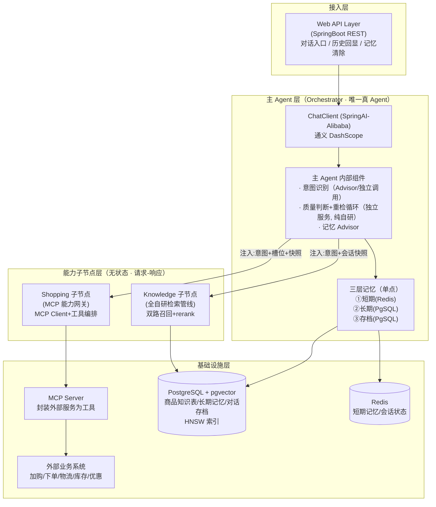
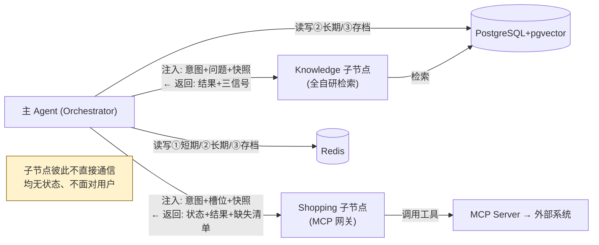

# 小米商城智能导购 Agent · 技术架构总纲

> 版本：v1.0 ｜ 定稿日期：2026-06-21
> 文档层级：**技术架构层（总纲）**
> 对应关系：本文档是逻辑设计文档 [架构.md](../架构.md) 的技术落地总纲；各 Agent 的实现细节见同目录的 3 份细化文档。
>
> - 逻辑设计（做什么/怎么做）：[架构.md](../架构.md)
> - 技术总纲（本文）：技术栈选型、分层架构、公共基础设施、各 Agent 技术落点映射
> - 细化文档：[主Agent-技术架构.md](主Agent-技术架构.md) ｜ [知识库Agent-技术架构.md](知识库Agent-技术架构.md) ｜ [购物Agent-技术架构.md](购物Agent-技术架构.md)

---

## 0. 文档定位

- 本文是**技术架构层的总纲**，回答「用什么技术栈、整体怎么分层、公共基础设施怎么搭、各 Agent 用框架还是自研」。
- **不重复**逻辑设计文档已讲清的职责边界与数据流（那些以 [架构.md](../架构.md) 为准）；本文聚焦技术落地。
- 若技术实现与逻辑设计冲突，**逻辑设计优先**，回头修订本文档。

---

## 1. 技术栈总览

| 分类 | 选型 | 用途 | 选型理由 |
|----|----|----|----|
| AI 框架 | **SpringAI-Alibaba** | 主 Agent 编排、Advisor 链、ChatMemory、MCP Client | 贴合 Java 主线；国产模型一等公民；MCP 内置；自研模块不受限；国内 Java+AI 赛道辨识度高 |
| 大模型 | **通义千问 / DashScope** | 意图识别、查询重写、答案生成、记忆提炼 | SpringAI-Alibaba 原生适配，开箱即用 |
| Embedding | **通义 Embedding 模型** | 商品知识向量化、查询向量化 | 同生态，无需跨服务调用 |
| 数据库 + 向量库 | **PostgreSQL + pgvector** | 结构化数据 + 向量存储（单库双能） | 一库同时存业务数据与向量，减少组件；500 SKU 小数据量完全够用 |
| 向量索引 | **HNSW** | 向量近似最近邻检索 | 小数据量下高召回、低延迟，优于 IVF 类 |
| 缓存 | **Redis** | ①短期记忆存储、会话状态、热点缓存 | 低延迟读写，天然适合工作记忆 |
| ORM | **MyBatis-Plus** | 操作 PostgreSQL 结构化数据 | 主流 Java ORM，灵活写 SQL（双路召回的关键词路需要原生 SQL） |
| 文档解析 | **Apache Tika** | 商品资料入库时解析（PDF/Word/HTML） | 多格式解析，知识库构建前置 |
| 工具协议 | **MCP** | 外置服务封装为标准工具，Shopping 接入 | 统一工具协议，解耦外部服务，主 Agent 标准化调用 |

---

## 2. 整体技术分层架构



---

## 3. 三大核心技术决策

### 决策一：框架选 SpringAI-Alibaba（而非 Python 生态）

- **贴合 Java 主线**：主语言是 Java，SpringBoot 是天然底座，项目放大而非绕开已有优势。
- **国产模型一等公民**：通义/DashScope 原生适配，调用零阻力。
- **MCP 内置**：Shopping 子节点「外置服务封装为 MCP 工具」直接用框架 MCP Client，省一大块。
- **自研模块不受限**：双路召回、rerank、质量判断逻辑，框架不干涉，想怎么搓怎么搓。
- **简历辨识度**：国内 Java + AI 应用赛道的高辨识度组合。
- **代价**：AI 生态比 Python 落后半拍，但对 500 SKU 导购 demo **无功能缺口**——所需能力（意图路由、MCP、ChatMemory、ReAct）全有。

### 决策二：存储用 PostgreSQL + pgvector（单库双能）

- **结构化 + 向量同库**：商品数据、长期记忆、对话存档、向量都在一个 PostgreSQL，免去独立向量库的同步成本。
- **小数据量够用**：500 SKU 级别，pgvector 性能绰绰有余。
- **运维简单**：个人项目少一个组件少一份负担。
- **MyBatis-Plus + 原生 SQL 兼顾**：结构化数据用 MP，双路召回的关键词路用原生 SQL（tsvector 全文检索）。

### 决策三：向量索引选 HNSW（而非 IVF 类）

- **小数据量最优**：HNSW 在中小数据量下召回率与延迟均优于 IVF/PQ 类。
- **关键参数**（建议起点，待实测标定）：
  - `m = 16`：每个节点的最大连接数，影响索引质量与内存。
  - `ef_construction = 64`：建图时候选邻居数，越大索引质量越好、建得越慢。
  - `ef_search = 40`：查询时候选数，越大召回越高、越慢。
- **IVF 不选的理由**：IVF 依赖聚类中心，小数据量下聚类质量不稳定，需训练 + 调 `nlist/probes`，性价比低。

---

## 4. 各 Agent 技术落点映射

> 声明「框架现成」还是「纯自研」——**自研部分是简历亮点**。

| 架构组件 | 技术落点 | 框架/自研 | 详见 |
|----|----|----|----|
| 主 Agent · ChatClient 入口 | SpringAI-Alibaba ChatClient + 通义 DashScope | **框架** | 主Agent文档 §2 |
| 主 Agent · 意图识别 | LLM 意图分类（Advisor / 独立调用）+ 置信度 | **半自研**（prompt 自研，框架承载调用） | 主Agent文档 §3 |
| 主 Agent · 检索质量判断 | 三信号 4 步组合判定 | **纯自研** ★ | 主Agent文档 §4 |
| 主 Agent · 重检循环 | 状态机循环控制（maxRetries=N） | **纯自研** ★ | 主Agent文档 §4 |
| 主 Agent · 三层记忆 | ①Redis 短期 / ②PgSQL 长期 / ③PgSQL 存档 | **半自研**（ChatMemory 框架 + 自定义后端） | 主Agent文档 §5 |
| 主 Agent · 长期记忆提炼 | 会话结束 LLM 批量提炼 | **纯自研** ★ | 主Agent文档 §5 |
| Knowledge · 知识库构建 | Tika 解析 + 切片 + embedding 入库 | **自研管线** | 知识库Agent文档 §2 |
| Knowledge · 查询重写/拆分 | LLM prompt | **半自研** | 知识库Agent文档 §3 |
| Knowledge · 双路召回 | 语义路 PgVectorStore + 关键词路原生 SQL | **纯自研编排** ★ | 知识库Agent文档 §4 |
| Knowledge · rerank | 加权打分（相似度+关键词+字段权重） | **纯自研** ★ | 知识库Agent文档 §5 |
| Shopping · MCP Server 封装 | 外部服务→MCP 工具（@McpTool） | **自研封装** | 购物Agent文档 §3 |
| Shopping · MCP 工具接入 | Spring AI MCP Client（ToolCallbackProvider） | **框架** | 购物Agent文档 §4 |
| Shopping · 工具编排 | 确定性编排（按主 Agent 指令） | **自研编排** | 购物Agent文档 §5 |

> ★ 标记为简历重点强调的自研部分。

---

## 5. 公共基础设施约定

### 5.1 pgvector Schema 设计

> 完整库表设计（17 张表，含建表 DDL 与初始化数据）见 [database/数据库设计.md](database/数据库设计.md) 与同目录 `schema.sql` / `init.sql`。此处仅列技术总纲层面需强调的关键点（含优先级），不重复完整 DDL。
>
> 优先级口径：**高** = 核心闭环必需 ｜ **中** = 业务完整度 ｜ **低** = 可观测增强（与 [数据库设计.md §2](database/数据库设计.md) 一致）。

**双路召回的存储落点（核心，优先级：高）：**

| 召回路 | 落点表 | 优先级 | 索引 | 说明 |
|---|---|---|---|---|
| 语义路 | `t_knowledge_vector` | 高 | **HNSW** `vector_cosine_ops` (m=16, ef_construction=64) | 向量与文本分离存储，便于重建索引 |
| 关键词路 | `t_knowledge_chunk` | 高 | **GIN**(tsv) + 触发器维护 tsv | tsv 由 `tsvector_update_trigger` 自动维护 |

- 切片表 `t_knowledge_chunk` 含独立 `title / spec_text` 列，供 rerank 字段加权（详见 [知识库Agent-技术架构.md §5](知识库Agent-技术架构.md)）。
- 向量表 `t_knowledge_vector` 通过 `chunk_id` 回链切片文本源。
- 向量维度 `VECTOR(1024)`（通义 text-embedding-v3，待实测确认）。

**三层记忆的存储落点：**

| 记忆层 | 落点表 | 优先级 | 说明 |
|---|---|---|---|
| ① 短期记忆 | **Redis**（不在 PG） | 高 | 最近 N 轮，详见 §5.2 |
| ② 长期记忆 | `t_user_longterm_memory` | 高 | mem_type 区分画像/偏好/决策/槽位，weight 支撑淘汰 |
| ③ 对话存档 | `t_message`（逐字）+ `t_conversation_summary`（摘要） | 高 / 中 | 逐字存档必需；摘要表长会话才必需，中优先级 |

> 关键约束：存档 ③ **不进默认上下文**（对齐 [架构.md §6](../架构.md)），避免 token 爆炸。

> 查询时关键词路用 `ts_rank(tsv, plainto_tsquery(...))`；语义路用 `<=>`（余弦距离）+ HNSW。

**全量 17 表按业务域的优先级一览（详见 [数据库设计.md §2](database/数据库设计.md)）：**

| 业务域 | 表 | 优先级 |
|---|---|---|
| 用户与会话域 | `t_user` / `t_conversation` | 高 |
| 三层记忆域 | `t_message` / `t_user_longterm_memory`（高）；`t_conversation_summary`（中） | 高 / 中 |
| 知识库域 | `t_knowledge_base` / `t_knowledge_document` / `t_knowledge_chunk` / `t_knowledge_vector` | 高 |
| 意图与查询域 | `t_intent_node`（高）；`t_query_term_mapping`（中） | 高 / 中 |
| 商品业务域 | `t_category` / `t_product_spu` / `t_product_sku` | 中 |
| 购物业务域 | `t_cart_item` / `t_order` | 中 |
| 链路追踪域 | `t_agent_trace` | 低 |

### 5.2 Redis 用途约定（①短期记忆）

```
Key:   chat:session:{sessionId}:messages
Type:  List (最近 N 轮 User/Assistant 消息)
TTL:   会话级（如 24h）
```

短期记忆用 Spring AI 的 `ChatMemory` 抽象承载。注意：Spring AI 内置后端仅有 `InMemoryChatMemoryRepository` 与 `JdbcChatMemoryRepository`，**无官方 Redis 实现**——Redis 后端需**自研实现 `ChatMemoryRepository` 接口**（用 RedisTemplate），或直接用 `MessageChatMemoryAdvisor` + 自研 Redis repository；也可退而用 `JdbcChatMemoryRepository`（落 PostgreSQL）。详见 [主Agent-技术架构.md §5](主Agent-技术架构.md)。

### 5.3 MCP 接入约定

- **外部业务服务**（加购/下单/物流/库存/优惠）封装为 **MCP Server**，对外暴露标准工具。
- **Shopping 子节点**用 **MCP Client**（SpringAI-Alibaba 的 `ToolCallbackProvider` / `SyncMcpToolCallbackProvider`）统一接入。
- **主 Agent 不直接调 MCP**——它通过 Shopping 网关间接调用（保持能力正交 P5）。

### 5.4 通义模型调用约定

- **Chat 模型**：通义千问（如 qwen-plus / qwen-max），用于意图识别、查询重写、答案生成、记忆提炼。
- **Embedding 模型**：通义 Embedding（如 text-embedding-v2），用于商品知识与查询向量化。

```java
// 调用骨架（官方模式）
DashScopeApi dashScopeApi = DashScopeApi.builder()
        .apiKey(System.getenv("AI_DASHSCOPE_API_KEY"))
        .build();
DashScopeChatModel chatModel = DashScopeChatModel.builder()
        .dashScopeApi(dashScopeApi)
        .build();
ChatClient chatClient = ChatClient.builder(chatModel)
        .defaultSystem("...")
        .defaultAdvisors(...)
        .build();
```

---

## 6. 跨 Agent 依赖关系



---

## 7. 项目模块结构

```
com.xiaomi.shopping.agent
├── orchestrator        # 主 Agent
│   ├── chatclient      # ChatClient 构建、Advisor 装配
│   ├── intent          # 意图识别（LLM 分类 + 置信度）
│   ├── judge           # ★ 质量判断 + 重检循环（纯自研）
│   ├── memory          # ★ 三层记忆（Redis/PgSQL）
│   └── dispatch        # 任务委派、跨节点编排
├── knowledge           # Knowledge 子节点（全自研检索管线）
│   ├── ingest          # Tika 解析 + 切片 + embedding 入库
│   ├── rewrite         # 查询重写 + 子问题拆分
│   ├── recall          # ★ 双路召回（语义 PgVectorStore + 关键词 SQL）+ 并行编排
│   ├── rerank          # ★ 加权 rerank（纯自研）
│   └── contract        # 输入/输出 DTO + 三信号
├── shopping            # Shopping 子节点（MCP 网关）
│   ├── mcpclient       # MCP Client 接入（ToolCallbackProvider）
│   ├── orchestration   # 确定性工具编排
│   └── contract        # 输入/输出 DTO + 状态信号
├── mcpserver           # 外部服务 → MCP Server 封装（@Tool）
│   ├── cart            # 加购
│   ├── order           # 下单
│   ├── logistics       # 物流
│   └── promotion       # 库存/优惠
├── common
│   ├── config          # SpringAI / pgvector / Redis / DashScope 配置
│   ├── dto             # 会话快照、跨节点契约
│   └── util
└── Application.java
```

---

## 8. 待确认技术项

- [ ] **embedding 维度**：通义具体 Embedding 模型对应的向量维度（1024 or 1536），决定 `VECTOR(N)` 的 N。
- [ ] **HNSW 参数实测**：`m / ef_construction / ef_search` 起点值待用真实数据标定。
- [ ] **检索质量阈值**：相关度分数、实体命中率的具体阈值待实测。
- [ ] **短期记忆窗口 N**：Redis 保留最近多少轮待定。
- [ ] **重检轮数**：默认 N=2 待结合延迟/成本确认。
- [ ] **MCP 传输方式**：外部服务 MCP Server 用 stdio 还是 HTTP/SSE 接入待定。

---

## 9. 文档导航

| 想了解 | 看这里 |
|----|----|
| 整体技术栈与分层 | 本文（技术架构总纲） |
| 主 Agent 怎么实现（意图/质量判断/循环/三层记忆） | [主Agent-技术架构.md](主Agent-技术架构.md) |
| 知识库检索管线怎么自研（双路召回/rerank） | [知识库Agent-技术架构.md](知识库Agent-技术架构.md) |
| 购物网关怎么接 MCP | [购物Agent-技术架构.md](购物Agent-技术架构.md) |
| 逻辑设计（职责/数据流/原则） | [架构.md](../架构.md) |
