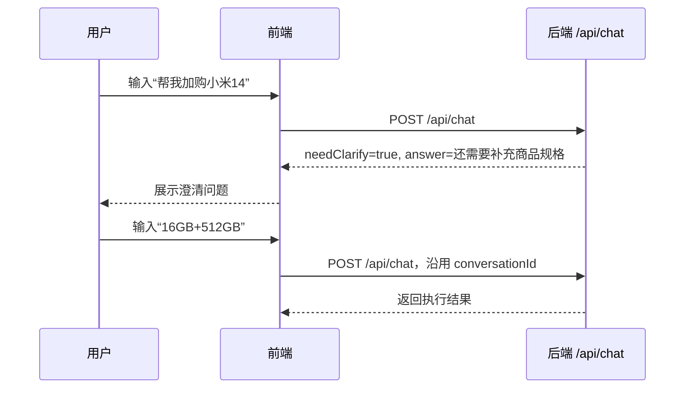
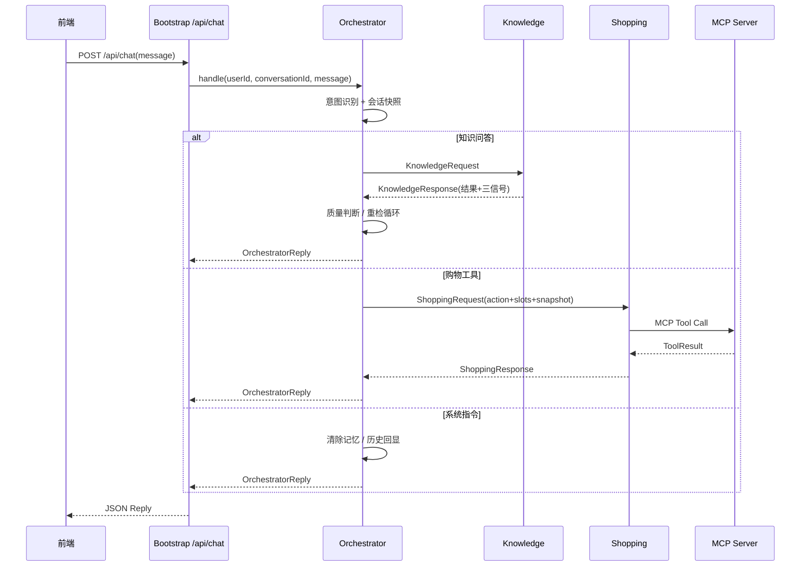

# 小米商城智能导购 Agent · 接口文档

> 面向对象：前端联调 / 本地端到端验证  
> 生成日期：2026-06-23  
> 依据文档：根目录 `架构.md`、`doc/技术架构.md`、`doc/主Agent-技术架构.md`、`doc/知识库Agent-技术架构.md`、`doc/购物Agent-技术架构.md`  
> 依据实现：`bootstrap` Web API、`common` 跨模块契约、`shopping` 编排器、`mcpserver` 工具实现

---

## 1. 接口总览

### 1.1 服务地址

| 服务 | 默认地址 | 说明 |
|---|---|---|
| Bootstrap 主应用 | `http://localhost:8080` | 前端主要联调对象，暴露 REST API |
| MCP Server | `http://localhost:8090` | Shopping 工具服务，通常不由前端直接调用 |

### 1.2 前端直接调用接口

| 编号 | 方法 | 路径 | 用途 | 前端是否必接 |
|---|---|---|---|---|
| API-001 | `GET` | `/api/health` | 存活检查 | 可选 |
| API-002 | `GET` | `/api/ready` | 聚合就绪检查 | 建议接入调试页 |
| API-003 | `POST` | `/api/chat` | 主 Agent 对话入口 | 必接 |

### 1.3 非前端直接调用的内部能力

| 能力 | 位置 | 说明 |
|---|---|---|
| Knowledge 子节点 | `KnowledgeGateway.ask(KnowledgeRequest)` | 由 Orchestrator 内部调用，前端不直接调用 |
| Shopping 子节点 | `ShoppingGateway.invoke(ShoppingRequest)` | 由 Orchestrator 内部调用，前端不直接调用 |
| MCP 工具 | `add_to_cart` / `place_order` / `query_logistics` / `query_stock` / `query_promotion` | 由 Shopping 子节点通过 MCP Client 调用，前端不直接调用 |

---

## 2. 通用约定

### 2.1 Content-Type

除 `GET` 接口外，所有 REST 请求统一使用：

```http
Content-Type: application/json
```

### 2.2 字段命名

后端为 Spring Boot 默认 JSON 序列化，字段使用 Java Bean 驼峰命名，例如：

- `userId`
- `conversationId`
- `needClarify`
- `qualityLevel`
- `retryCount`
- `childCalls`

### 2.3 当前实现的错误处理说明

当前 Web Controller 未定义统一错误响应 DTO。联调时可按以下原则处理：

| 场景 | 前端处理建议 |
|---|---|
| HTTP 2xx 且响应体正常 | 按接口响应字段渲染 |
| HTTP 4xx / 5xx | 弹出“服务暂不可用，请稍后重试”，并在调试面板展示原始响应 |
| `/api/chat` 返回 `needClarify=true` | 将 `answer` 作为澄清问题展示给用户，等待用户补充输入 |
| `/api/ready` 返回 `status=DEGRADED` | 主流程可能可用，但模型、Redis、PostgreSQL 或 MCP 存在降级项 |

---

## 3. API-001：存活检查

### 3.1 基本信息

| 项 | 内容 |
|---|---|
| 方法 | `GET` |
| 路径 | `/api/health` |
| 完整 URL | `http://localhost:8080/api/health` |
| 用途 | 验证 Bootstrap 主应用是否启动 |
| 认证 | 当前无 |

### 3.2 请求参数

无。

### 3.3 响应示例

```json
{
  "status": "UP",
  "project": "xiaomi-shopping-agent",
  "arch": "orchestrator + knowledge + shopping"
}
```

### 3.4 响应字段

| 字段 | 类型 | 说明 |
|---|---|---|
| `status` | string | 当前固定为 `UP` |
| `project` | string | 项目标识 |
| `arch` | string | 架构摘要 |

### 3.5 curl 示例

```bash
curl http://localhost:8080/api/health
```

---

## 4. API-002：聚合就绪检查

### 4.1 基本信息

| 项 | 内容 |
|---|---|
| 方法 | `GET` |
| 路径 | `/api/ready` |
| 完整 URL | `http://localhost:8080/api/ready` |
| 用途 | 检查主应用、三节点装配、PostgreSQL、Redis、MCP Server、模型配置是否就绪 |
| 认证 | 当前无 |

### 4.2 请求参数

无。

### 4.3 响应示例

```json
{
  "bootstrap": "UP",
  "orchestrator": "UP",
  "knowledgeGateway": "UP",
  "shoppingGateway": "UP",
  "postgres": "UP",
  "redis": "UP",
  "mcpserver": "UP",
  "chatModel": "CONFIGURED",
  "embeddingModel": "CONFIGURED",
  "rerank": "CONFIGURED",
  "status": "UP"
}
```

### 4.4 响应字段

| 字段 | 类型 | 可能值 | 说明 |
|---|---|---|---|
| `bootstrap` | string | `UP` | Bootstrap 应用自身状态 |
| `orchestrator` | string | `UP` / `DOWN` | 主 Agent Bean 是否装配 |
| `knowledgeGateway` | string | `UP` / `DOWN` | Knowledge 能力端口是否装配 |
| `shoppingGateway` | string | `UP` / `DOWN` | Shopping 能力端口是否装配 |
| `postgres` | string | `UP` / `DOWN` | PostgreSQL 是否可连接并执行 `SELECT 1` |
| `redis` | string | `UP` / `DOWN` | Redis `PING` 是否返回 `PONG` |
| `mcpserver` | string | `UP` / `DOWN` | MCP Server 地址是否可访问，默认检查 `http://localhost:8090` |
| `chatModel` | string | `CONFIGURED` / `MISSING_KEY` | `xiaomi.agent.chat.api-key` 是否配置 |
| `embeddingModel` | string | `CONFIGURED` / `MISSING_KEY` | `xiaomi.agent.embedding.api-key` 是否配置 |
| `rerank` | string | `CONFIGURED` / `FALLBACK` | rerank API Key 是否配置；未配置时走降级策略 |
| `status` | string | `UP` / `DEGRADED` / `DOWN` | 聚合状态 |

### 4.5 聚合状态规则

| `status` | 含义 |
|---|---|
| `UP` | 核心 Bean、基础设施、模型配置均正常 |
| `DEGRADED` | 核心 Bean 正常，但存在基础设施不可用、模型 Key 缺失或 rerank 降级 |
| `DOWN` | `orchestrator`、`knowledgeGateway`、`shoppingGateway` 任一核心 Bean 未装配 |

### 4.6 前端使用建议

- 开发调试页可以展示 `/api/ready` 的完整 JSON。
- 如果 `status=DOWN`，对话入口应禁用或提示后端未就绪。
- 如果 `status=DEGRADED`，可以允许对话，但提示“部分能力降级”。

### 4.7 curl 示例

```bash
curl http://localhost:8080/api/ready
```

---

## 5. API-003：主 Agent 对话接口

### 5.1 基本信息

| 项 | 内容 |
|---|---|
| 方法 | `POST` |
| 路径 | `/api/chat` |
| 完整 URL | `http://localhost:8080/api/chat` |
| 用途 | 前端统一对话入口；知识问答、加购、下单、查物流、查库存、系统指令均从此进入 |
| 认证 | 当前无 |

### 5.2 请求体

```json
{
  "userId": "demo-user",
  "conversationId": "demo-conversation",
  "message": "小米14的影像规格怎么样？"
}
```

### 5.3 请求字段

| 字段 | 类型 | 必填 | 默认值 | 说明 |
|---|---|---|---|---|
| `userId` | string | 否 | `demo-user` | 用户标识；为空时后端兜底为 `demo-user` |
| `conversationId` | string | 否 | `demo-conversation` | 会话标识；为空时后端兜底为 `demo-conversation` |
| `message` | string | 是 | 无 | 用户输入内容 |

> 注意：当前 `message` 未在 Controller 层显式判空。前端必须保证传入非空字符串。

### 5.4 响应体

```json
{
  "answer": "根据当前知识库资料：小米14采用...",
  "intent": "KNOWLEDGE",
  "needClarify": false,
  "qualityLevel": "SUFFICIENT",
  "retryCount": 0,
  "childCalls": 1
}
```

### 5.5 响应字段

| 字段 | 类型 | 可能值 | 说明 |
|---|---|---|---|
| `answer` | string | - | 主 Agent 最终回复文案，前端直接展示 |
| `intent` | string | `KNOWLEDGE` / `TOOL` / `SYSTEM` / `null` | 主 Agent 一级意图。低置信度澄清时可能仍带原识别结果；异常场景可能为空 |
| `needClarify` | boolean | `true` / `false` | 是否需要用户继续补充信息 |
| `qualityLevel` | string | 见下表 | 知识检索质量等级，仅知识问答通常有值；购物/系统指令可为空 |
| `retryCount` | number | `0`、`1`、`2`... | Knowledge 重检次数；非知识问答可为 0 或空 |
| `childCalls` | number | `0`、`1`、`2`... | 本轮调用子节点次数；系统指令为 0，普通购物为 1，知识问答为 `retryCount + 1` |

### 5.6 `intent` 说明

| 值 | 含义 | 后端流向 |
|---|---|---|
| `KNOWLEDGE` | 商品咨询、规格对比、推荐、售后/促销等知识型问题 | Orchestrator → Knowledge → 质量判断 → 回复 |
| `TOOL` | 加购、下单、查物流、查库存等工具型操作 | Orchestrator → Shopping → MCP 工具 → 回复 |
| `SYSTEM` | 清除记忆、查看历史等系统指令 | Orchestrator 内部处理 |

### 5.7 `qualityLevel` 说明

`qualityLevel` 来源于主 Agent 的检索质量判断，仅对 Knowledge 流程有意义。

| 值 | 含义 | 前端建议 |
|---|---|---|
| `SUFFICIENT` | 检索结果充分 | 正常展示 `answer` |
| `INSUFFICIENT` | 召回有结果但分数不足 | 展示 `answer`，若 `needClarify=true` 则引导用户补充 |
| `INCOMPLETE` | 召回结果未命中关键实体 | 展示澄清/补充提示 |
| `FAILED` | 召回数为 0 或最终退化 | 展示 `answer` 中的资料不足提示 |

> 实际枚举名称以 `common.contract.QualityVerdict.Level` 序列化结果为准。前端应兼容未知字符串。

### 5.8 `needClarify=true` 的处理

当响应：

```json
{
  "answer": "还需要补充[商品规格]，请告诉我后我再继续处理。",
  "intent": "TOOL",
  "needClarify": true,
  "childCalls": 1
}
```

前端应：

1. 将 `answer` 作为普通 Agent 消息展示；
2. 保持当前 `conversationId` 不变；
3. 用户补充信息后，再次调用 `/api/chat`；
4. 不需要前端直接拼内部 `slots`，槽位抽取由主 Agent 负责。

---

## 6. `/api/chat` 典型调用示例

### 6.1 知识问答：商品参数咨询

#### 请求

```bash
curl -X POST http://localhost:8080/api/chat \
  -H "Content-Type: application/json" \
  -d '{
    "userId": "u001",
    "conversationId": "c001",
    "message": "小米14的影像规格怎么样？"
  }'
```

#### 可能响应

```json
{
  "answer": "根据当前知识库资料：小米14影像相关资料...",
  "intent": "KNOWLEDGE",
  "needClarify": false,
  "qualityLevel": "SUFFICIENT",
  "retryCount": 0,
  "childCalls": 1
}
```

### 6.2 知识问答：资料不足 / 需澄清

#### 请求

```json
{
  "userId": "u001",
  "conversationId": "c001",
  "message": "这个拍照怎么样？"
}
```

#### 可能响应

```json
{
  "answer": "抱歉，当前资料不足以确认该问题。请补充具体型号或想了解的参数，我再帮你查询。",
  "intent": "KNOWLEDGE",
  "needClarify": true,
  "qualityLevel": "FAILED",
  "retryCount": 2,
  "childCalls": 3
}
```

### 6.3 混合意图：推荐并加购

当前设计中，混合意图由主 Agent 先走 Knowledge 推荐，再引导用户确认，不会在同一轮未经确认直接加购。

#### 请求

```json
{
  "userId": "u001",
  "conversationId": "c002",
  "message": "帮我推荐一款适合打游戏的手机，合适就加购"
}
```

#### 可能响应

```json
{
  "answer": "根据当前知识库资料：...。如果你确认这款商品和规格，我再帮你加购。",
  "intent": "KNOWLEDGE",
  "needClarify": true,
  "qualityLevel": "SUFFICIENT",
  "retryCount": 0,
  "childCalls": 1
}
```

### 6.4 加购：信息完整

#### 请求

```json
{
  "userId": "u001",
  "conversationId": "c003",
  "message": "帮我加购一台小米14 16GB+512GB"
}
```

#### 可能响应

```json
{
  "answer": "已处理成功：{cartId=cart-1a2b3c4d, skuId=sku-14, spec=16GB+512GB, quantity=1, tool=add_to_cart}",
  "intent": "TOOL",
  "needClarify": false,
  "qualityLevel": null,
  "retryCount": 0,
  "childCalls": 1
}
```

> 说明：当前 `answer` 中的结果数据由后端 `Map.toString()` 拼接，表现为 `{key=value}` 风格，不是嵌套 JSON。前端联调阶段可直接展示；若后续要结构化渲染，建议后端新增结构化 `data` 字段。

### 6.5 加购：缺少规格

#### 请求

```json
{
  "userId": "u001",
  "conversationId": "c003",
  "message": "帮我加购小米14"
}
```

#### 可能响应

```json
{
  "answer": "还需要补充[商品规格]，请告诉我后我再继续处理。",
  "intent": "TOOL",
  "needClarify": true,
  "qualityLevel": null,
  "retryCount": 0,
  "childCalls": 1
}
```

### 6.6 下单：信息完整

#### 请求

```json
{
  "userId": "u001",
  "conversationId": "c004",
  "message": "用购物车里的商品下单，收货地址是武汉市洪山区，在线支付"
}
```

#### 可能响应

```json
{
  "answer": "已处理成功：{orderId=order-1a2b3c4d, orderNo=XMABCDEF12, status=CREATED, tool=place_order}",
  "intent": "TOOL",
  "needClarify": false,
  "qualityLevel": null,
  "retryCount": 0,
  "childCalls": 1
}
```

### 6.7 下单：缺少地址或购物车项

#### 可能响应

```json
{
  "answer": "还需要补充[收货地址]，请告诉我后我再继续处理。",
  "intent": "TOOL",
  "needClarify": true,
  "qualityLevel": null,
  "retryCount": 0,
  "childCalls": 1
}
```

或：

```json
{
  "answer": "还需要补充[购物车商品]，请告诉我后我再继续处理。",
  "intent": "TOOL",
  "needClarify": true,
  "qualityLevel": null,
  "retryCount": 0,
  "childCalls": 1
}
```

### 6.8 查询物流

#### 请求

```json
{
  "userId": "u001",
  "conversationId": "c005",
  "message": "帮我查一下订单 order-12345678 的物流"
}
```

#### 可能响应

```json
{
  "answer": "已处理成功：{orderId=order-12345678, logisticsNo=SF1a2b3c4d, logisticsStatus=运输中, tool=query_logistics}",
  "intent": "TOOL",
  "needClarify": false,
  "qualityLevel": null,
  "retryCount": 0,
  "childCalls": 1
}
```

### 6.9 查询库存

#### 请求

```json
{
  "userId": "u001",
  "conversationId": "c006",
  "message": "查一下 sku-14 有没有库存"
}
```

#### 可能响应

```json
{
  "answer": "已处理成功：{skuId=sku-14, stock=100, tool=query_stock}",
  "intent": "TOOL",
  "needClarify": false,
  "qualityLevel": null,
  "retryCount": 0,
  "childCalls": 1
}
```

### 6.10 系统指令：清除记忆

#### 请求

```json
{
  "userId": "u001",
  "conversationId": "c007",
  "message": "清除我的记忆"
}
```

#### 可能响应

```json
{
  "answer": "已清除你的长期记忆和当前会话短期记忆。",
  "intent": "SYSTEM",
  "needClarify": false,
  "qualityLevel": null,
  "retryCount": 0,
  "childCalls": 0
}
```

### 6.11 系统指令：查看历史

#### 请求

```json
{
  "userId": "u001",
  "conversationId": "c007",
  "message": "查看当前会话历史"
}
```

#### 可能响应

```json
{
  "answer": "当前会话历史：[...]",
  "intent": "SYSTEM",
  "needClarify": false,
  "qualityLevel": null,
  "retryCount": 0,
  "childCalls": 0
}
```

---

## 7. 前端联调流程建议

### 7.1 启动后检查

前端开始联调前建议依次调用：

1. `GET /api/health`
2. `GET /api/ready`
3. `POST /api/chat`

### 7.2 会话管理

前端需要维护：

| 字段 | 建议 |
|---|---|
| `userId` | 登录后使用真实用户 ID；未登录可使用浏览器本地生成的临时 ID |
| `conversationId` | 每个新会话生成一个 ID；澄清追问必须沿用同一个 ID |
| `message` | 每轮用户输入 |

### 7.3 澄清链路

当 `/api/chat` 返回 `needClarify=true`：



---

## 8. 内部契约：Knowledge 子节点

> 本节供后端联调、测试或未来拆服务时参考。前端不直接调用。

### 8.1 调用入口

```java
KnowledgeGateway.ask(KnowledgeRequest request)
```

### 8.2 KnowledgeRequest

```json
{
  "question": "小米14的影像规格怎么样？",
  "intent": "参数咨询",
  "snapshot": {
    "userId": "u001",
    "conversationId": "c001",
    "currentIntent": "KNOWLEDGE",
    "recentContext": "最近对话摘要",
    "selectedProducts": "小米14",
    "cartState": {},
    "browseHistory": "小米14,Redmi K70"
  },
  "retryAttempt": 0,
  "queryEntities": ["小米14", "影像"]
}
```

| 字段 | 类型 | 说明 |
|---|---|---|
| `question` | string | 原始问题 |
| `intent` | string | 二级意图，如 `参数咨询`、`商品推荐` |
| `snapshot` | object | 主 Agent 注入的会话快照 |
| `retryAttempt` | number | 当前重检策略序号 |
| `queryEntities` | array<string> | 主 Agent 抽取的查询实体，用于命中信号 |

### 8.3 KnowledgeResponse

```json
{
  "results": [
    {
      "sourceId": "chunk-001",
      "content": "小米14影像资料片段...",
      "score": 0.91,
      "hitType": "semantic"
    }
  ],
  "topScore": 0.91,
  "hitEntities": ["小米14", "影像"],
  "recallCount": 1
}
```

| 字段 | 类型 | 说明 |
|---|---|---|
| `results` | array | 检索结果列表 |
| `results[].sourceId` | string | 来源文档或切片标识 |
| `results[].content` | string | 文本内容 |
| `results[].score` | number | rerank 后综合得分 |
| `results[].hitType` | string | 命中类型，如 `semantic` / `keyword` |
| `topScore` | number | 最高相关度分数 |
| `hitEntities` | array<string> | 命中的查询实体 |
| `recallCount` | number | 召回数量 |

### 8.4 质量判断口径

Knowledge 只返回客观信号，不判断“够不够”。充分性由 Orchestrator 判定：

1. `recallCount == 0` → `FAILED`
2. 召回非 0 但关键实体未全部命中 → `INCOMPLETE`
3. 实体命中但 `topScore < xiaomi.agent.judge.relevance-threshold` → `INSUFFICIENT`
4. 全满足 → `SUFFICIENT`

---

## 9. 内部契约：Shopping 子节点

> 本节供后端联调、测试或未来拆服务时参考。前端不直接调用。

### 9.1 调用入口

```java
ShoppingGateway.invoke(ShoppingRequest request)
```

### 9.2 ShoppingRequest

```json
{
  "action": "add_cart",
  "slots": {
    "skuId": "sku-14",
    "spec": "16GB+512GB",
    "quantity": 1
  },
  "snapshot": {
    "userId": "u001",
    "conversationId": "c001",
    "currentIntent": "TOOL",
    "recentContext": "",
    "selectedProducts": "sku-14",
    "cartState": {},
    "browseHistory": ""
  }
}
```

### 9.3 `action` 支持值

| 规范动作 | 别名 | 对应 MCP 工具 | 说明 |
|---|---|---|---|
| `add_to_cart` | `add_cart` / `addtocart` | `add_to_cart` | 加购 |
| `place_order` | `order` / `submit_order` | `place_order` | 下单 |
| `query_logistics` | `logistics` / `track_order` | `query_logistics` | 查询物流 |
| `query_stock` | `stock` / `inventory` / `query_inventory` | `query_stock` | 查询库存 |
| `query_promotion` | `promotion` / `coupon` / `query_coupon` | `query_promotion` | 查询优惠 |

以下动作明确不归 Shopping 执行，会返回失败：

- `recommend`
- `recommendation`
- `compare`
- `comparison`
- `guide_payment`
- `upsell`
- `推荐`
- `比较`
- `对比`
- `付款引导`
- `付费引导`

原因：推荐、对比属于 Knowledge / 主 Agent 决策边界，Shopping 只做外部工具调用。

### 9.4 `slots` 支持字段

| 场景 | 字段 | 别名 | 必填 | 说明 |
|---|---|---|---|---|
| 加购 | `skuId` | `skuCode` | 是 | 商品 SKU |
| 加购 | `spec` | `specText` | 是 | 商品规格 |
| 加购 | `quantity` | `qty` | 否 | 数量，默认 1 |
| 加购 | `stock` | - | 否 | 测试/Mock 用；`0` 表示无库存 |
| 下单 | `address` | `shippingAddress` | 是 | 收货地址 |
| 下单 | `payMethod` | `paymentMethod` | 否 | 支付方式 |
| 下单 | `cartId` | - | 三选一 | 购物车 ID |
| 下单 | `cartItems` | - | 三选一 | 购物车项 |
| 下单 | `cartItemIds` | - | 三选一 | 购物车项 ID 列表 |
| 物流 | `orderId` | `orderNo` | 是 | 订单 ID 或订单号 |
| 库存 | `skuId` | `skuCode` | 是 | 商品 SKU |
| 库存 | `stock` | - | 否 | 测试/Mock 用 |
| 优惠 | `skuId` | `skuCode` | 否 | 商品 SKU |
| 优惠 | `cartItems` | - | 否 | 购物车项；为空时可从快照取 |

### 9.5 ShoppingResponse

```json
{
  "status": "SUCCESS",
  "resultData": {
    "cartId": "cart-1a2b3c4d",
    "skuId": "sku-14",
    "spec": "16GB+512GB",
    "quantity": 1
  },
  "missingSlots": [],
  "errorMessage": null
}
```

| 字段 | 类型 | 说明 |
|---|---|---|
| `status` | string | `SUCCESS` / `NEED_CLARIFY` / `FAILED` |
| `resultData` | object | 成功时的结果数据 |
| `missingSlots` | array<string> | `NEED_CLARIFY` 时缺失的槽位 |
| `errorMessage` | string | `FAILED` 时的失败原因 |

---

## 10. MCP 工具契约

> MCP 工具由 `mcpserver` 暴露，默认端口 `8090`。通常不建议前端直接调用 MCP Server。本节用于后端联调和排查 Shopping 工具结果。

### 10.1 工具统一返回结构

```json
{
  "status": "SUCCESS",
  "data": {},
  "missingSlots": [],
  "errorMessage": null
}
```

| 字段 | 类型 | 说明 |
|---|---|---|
| `status` | string | `SUCCESS` / `NEED_CLARIFY` / `FAILED` |
| `data` | object | 工具执行结果 |
| `missingSlots` | array<string> | 缺失槽位 |
| `errorMessage` | string | 失败原因 |

### 10.2 `add_to_cart`

| 项 | 内容 |
|---|---|
| 工具名 | `add_to_cart` |
| 说明 | 将指定 SKU 和规格加入购物车 |

#### 入参

```json
{
  "skuId": "sku-14",
  "spec": "16GB+512GB",
  "quantity": 1,
  "stock": 100
}
```

| 字段 | 类型 | 必填 | 说明 |
|---|---|---|---|
| `skuId` | string | 是 | 商品 SKU；值为 `OUT_OF_STOCK` 或 `0` 时 mock 为无库存 |
| `spec` | string | 是 | 商品规格 |
| `quantity` | number | 否 | 数量，默认 1；小于等于 0 返回失败 |
| `stock` | number | 否 | mock 库存；小于等于 0 视为无库存 |

#### 成功返回

```json
{
  "status": "SUCCESS",
  "data": {
    "cartId": "cart-1a2b3c4d",
    "skuId": "sku-14",
    "spec": "16GB+512GB",
    "quantity": 1
  },
  "missingSlots": [],
  "errorMessage": null
}
```

#### 需澄清返回

```json
{
  "status": "NEED_CLARIFY",
  "data": {},
  "missingSlots": ["spec"],
  "errorMessage": null
}
```

#### 失败返回

```json
{
  "status": "FAILED",
  "data": {},
  "missingSlots": [],
  "errorMessage": "INVALID_QUANTITY"
}
```

### 10.3 `place_order`

| 项 | 内容 |
|---|---|
| 工具名 | `place_order` |
| 说明 | 基于购物车项和收货地址创建订单 |

#### 入参

```json
{
  "cartId": "cart-1a2b3c4d",
  "address": "武汉市洪山区",
  "payMethod": "ONLINE"
}
```

| 字段 | 类型 | 必填 | 说明 |
|---|---|---|---|
| `address` | string | 是 | 收货地址 |
| `cartId` | string | 与 `cartItems` / `cartItemIds` 三选一 | 购物车 ID |
| `cartItems` | object/array | 三选一 | 购物车项 |
| `cartItemIds` | array<string> | 三选一 | 购物车项 ID |
| `payMethod` | string | 否 | 支付方式 |

#### 成功返回

```json
{
  "status": "SUCCESS",
  "data": {
    "orderId": "order-1a2b3c4d",
    "orderNo": "XMABCDEF12",
    "status": "CREATED"
  },
  "missingSlots": [],
  "errorMessage": null
}
```

#### 缺地址

```json
{
  "status": "NEED_CLARIFY",
  "data": {},
  "missingSlots": ["address"],
  "errorMessage": null
}
```

#### 缺购物车项

```json
{
  "status": "NEED_CLARIFY",
  "data": {},
  "missingSlots": ["cartItems"],
  "errorMessage": null
}
```

### 10.4 `query_logistics`

| 项 | 内容 |
|---|---|
| 工具名 | `query_logistics` |
| 说明 | 查询订单物流状态 |

#### 入参

```json
{
  "orderId": "order-12345678"
}
```

#### 成功返回

```json
{
  "status": "SUCCESS",
  "data": {
    "orderId": "order-12345678",
    "logisticsNo": "SF1a2b3c4d",
    "logisticsStatus": "运输中"
  },
  "missingSlots": [],
  "errorMessage": null
}
```

#### 缺订单号

```json
{
  "status": "NEED_CLARIFY",
  "data": {},
  "missingSlots": ["orderId"],
  "errorMessage": null
}
```

### 10.5 `query_stock`

| 项 | 内容 |
|---|---|
| 工具名 | `query_stock` |
| 说明 | 查询指定 SKU 库存 |

#### 入参

```json
{
  "skuId": "sku-14"
}
```

#### 成功返回

```json
{
  "status": "SUCCESS",
  "data": {
    "skuId": "sku-14",
    "stock": 100
  },
  "missingSlots": [],
  "errorMessage": null
}
```

#### 无库存 mock 规则

当 `skuId` 为 `OUT_OF_STOCK` 或 `0` 时：

```json
{
  "status": "SUCCESS",
  "data": {
    "skuId": "0",
    "stock": 0
  },
  "missingSlots": [],
  "errorMessage": null
}
```

### 10.6 `query_promotion`

| 项 | 内容 |
|---|---|
| 工具名 | `query_promotion` |
| 说明 | 查询指定 SKU 或购物车的已有优惠信息 |

#### 入参

```json
{
  "skuId": "sku-14"
}
```

#### 成功返回

```json
{
  "status": "SUCCESS",
  "data": {
    "skuId": "sku-14",
    "promotion": "暂无优惠",
    "promotionType": "NONE"
  },
  "missingSlots": [],
  "errorMessage": null
}
```

---

## 11. 前端展示建议

### 11.1 对话气泡

前端对 `/api/chat` 的最小展示只需要使用：

```ts
interface ChatReply {
  answer: string;
  intent?: 'KNOWLEDGE' | 'TOOL' | 'SYSTEM' | string | null;
  needClarify?: boolean;
  qualityLevel?: string | null;
  retryCount?: number | null;
  childCalls?: number | null;
}
```

推荐展示规则：

| 条件 | UI 行为 |
|---|---|
| `needClarify=true` | Agent 气泡下方显示“需要补充信息”标记 |
| `intent=KNOWLEDGE` 且 `qualityLevel=FAILED` | 展示“资料不足”弱提示 |
| `intent=TOOL` 且 `answer` 以“已处理成功”开头 | 展示成功态 |
| `intent=SYSTEM` | 展示系统消息样式 |

### 11.2 调试信息

开发环境可以在气泡下方展示：

```text
intent=KNOWLEDGE | quality=SUFFICIENT | retry=0 | childCalls=1
```

生产环境可隐藏。

---

## 12. 当前接口边界与后续建议

### 12.1 当前边界

1. 前端只有一个正式业务入口：`POST /api/chat`。
2. 历史回显、记忆清除当前通过自然语言系统指令进入 `/api/chat`，尚未暴露独立 REST 接口。
3. Shopping 工具结果当前被拼入 `answer` 字符串，没有作为结构化字段返回给前端。
4. MCP Server 是后端内部工具服务，前端不直接依赖其协议。

### 12.2 建议后续新增接口

如前端需要更强结构化能力，建议后端后续新增：

| 建议接口 | 方法 | 说明 |
|---|---|---|
| `/api/conversations/{conversationId}/messages` | `GET` | 获取会话历史，替代自然语言“查看历史” |
| `/api/users/{userId}/memory` | `DELETE` | 清除用户记忆，替代自然语言“清除记忆” |
| `/api/chat` 响应新增 `data` | - | 将购物结果、检索引用等结构化返回 |
| `/api/products/search` | `GET` | 如前端需要商品列表/搜索，可单独提供，不走 Agent |

---

## 13. 联调检查清单

| 检查项 | 预期 |
|---|---|
| `GET /api/health` | 返回 `status=UP` |
| `GET /api/ready` | 核心 Bean 为 `UP`；整体最好为 `UP`，允许 `DEGRADED` |
| 知识问答 | `/api/chat` 返回 `intent=KNOWLEDGE`，`answer` 可展示 |
| 加购缺规格 | 返回 `needClarify=true`，`answer` 提示补充商品规格 |
| 加购完整 | 返回 `intent=TOOL`，`answer` 包含购物车结果 |
| 下单缺地址 | 返回 `needClarify=true`，提示补充收货地址 |
| 查询物流 | 返回物流单号和状态 |
| 清除记忆 | 返回“已清除你的长期记忆和当前会话短期记忆。” |

---

## 14. 参考调用序列


