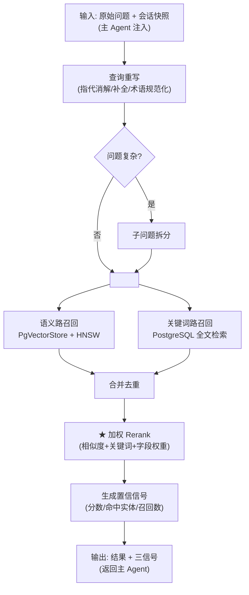
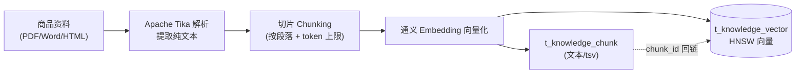

# Knowledge 子节点（知识库检索）· 技术架构

> 版本：v1.0 ｜ 定稿日期：2026-06-21
> 文档层级：**技术架构层（细化）**
> 对应关系：逻辑设计 [架构.md §3.2 / §8.1](../架构.md) ｜ 技术总纲 [技术架构.md](技术架构.md)

---

## 0. 文档定位

本文落实 **Knowledge 子节点** 的技术实现——**全自研的检索增强流水线**。

**子节点约束（不可违反）：**
- **无状态**：被主 Agent 请求-响应调用，不持有任何记忆。
- **不面对用户**：永不直接与用户对话（P2）。
- **不做意图识别**：收到主 Agent 注入的「明确意图=知识查询」即开始工作（P1）。
- **不做质量自判**：只返回客观可量化信号，充分性由主 Agent 判定（P6）。

**自研重点（简历亮点）：**
- 双路召回（语义 HNSW + 关键词全文检索）+ `CompletableFuture` 并行编排 —— §4
- 加权 rerank 重排序（纯自研打分） —— §5
- 置信信号生成（相关度分数/命中实体/召回数） —— §6

**模块归属**：本子节点对应 Maven 模块 `knowledge`，依赖 `common`。模块依赖、包结构、核心类清单见 §12「模块落地」。多模块总览见 [技术架构.md §8](技术架构.md)。

---

## 1. 检索流水线总览



> 性质：整体为**确定性流水线**，仅在「查询重写」环节引入受限智能（指代消解/补全/术语规范化），不涉及对结果质量的自主判断（P6）。

---

## 2. 知识库构建（数据准备）

### 2.1 解析 → 切片 → 向量化 → 入库



**切片策略：**
- 按段落/标题切分，单 chunk 控制在 **256~512 token**（保留语义完整）。
- 相邻 chunk 重叠 **50 token**，避免跨段信息断裂。
- 每个 chunk 携带 `metadata`（sku_id、品类、规格、价格、促销）。

### 2.2 入库（表结构见 [数据库设计.md §3.4](数据库设计.md)）

> 入库写两张表：`t_knowledge_chunk`（文本 + title/spec_text + tsv，优先级高）与 `t_knowledge_vector`（向量 + chunk_id 回链，优先级高）。两张表均属知识库域，详见 [数据库设计.md](数据库设计.md)。

```java
@Service
public class KnowledgeIngestService {

    private final EmbeddingModel embeddingModel;   // OpenAI 协议接硅基流动 Qwen3-Embedding-8B(1024维)
    private final VectorStore vectorStore;          // PgVectorStore → 写 t_knowledge_vector
    private final KnowledgeChunkMapper chunkMapper; // MyBatis → 写 t_knowledge_chunk
    private final TikaParser tika;

    public void ingest(InputStream doc, String skuId, String title, String specText,
                       Map<String,Object> meta) {
        String text = tika.parseToString(doc);                // Tika 解析
        List<String> chunks = chunker.split(text, 400, 50);   // 切片
        for (String chunk : chunks) {
            // ① 文本/标题/规格写入 t_knowledge_chunk（tsv 由触发器自动维护，供关键词路 + rerank 加权）
            long chunkId = chunkMapper.insert(new KnowledgeChunk(skuId, chunk, title, specText));

            // ② 向量写入 t_knowledge_vector（VectorStore 内部调 embedding(硅基流动) 后落库，chunk_id 回链）
            Document d = new Document(chunk, Map.of("chunk_id", chunkId, "sku_id", skuId, "meta", meta));
            vectorStore.add(List.of(d));
        }
    }
}
```

---

## 3. 查询重写（流水线唯一的「受限智能」环节）

用 LLM 对原始问题做指代消解、补全、口语化转规范术语。**这是唯一引入智能的地方，且不判断结果质量。**

**Prompt 要点：**
```
请重写用户的商品咨询问题：
1. 消解指代（"它/这款" → 具体型号）
2. 补全省略信息（结合会话快照中已选商品）
3. 口语化转规范术语（"打游戏爽" → "高性能GPU/高刷新率"）
仅输出重写后的问题，不要解释。
```

```java
@Service
public class QueryRewriter {
    private final ChatClient chatClient;

    public String rewrite(String question, SessionSnapshot snapshot) {
        return chatClient.prompt()
                .system(REWRITE_PROMPT)
                .user("问题: " + question + "\n会话快照: " + toJson(snapshot))
                .call()
                .content();
    }

    // 重检时换策略（由主 Agent RetrievalLoop 调用）
    public String rewriteWithNewStrategy(String q, QualityVerdict v, int attempt) {
        // attempt=0: 换关键词；attempt=1: 拆子问题
        return attempt == 0 ? rewriteKeywords(q) : splitSubQuestion(q);
    }
}
```

---

## 4. 双路召回（全自研编排 ★）

### 4.1 语义路（pgvector + HNSW）

用 SpringAI 的 `VectorStore`（PgVectorStore）走 HNSW 向量检索，查询 `t_knowledge_vector` 表：

```java
@Component
public class SemanticRecaller {
    private final VectorStore vectorStore;

    public List<ScoredDoc> recall(String query, int topK) {
        // 注意：similaritySearch 内部会用注入的 EmbeddingModel 自动对 query 向量化，
        // 这里传文本即可，无需手动 embed。
        SearchRequest req = SearchRequest.builder()
                .query(query)
                .topK(topK)                 // 建议 20~30，给 rerank 留候选
                .similarityThreshold(0.6)   // 余弦相似度阈值，待标定
                .build();
        return vectorStore.similaritySearch(req).stream()
                .map(ScoredDoc::from)
                .toList();
    }
}
```

> 底层走 `vector_cosine_ops` + HNSW 索引（见 [技术架构.md §5.1](技术架构.md)），查询时 `ef_search` 越大召回越高。

### 4.2 关键词路（PostgreSQL 全文检索）

用 MyBatis 原生 SQL 走 `tsvector` + `ts_rank`：

```java
@Component
public class KeywordRecaller {
    private final KeywordMapper mapper;

    public List<ScoredDoc> recall(String query, int topK) {
        return mapper.fullTextSearch(query, topK);
    }
}
```

```xml
<!-- KeywordMapper.xml -->
<select id="fullTextSearch" resultType="ScoredDoc">
    SELECT id, spu_id, content,
           ts_rank(tsv, plainto_tsquery('pg_catalog.simple', #{query})) AS score
    FROM t_knowledge_chunk
    WHERE tsv @@ plainto_tsquery('pg_catalog.simple', #{query})
      AND enabled = 1 AND deleted = 0
    ORDER BY score DESC
    LIMIT #{topK}
</select>
```

> 中文场景 `simple` 配置可能需要额外中文分词（如 zhparser 扩展），待实测决定。

### 4.3 并行编排（CompletableFuture，对齐简历「Future 类编排并行查询」）

```java
@Service
public class DualChannelRecaller {

    private final SemanticRecaller semantic;
    private final KeywordRecaller keyword;

    public List<ScoredDoc> recallParallel(String query, int topK) {
        CompletableFuture<List<ScoredDoc>> semFuture =
                CompletableFuture.supplyAsync(() -> semantic.recall(query, topK));
        CompletableFuture<List<ScoredDoc>> kwFuture =
                CompletableFuture.supplyAsync(() -> keyword.recall(query, topK));

        CompletableFuture.allOf(semFuture, kwFuture).join();

        // 合并 + 去重（按 chunk id）
        return mergeAndDedup(semFuture.join(), kwFuture.join());
    }

    private List<ScoredDoc> mergeAndDedup(List<ScoredDoc> a, List<ScoredDoc> b) {
        Map<Long, ScoredDoc> merged = new HashMap<>();
        a.forEach(d -> merged.put(d.getId(), d));
        // 关键词路结果并入，已存在则保留语义分
        b.forEach(d -> merged.putIfAbsent(d.getId(), d));
        return new ArrayList<>(merged.values());
    }
}
```

> 双路并行：墙钟时间 ≈ 较慢的一路，而非两路之和。

---

## 5. 加权 Rerank（★ 简历重点）

### 5.1 方案：外部 Rerank 模型主用 + 自研加权降级

- **主用方案 A：外部 Qwen3-Reranker-8B（硅基流动）**——cross-encoder 重排序模型，精度高。经 `/v1/rerank` 接入。
- **降级方案 B：自研加权打分**——外部 rerank 不可用（限流/超时/key 缺失）时自动降级，保证可用性。小数据量下加权打分亦有不错效果。
- **策略**：`Reranker` 门面统一入口，优先调外部模型；失败/降级开关打开时回退到 `WeightedReranker`（纯自研）。两者均产出 `finalScore`，下游无感。

> 设计意图：外部模型求精度，自研加权保兜底 + 体现工程完整度。简历可写「双 rerank 策略（cross-encoder 主用 + 自研加权降级）」。

### 5.2 外部 Rerank 客户端（硅基流动 /v1/rerank）

Spring AI 无 rerank 抽象，自研 WebClient 客户端：

```java
@Component
public class QwenRerankClient {
    private final WebClient webClient;   // baseUrl = https://api.siliconflow.cn/v1

    public List<ScoredDoc> rerank(String query, List<ScoredDoc> candidates, int topN) {
        RerankResponse resp = webClient.post()
                .uri("/rerank")
                .header("Authorization", "Bearer " + System.getenv("SILICONFLOW_API_KEY"))
                .bodyValue(new RerankRequest("Qwen/Qwen3-Reranker-8B", query,
                        candidates.stream().map(ScoredDoc::getContent).toList(),
                        topN, false))
                .retrieve()
                .bodyToMono(RerankResponse.class)
                .block();
        // resp.results: [{index, relevance_score}]，按 relevance_score 降序映射回 ScoredDoc
        return mapToScoredDocs(candidates, resp.getResults());
    }
}

record RerankRequest(String model, String query, List<String> documents,
                     int top_n, boolean return_text) {}
record RerankResponse(List<Result> results) {
    record Result(int index, double relevance_score) {}
}
```

> 关键字段：`relevance_score`（0~1）即 cross-encoder 打分，直接作为 `finalScore`。

### 5.3 自研加权打分（降级方案 B）

降级时的加权公式：

```
finalScore = w_sem * simScore          // 语义相似度(归一化0~1)
           + w_kw  * kwScore           // 关键词匹配度(ts_rank归一化)
           + w_field * fieldBoost      // 字段权重(标题命中>正文命中)
```

起点权重：`w_sem=0.5, w_kw=0.3, w_field=0.2`。

```java
@Service
public class WeightedReranker {

    private static final double W_SEM = 0.5, W_KW = 0.3, W_FIELD = 0.2;

    public List<ScoredDoc> rerank(List<ScoredDoc> merged, String query) {
        List<String> queryTerms = extractTerms(query);
        return merged.stream()
                .map(d -> {
                    double fieldBoost = computeFieldBoost(d, queryTerms);
                    double finalScore = W_SEM * d.getSimScore()
                                      + W_KW  * d.getKwScore()
                                      + W_FIELD * fieldBoost;
                    return d.withFinalScore(finalScore);
                })
                .sorted(Comparator.comparingDouble(ScoredDoc::getFinalScore).reversed())
                .limit(TOP_N_FINAL)        // 如 5，最终返回主 Agent 的条数
                .toList();
    }

    // 字段命中权重：直接取 t_knowledge_chunk 的独立列 title / spec_text
    private double computeFieldBoost(ScoredDoc d, List<String> terms) {
        String title = d.getTitle();       // chunk.title 列
        String spec  = d.getSpecText();    // chunk.spec_text 列
        double boost = 0;
        if (title != null && terms.stream().anyMatch(title::contains)) boost += 1.0;
        if (spec  != null && terms.stream().anyMatch(spec::contains))  boost += 0.5;
        return boost;
    }
}
```

> 说明：`ScoredDoc` 的 `title/specText` 直接取自 `t_knowledge_chunk` 的独立列（title / spec_text），命中实体比对（§6）以 `content` 列为准。两处字段口径已统一：标题/规格用于 rerank 加权，正文用于命中判定。

---

## 6. 置信信号生成（对齐 P6：只给客观信号，不主观自评）

从 rerank 结果算出三信号，交主 Agent 判定充分性：

```java
public class ConfidenceSignalBuilder {

    public KnowledgeResponse build(List<ScoredDoc> reranked,
                                   Set<String> queryEntities) {
        // 召回数
        int recallCount = reranked.size();

        // 相关度分数（rerank 最高分）
        double maxScore = reranked.isEmpty() ? 0.0
                : reranked.get(0).getFinalScore();

        // 命中实体：query 中的型号/参数是否出现在结果文本
        Set<String> hitEntities = reranked.stream()
                .flatMap(d -> queryEntities.stream()
                        .filter(e -> d.getContent().contains(e)))   // content 列（t_knowledge_chunk.content）
                .collect(Collectors.toSet());

        return new KnowledgeResponse(
                toDocChunks(reranked),
                maxScore,
                hitEntities,
                recallCount
        );
    }
}
```

> **关键（P6）**：Knowledge **不返回**「我认为这个结果好不好」的主观自评——充分性判断是主 Agent `QualityJudge` 的职责。Knowledge 只提供客观可量化信号。

---

## 7. 命中实体提取

从用户问题抽取型号/参数实体（如「小米14」「16+512」「影像」），用于命中比对：

```java
public class EntityExtractor {
    // 可用规则 + LLM 辅助抽取
    public Set<String> extract(String query) {
        Set<String> entities = new HashSet<>();
        // 正则匹配型号、规格参数
        entities.addAll(regexMatchModels(query));      // 小米14 / Redmi K70
        entities.addAll(regexMatchSpecs(query));       // 16+512 / 5000mAh
        return entities;
    }
}
```

> 实体抽取在主 Agent 调用前完成（`extractEntities`），实体集合作为参数传入 Knowledge。

---

## 8. Knowledge 服务骨架（请求-响应，无状态）

```java
@Service
@RequiredArgsConstructor
public class KnowledgeService {

    private final QueryRewriter rewriter;
    private final DualChannelRecaller recaller;
    private final WeightedReranker reranker;
    private final ConfidenceSignalBuilder signalBuilder;

    // 主 Agent 调用入口（无状态）
    // question：原始问题；queryEntities：主 Agent 抽取的实体（用于命中信号，显式传入）
    public KnowledgeResponse ask(String question, SessionSnapshot snapshot,
                                 Set<String> queryEntities) {
        // 1. 查询重写
        String rewritten = rewriter.rewrite(question, snapshot);

        // 2. 双路并行召回
        List<ScoredDoc> merged = recaller.recallParallel(rewritten, RECALL_TOPK);

        // 3. 加权 rerank
        List<ScoredDoc> reranked = reranker.rerank(merged, rewritten);

        // 4. 生成置信信号（无主观自评）；queryEntities 由主 Agent 显式注入
        return signalBuilder.build(reranked, queryEntities);
    }
}
```

---

## 9. 与主 Agent 契约对接（对齐 [架构.md §8.1](../架构.md)）

```java
// 输入（主 Agent 注入）
public record KnowledgeRequest(
        String intent,            // 固定 KNOWLEDGE
        String question,          // 原始问题（含会话上下文）
        SessionSnapshot snapshot,
        Set<String> queryEntities // ★ 主 Agent 抽取的实体（用于命中信号，显式传入）
) {}

// 输出（返回主 Agent）—— 三信号，无主观自评
public record KnowledgeResponse(
        List<DocChunk> results,
        double maxRelevanceScore,  // ★ 相关度分数
        Set<String> hitEntities,   // ★ 命中实体
        int recallCount            // ★ 召回数（0判失败）
) {
    public boolean isDegraded() {
        return recallCount == 0 && results.isEmpty();
    }
    public String toContext() { /* 拼成检索上下文供主 Agent 生成答案 */ }
}
```

---

## 10. 性能与调优

| 调优点 | 说明 |
|----|----|
| `RECALL_TOPK` | 双路各召回 20~30，给 rerank 留候选池 |
| `TOP_N_FINAL` | rerank 后最终返回主 Agent 5 条左右 |
| HNSW `ef_search` | 越大召回越高、越慢；500 SKU 下 40~64 即可 |
| `similarityThreshold` | 语义路余弦阈值，过滤无关结果，待标定 |
| 双路 topK 配比 | 语义路侧重相关性，关键词路侧重精确匹配，可不等配 |
| 中文分词 | `simple` 配置可能不足，必要时引入 zhparser |

---

---

## 12. 模块落地（knowledge）

> 对应 [技术架构.md §8](技术架构.md) 多模块工程的 `knowledge` 模块。依赖 `common`（契约 DTO / 全局配置）。**全自研检索管线**（不依赖框架 RAG Advisor）。

### 12.1 模块依赖（knowledge/pom.xml）

```xml
<dependencies>
    <!-- 内部模块：契约 DTO（KnowledgeRequest/Response）、全局配置 -->
    <dependency>
        <groupId>com.xiaomi.shopping</groupId>
        <artifactId>common</artifactId>
        <version>${project.version}</version>
    </dependency>

    <!-- 语义路：Spring AI pgvector VectorStore（版本由 parent BOM 管理） -->
    <dependency>
        <groupId>org.springframework.ai</groupId>
        <artifactId>spring-ai-starter-vector-store-pgvector</artifactId>
    </dependency>
    <!-- embedding：OpenAI 协议手动 Bean 接硅基流动 Qwen3-Embedding-8B（不用 starter 自动装配，避免与 chat 端点冲突） -->
    <dependency>
        <groupId>org.springframework.ai</groupId>
        <artifactId>spring-ai-openai</artifactId>
    </dependency>
    <!-- rerank：自研 WebClient 客户端调硅基流动 /v1/rerank -->
    <dependency>
        <groupId>org.springframework.boot</groupId>
        <artifactId>spring-boot-starter-webflux</artifactId>
    </dependency>

    <!-- 关键词路：MyBatis 原生 SQL（全文检索 ts_rank） -->
    <dependency>
        <groupId>com.baomidou</groupId>
        <artifactId>mybatis-plus-spring-boot3-starter</artifactId>
    </dependency>
    <dependency>
        <groupId>org.postgresql</groupId>
        <artifactId>postgresql</artifactId>
    </dependency>
    <dependency>
        <groupId>com.pgvector</groupId>
        <artifactId>pgvector</artifactId>
    </dependency>

    <!-- 知识库构建：Tika 文档解析 -->
    <dependency>
        <groupId>org.apache.tika</groupId>
        <artifactId>tika-core</artifactId>
    </dependency>
    <dependency>
        <groupId>org.apache.tika</groupId>
        <artifactId>tika-parsers-standard-package</artifactId>
    </dependency>

    <dependency>
        <groupId>org.projectlombok</groupId>
        <artifactId>lombok</artifactId>
        <optional>true</optional>
    </dependency>
</dependencies>
```

> 关键：本模块**不引 spring-ai-rag / QuestionAnswerAdvisor**——双路召回 + rerank 全自研编排（见 §4-§5）。仅用 Spring AI 的 `VectorStore`（语义路底层）+ `EmbeddingModel`（向量化，OpenAI 协议手动 Bean）+ 自研 WebClient（rerank 客户端）。
>
> **embedding 端点**：硅基流动（与 chat 端点不同 base-url），需手动 `OpenAiEmbeddingModel` Bean，关闭 `OpenAiEmbeddingAutoConfiguration`。

### 12.2 模块包结构

```
knowledge/src/main/java/com/xiaomi/shopping/agent/knowledge/
├── ingest/                                  # 知识库构建（§2）
│   ├── KnowledgeIngestService.java          # Tika 解析 → 切片 → embedding → 入库
│   ├── ChunkSplitter.java                   # 切片（按段落 + token 上限 + 重叠）
│   ├── mapper/
│   │   ├── KnowledgeChunkMapper.java        # 写 t_knowledge_chunk（文本/title/spec_text）
│   │   └── KeywordMapper.java               # 关键词路全文检索 SQL（§4.2）
│   └── entity/
│       └── KnowledgeChunk.java              # 实体（对应 t_knowledge_chunk）
├── rewrite/                                 # 查询重写（§3）
│   ├── QueryRewriter.java                   # 指代消解/补全/术语规范化（LLM）
│   └── SubQuestionSplitter.java             # 子问题拆分（LLM）
├── recall/                                  # ★ 双路召回（§4）
│   ├── semantic/
│   │   └── SemanticRecaller.java            # 语义路（PgVectorStore + HNSW）（§4.1）
│   ├── keyword/
│   │   └── KeywordRecaller.java             # 关键词路（tsvector + ts_rank）（§4.2）
│   └── DualChannelRecaller.java             # 并行编排（CompletableFuture）（§4.3）
├── rerank/                                  # ★ rerank（§5）
│   ├── Reranker.java                        # 门面：外部模型主用 + 自研加权降级
│   ├── QwenRerankClient.java                # 外部 Qwen3-Reranker-8B（硅基流动 /v1/rerank）
│   ├── WeightedReranker.java                # 自研加权打分（降级方案 B）
│   └── RerankWeights.java                   # 权重常量（w_sem/w_kw/w_field）
├── signal/                                  # 置信信号（§6）
│   └── ConfidenceSignalBuilder.java         # 生成三信号（分数/命中实体/召回数）
├── entityextract/                           # 命中实体提取（§7）
│   └── EntityExtractor.java                 # 抽取型号/参数实体
├── model/
│   ├── ScoredDoc.java                       # 召回文档（含 simScore/kwScore/title/specText/content）
│   └── KnowledgeContext.java                # 拼装的检索上下文
└── service/
    └── KnowledgeService.java                # 子节点入口（§8）：重写→召回→rerank→信号
```

### 12.3 核心类清单

| 类 | 职责 | 关键方法 | 对应章节 |
|---|---|---|---|
| `KnowledgeIngestService` | Tika 解析+切片+入库 | `ingest(doc, skuId, title, spec, meta)` | §2 |
| `QueryRewriter` | 查询重写（受限智能） | `rewrite(question, snapshot)` | §3 |
| `SemanticRecaller` | 语义路召回 | `recall(query, topK)` | §4.1 |
| `KeywordRecaller` | 关键词路召回 | `recall(query, topK)` | §4.2 |
| `DualChannelRecaller` | 双路并行编排 | `recallParallel(query, topK)` | §4.3 |
| `WeightedReranker` | 自研加权重排序（降级） | `rerank(merged, query)` | §5.3 |
| `QwenRerankClient` | 外部 rerank 客户端（硅基流动） | `rerank(query, candidates, topN)` | §5.2 |
| `Reranker` | 门面：外部主用+自研降级 | `rerank(merged, query)` | §5.1 |
| `ConfidenceSignalBuilder` | 生成三信号 | `build(reranked, entities)` | §6 |
| `EntityExtractor` | 实体抽取 | `extract(query)` | §7 |
| `KnowledgeService` | 子节点入口（无状态） | `ask(question, snapshot, queryEntities)` | §8 |

### 12.4 与 common 的契约
- **依赖 common 提供**：`KnowledgeRequest` / `KnowledgeResponse`（三信号）、`SessionSnapshot`、`DocChunk`、全局配置。
- **knowledge 不依赖** orchestrator / shopping——它是无状态子节点，由 bootstrap 装配 `KnowledgeService` Bean，orchestrator 经 `KnowledgeClient` 接口调用（对齐 P5）。

---

## 13. 待确认技术项

- [ ] embedding 维度（决定 `VECTOR(N)`）。
- [ ] rerank 权重 `w_sem/w_kw/w_field` 实测标定。
- [ ] 中文全文检索是否需要 zhparser。
- [ ] `RECALL_TOPK` / `TOP_N_FINAL` / `ef_search` 具体值。
- [ ] 相关度阈值（与主 Agent `RELEVANCE_THRESHOLD` 联动）。
