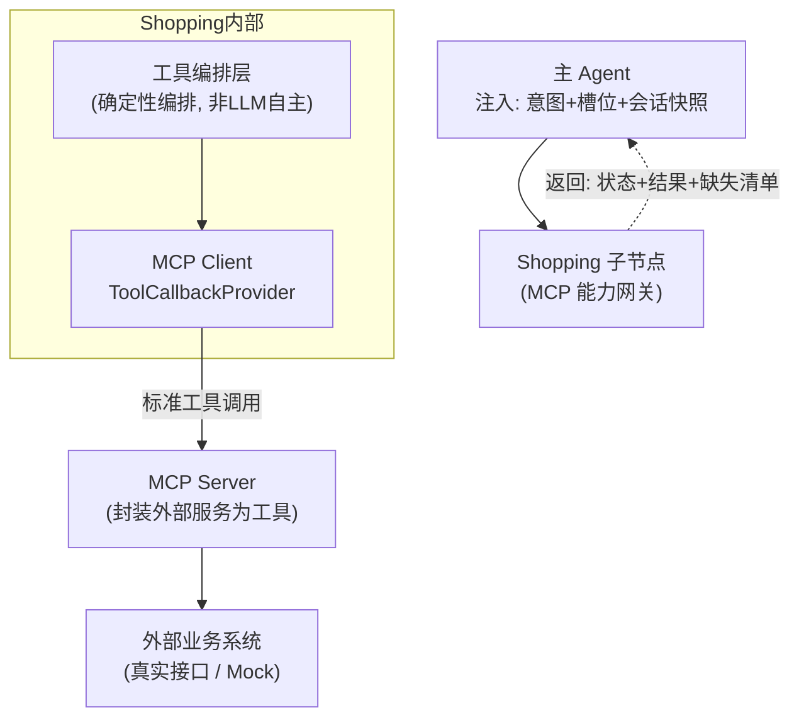

# Shopping 子节点（购物网关）· 技术架构

> 版本：v1.0 ｜ 定稿日期：2026-06-21
> 文档层级：**技术架构层（细化）**
> 对应关系：逻辑设计 [架构.md §3.3 / §8.2](../架构.md) ｜ 技术总纲 [技术架构.md](技术架构.md)

---

## 0. 文档定位

本文落实 **Shopping 子节点** 的技术实现——基于 **MCP** 的纯能力网关。

**子节点约束（不可违反）：**
- **无状态**：被主 Agent 请求-响应调用，不持有任何记忆。
- **不面对用户**：永不直接与用户对话（P2）。
- **不做意图识别**：收到主 Agent 注入的「明确意图=购物/工具」即开始工作（P1）。
- **禁止长出业务判断**（边界红线）：不做推荐策略、付费引导；检索型能力归 Knowledge（P5）。

**定位**：Shopping 是「纯能力层」——主 Agent 说"加购小米14"，Shopping 编排对应 MCP 工具执行。**它薄，但它该薄。**

---

## 1. 技术架构总览



---

## 2. MCP 整体设计

### 为什么用 MCP
- **统一工具协议**：所有外置服务接口用同一标准暴露，主 Agent 通过标准方式调用。
- **解耦外部服务**：外部业务系统的实现（HTTP/RPC/Mock）对 Shopping 透明，只认 MCP 工具契约。
- **可扩展**：新增外部能力只需注册新 MCP 工具，不改主 Agent。

### 整体形态
```
外部业务系统  ──封装──>  MCP Server(标准工具)  ──接入──>  Shopping(MCP Client)  ──被调──>  主 Agent
```

---

## 3. MCP Server 封装（外部服务 → MCP 工具）

### 部署形态（重要）
- **MCP Server**：一个独立的 Spring Boot 应用（依赖 `spring-ai-mcp-server-webmvc` 或 `webflux` starter），承载所有工具定义，对外以 MCP 协议暴露。
- **Shopping 子节点**：主应用内的 MCP Client（依赖 `spring-ai-mcp-client-spring-boot-starter`），通过 stdio/sse 接入 MCP Server，**不直接持有工具类的 Java 引用**——所有工具调用都经 MCP 协议，不绕过。
- demo 阶段若想简化（单进程），也可用 Spring AI MCP Server Boot Starter 同进程暴露；但本文档按「Server/Client 分离」描述，更贴近真实落地。

### 工具清单

> 工具操作的主数据表见 [数据库设计.md §3.6](数据库设计.md)（购物业务域，优先级中）。

| 工具名 | 操作表 | 优先级 | 说明 | 关键入参 | 出参状态 |
|----|----|----|----|----|----|
| `add_to_cart` | `t_cart_item` | 中 | 加购商品 | skuId、规格、数量 | success / need_clarify(缺规格) |
| `place_order` | `t_order` | 中 | 提交订单 | 购物车项、收货地址、支付方式 | success / need_clarify(缺地址) / failed(库存不足) |
| `query_logistics` | `t_order.logistics_no` | 中 | 查物流 | orderId | success |
| `query_stock` | `t_product_sku.stock` | 中 | 查库存 | skuId | success |
| `query_promotion` | （促销表，待扩展） | 低 | 查优惠 | skuId / cartItems | success |

> 工具内部经 `ExternalXxxClient` 调真实外部业务接口（或 Mock 实现），落库到上述表；缺库存时读 `t_product_sku.stock` 判定 `FAILED`，缺槽位时返回 `need_clarify`。

### 工具定义示例（MCP Server 端 `@McpTool`）

> MCP Server 端暴露工具用 **`@McpTool` + `@McpToolParam`**（不是 Spring AI 本地函数工具的 `@Tool`，后者不会暴露为 MCP 工具）。

```java
// MCP Server 端（独立进程：mcp-server-shopping）
@Service
public class CartTools {

    private final ExternalCartClient extClient;   // 对接真实外部加购接口(HTTP/RPC)

    @McpTool(name = "add_to_cart",
             description = "将指定商品加入购物车。需要 skuId、规格(如16+512)、数量。")
    public ToolResult addToCart(
            @McpToolParam(description = "商品SKU", required = true) String skuId,
            @McpToolParam(description = "规格,如 16+512") String spec,
            @McpToolParam(description = "数量,默认1") Integer quantity) {

        int qty = quantity == null ? 1 : quantity;
        // 缺规格 → 举手（need_clarify），不自己开口问用户（P4）
        if (spec == null || spec.isBlank()) {
            return ToolResult.needClarify(List.of("spec"));
        }
        try {
            CartItem item = extClient.add(skuId, spec, qty);  // 调外部业务系统
            return ToolResult.success(Map.of("cartItemId", item.getId()));
        } catch (OutOfStockException e) {
            return ToolResult.failed("OUT_OF_STOCK");
        }
    }
}
```

> 工具内部调用真实外部业务接口（HTTP/RPC）。**缺参数时不自己问用户**——返回 `need_clarify + 缺失清单`，由主 Agent 开口（P4 只举手不开口）。

---

## 4. MCP Client 接入（SpringAI-Alibaba）

### 配置（application.yml）

```yaml
spring:
  ai:
    mcp:
      client:
        stdio:
          servers-configuration: classpath:mcp-servers.json   # 或用 sse/http
```

`mcp-servers.json` 示例：
```json
{
  "mcpServers": {
    "xiaomi-shopping": {
      "command": "java",
      "args": ["-jar", "mcp-server-shopping.jar"]
    }
  }
}
```

### Java 注入（官方模式）

```java
@Configuration
public class McpClientConfig {

    // SpringAI-Alibaba 自动装配 ToolCallbackProvider（来自 MCP Server）
    @Bean
    public ChatClient shoppingChatClient(DashScopeChatModel model,
                                         ToolCallbackProvider mcpToolProvider) {
        return ChatClient.builder(model)
                .defaultToolCallbacks(mcpToolProvider)
                .build();
    }
}
```

> 也可用 `SyncMcpToolCallbackProvider(mcpClient...)` 显式装配多个 MCP Client。
> `ToolCallbackProvider` / `SyncMcpToolCallbackProvider` 是 Spring AI（spring-ai-core / spring-ai-mcp）的标准类，Spring AI Alibaba 兼容使用，非 Alibaba 专属。

---

## 5. 工具编排（确定性编排，非 LLM 自主 ★）

**关键设计（对齐"砍掉意图识别"）**：Shopping **不让 LLM 自由决策调哪些工具**——那样会变成能力过载的大 Agent。Shopping 收到主 Agent 的**明确指令**（意图 + 槽位），用**确定性逻辑**决定调用哪个 MCP 工具、以什么参数，然后**经 MCP Client 调用**（不绕过 MCP 协议直接 Java 调用工具类）。

### ShoppingAction 枚举（对应工具清单，由主 Agent 意图识别产出）

```java
public enum ShoppingAction {
    ADD_TO_CART,      // → add_to_cart
    PLACE_ORDER,      // → place_order
    QUERY_LOGISTICS,  // → query_logistics
    QUERY_STOCK,      // → query_stock
    QUERY_PROMOTION   // → query_promotion
}
```

### 编排骨架（经 MCP Client）

```java
@Service
@RequiredArgsConstructor
public class ShoppingService {

    // 经 MCP Client 注入的工具回调（来自 MCP Server，非工具类 Java 引用）
    private final ToolCallbackProvider mcpToolProvider;
    private final ToolInvoker toolInvoker;   // 封装"按工具名经 MCP 调用"

    // 主 Agent 调用入口（无状态）
    public ShoppingResponse invoke(IntentResult intent, SessionSnapshot snapshot) {
        return switch (intent.shoppingAction()) {
            case ADD_TO_CART     -> doAddToCart(intent);
            case PLACE_ORDER     -> doPlaceOrder(intent, snapshot);
            case QUERY_LOGISTICS -> doQueryLogistics(intent);
            case QUERY_STOCK     -> doInvokeTool("query_stock",
                    Map.of("skuId", intent.getSlot("skuId")));
            case QUERY_PROMOTION -> doInvokeTool("query_promotion",
                    Map.of("skuId", intent.getSlot("skuId")));
        };
    }

    // 加购流：确定性选 add_to_cart 工具，拼好参数经 MCP 调用
    private ShoppingResponse doAddToCart(IntentResult intent) {
        Map<String, Object> args = Map.of(
                "skuId",    intent.getSlot("skuId"),
                "spec",     intent.getSlot("spec"),       // 可能为空 → 工具内举手
                "quantity", intent.getIntSlot("quantity", 1));
        return toResponse(doInvokeTool("add_to_cart", args));
    }

    // 下单流：从会话快照取购物车项 → place_order
    private ShoppingResponse doPlaceOrder(IntentResult intent, SessionSnapshot snap) {
        Map<String, Object> args = new HashMap<>();
        args.put("cartItemIds", snap.getCart().stream().map(CartItem::getId).toList());
        args.put("address",  intent.getSlot("address"));   // 可能为空 → 举手
        args.put("payMethod", intent.getSlot("payMethod"));
        return toResponse(doInvokeTool("place_order", args));
    }

    private ShoppingResponse doQueryLogistics(IntentResult intent) {
        return toResponse(doInvokeTool("query_logistics",
                Map.of("orderId", intent.getSlot("orderId"))));
    }

    // 经 MCP Client 按工具名调用（ToolCallbackProvider 提供）
    private ToolResult doInvokeTool(String toolName, Map<String, Object> args) {
        return toolInvoker.invoke(mcpToolProvider, toolName, args);
    }

    private ShoppingResponse toResponse(ToolResult r) {
        return new ShoppingResponse(
                mapStatus(r.getStatus()),   // SUCCESS/FAILED/NEED_CLARIFY
                r.getData(),
                r.getMissing()
        );
    }
}
```

> 编排是**确定性的**（switch + 固定调用顺序），不依赖 LLM 自主选择工具——这是 Shopping 保持「薄」的关键。

---

## 6. 状态信号返回（对齐 [架构.md §8.2](../架构.md)）

| 状态 | 含义 | 主 Agent 处置 |
|----|----|----|
| `SUCCESS` | 执行成功 | 转述用户 |
| `FAILED` | 执行失败（如缺库存） | 据状态决定重试或告知 |
| `NEED_CLARIFY` | 缺参数（举手） | 据缺失清单开口反问（主 Agent 唯一开口 P2/P4） |

```java
// 输入（主 Agent 注入）
public record ShoppingRequest(
        String intent,                 // 固定 SHOPPING
        Map<String, Object> slots,     // skuId/spec/quantity/address/...
        SessionSnapshot snapshot
) {}

// 输出（返回主 Agent）—— 状态 + 结果 + 缺失清单
public record ShoppingResponse(
        ShoppingStatus status,         // SUCCESS / FAILED / NEED_CLARIFY
        Map<String, Object> data,
        List<String> missing           // NEED_CLARIFY 时缺失槽位（主 Agent 开口问）
) {}

public enum ShoppingStatus { SUCCESS, FAILED, NEED_CLARIFY }

// 工具统一返回结构
public record ToolResult(
        ToolStatus status,             // SUCCESS/FAILED/NEED_CLARIFY
        Map<String, Object> data,
        List<String> missing
) {
    public static ToolResult success(Map<String,Object> d) { return new ToolResult(ToolStatus.SUCCESS, d, List.of()); }
    public static ToolResult failed(String reason)        { return new ToolResult(ToolStatus.FAILED, Map.of("reason", reason), List.of()); }
    public static ToolResult needClarify(List<String> m)  { return new ToolResult(ToolStatus.NEED_CLARIFY, Map.of(), m); }
}
```

---

## 7. 边界红线重申（对齐 [架构.md §3.3](../架构.md)）

Shopping **禁止**做以下事——否则会重新变成能力过载的大 Agent：
- ❌ 推荐策略（"买这个手机的人还买了…"）→ 归 Knowledge
- ❌ 付费引导（"凑单满减/限时优惠"诱导）→ 归 Knowledge 或主 Agent 决策
- ❌ 意图识别、需求理解 → 归主 Agent
- ❌ 自主决定调工具的顺序/组合 → 用确定性编排

Shopping **只做**：按主 Agent 明确指令，确定性调用 MCP 工具，返回结果 + 状态信号。

---

## 8. 外部服务 Mock（个人项目 demo 阶段）

demo 阶段外部业务系统未必真实存在，用 Mock 实现（数据落本项目正式表 `t_cart_item` / `t_order`，库存读 `t_product_sku.stock`）：

```java
// Mock 外部加购客户端（库存从 t_product_sku.stock 读取）
@Component
@Profile("mock")
public class MockExternalCartClient implements ExternalCartClient {
    private final ProductSkuMapper skuMapper;   // 读 t_product_sku

    @Override
    public CartItem add(String skuId, String spec, int quantity) {
        int stock = skuMapper.getStockByCode(skuId);   // t_product_sku.stock
        if (stock < quantity) {
            throw new OutOfStockException(skuId);      // → Shopping 返回 FAILED
        }
        // demo 阶段直接落 t_cart_item（真实环境调外部加购接口）
        return new CartItem(UUID.randomUUID().toString(), skuId, spec, quantity);
    }
}
```

> MCP Server 内部注入 `ExternalCartClient`（真实/Mock 由 Profile 切换），对外只暴露 MCP 工具契约——实现可平滑替换。

---

## 9. 待确认技术项

- [ ] MCP 传输方式：stdio / SSE / HTTP，demo 阶段建议 stdio（最简单）。
- [ ] 外部业务接口清单与真实/Mock 边界。
- [ ] 工具入参 schema 的细化（`@Tool` 详细参数描述）。
- [ ] Shopping 工具编排是否需要支持多步组合（如"加购并下单"），还是纯单步由主 Agent 串联（当前设计：主 Agent 串联，Shopping 单步）。
