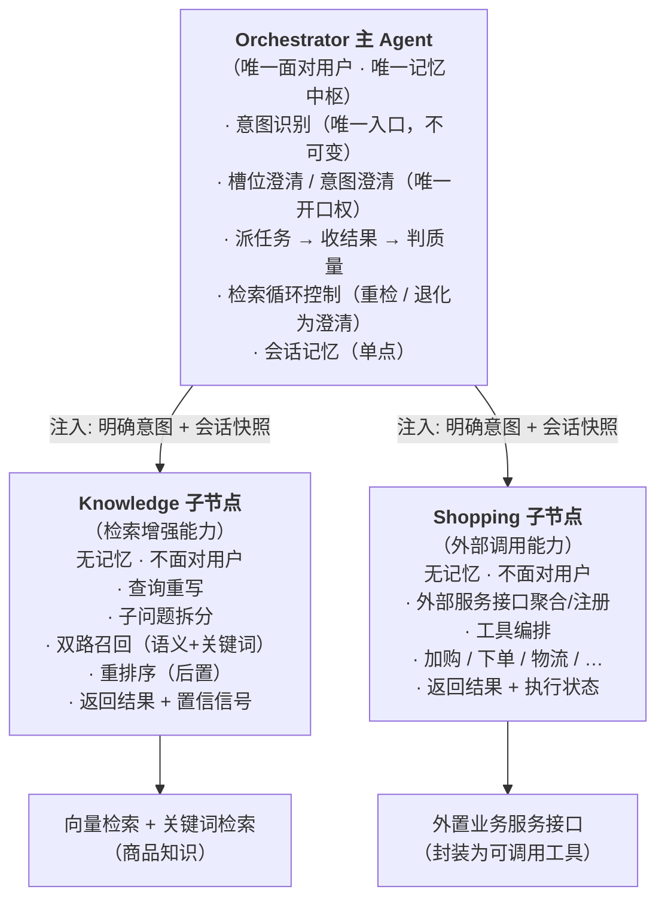
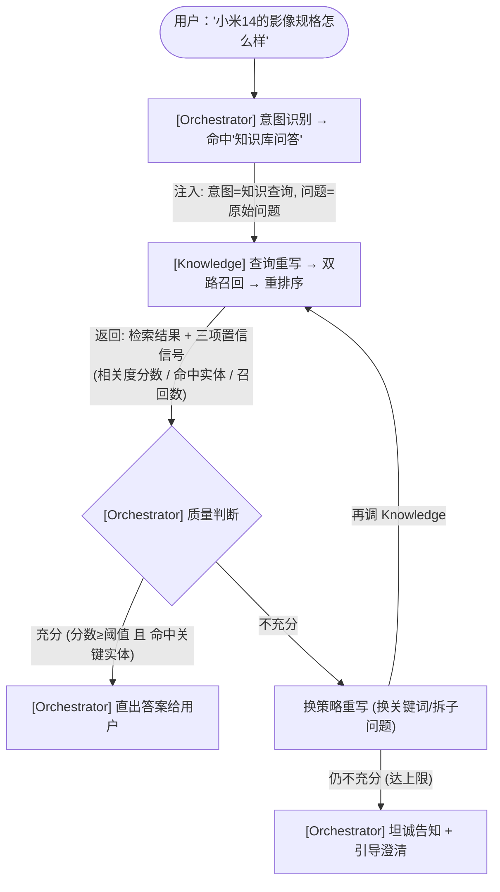
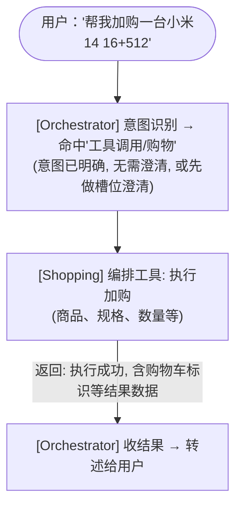
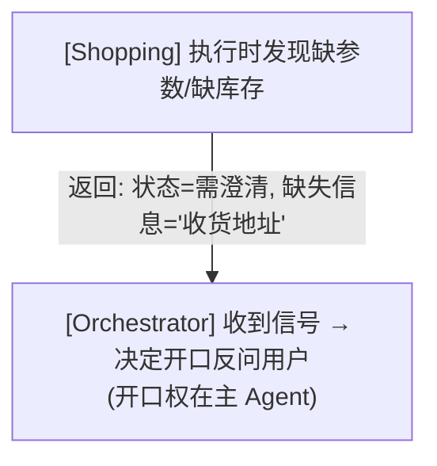
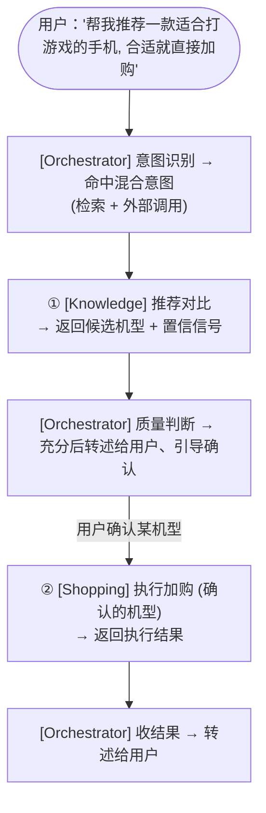
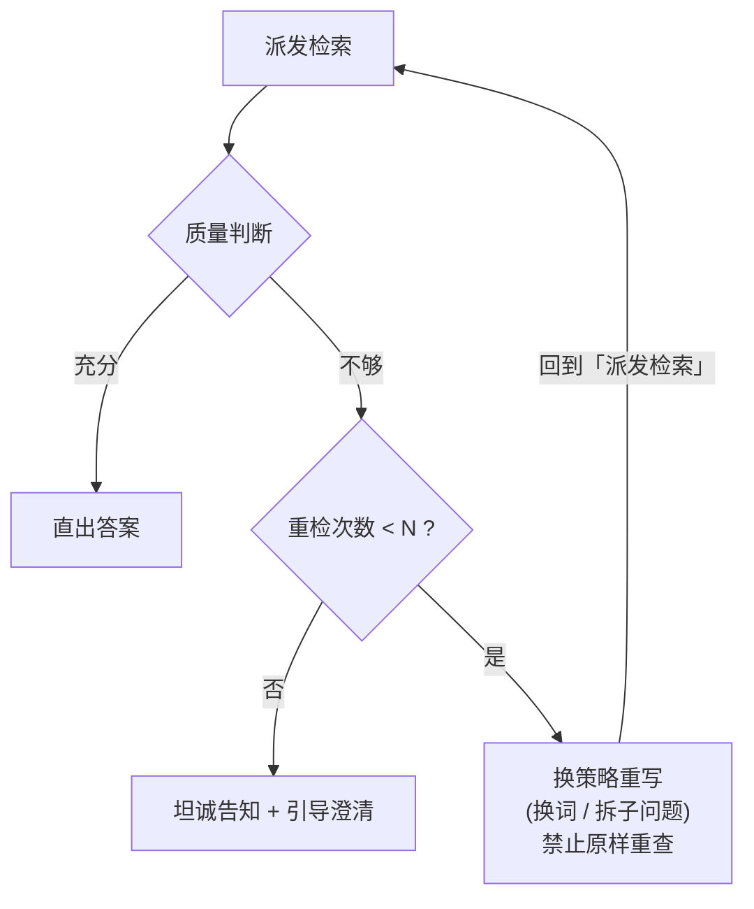
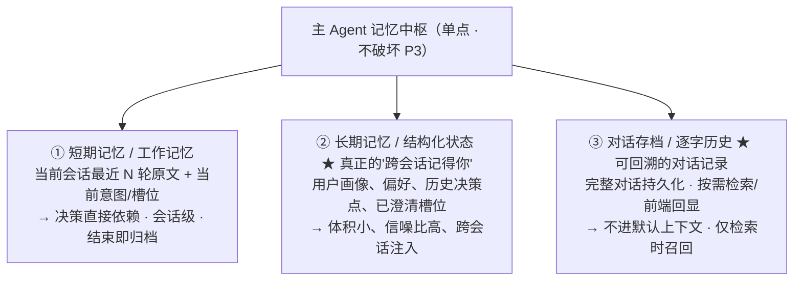
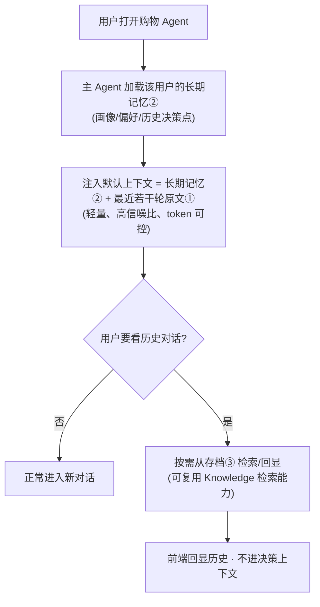
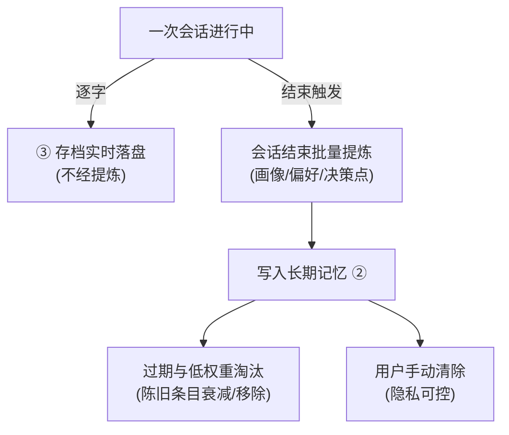

# 小米商城智能导购 Agent · 架构设计文档

> 版本：v2.2（新增三层记忆设计） ｜ 定稿日期：2026-06-21
> 状态：逻辑设计定稿，待实现检查

---

## 0. 文档定位

- 本文档是**逻辑设计层**文档，只描述「做什么」「怎么做」，**不含任何技术栈选型**。
- 框架、存储介质、通信协议、代码包结构、接口类型签名、具体检索实现库等，均属于后续「技术架构」阶段，本文档**不涉及**。
- 设计意图（节点职责、数据流、判断逻辑、记忆策略）是稳定锚点；技术选型可变。实现中如要做技术决策，应回到本文档确认设计意图未变，再去选型。
- 若实现中发现设计矛盾，**以本文档为准并回头修订本文档**，不口头偏离。

### 术语约定（重要）
本设计中**只有 Orchestrator 是「Agent」**（具备自主性、唯一面对用户、唯一持有记忆）。Knowledge 与 Shopping **一律称为「子节点」**——它们是无状态的能力层，不具备 agent 自主性。全文严格沿用此称呼，避免「子 Agent」造成「它们是否算 Agent」的混淆。

### 关于检索方法的说明
§3.2 提到的查询重写、子问题拆分、双路召回（语义检索 + 关键词检索）、重排序等，是检索流水线的**方法选择**（属于「怎么做」的设计），并非绑定某项具体技术；未来实现可替换为等价手段，设计意图不变。

---

## 1. 架构总览

### 一句话概括
**一个有自主性的主 Agent（唯一意图入口 + 唯一开口权 + 唯一记忆中枢 + 质量判断 + 循环控制）+ 两个无状态的能力子节点（检索增强流水线 / 外部调用网关），分工正交、记忆单点。** 子节点不直接面对用户、不做意图识别、不持有记忆。

---

## 2. 核心设计原则（不可违反）

| 编号 | 原则 | 说明 |
|----|----|----|
| P1 | **意图识别唯一入口** | 只有 Orchestrator 做意图识别，子节点不做。**不可变。** |
| P2 | **唯一开口权** | 只有 Orchestrator 直接对用户说话；子节点永不直接与用户交互。 |
| P3 | **记忆单点** | 只有 Orchestrator 持有记忆；子节点完全无状态，请求-响应模式。 |
| P4 | **子节点只举手、不开口** | 子节点搞不定时，返回结构化信号（需澄清/缺失信息）给主 Agent，由主 Agent 决定如何开口。 |
| P5 | **能力正交** | Knowledge 管「检索型」能力，Shopping 管「外部调用型」能力。推荐/对比归 Knowledge，下单/加购归 Shopping，互不越界。 |
| P6 | **质量判断上移** | 检索结果好不好，由 Orchestrator 判定，不由 Knowledge 自判自反馈。 |
| P7 | **克制原则** | 重检有上限、引导有阈值，避免死循环与过度打扰用户。 |

---

## 3. 三节点职责边界（做什么）

### 3.1 Orchestrator（主 Agent）— 唯一的真 Agent

| 能力 | 描述 |
|----|----|
| **意图识别** | 区分知识库问答 / 工具调用 / 系统指令三大类一级意图；低置信度触发澄清反问。（二级意图清单待落地，见 §9） |
| **澄清权** | 意图级澄清（"想了解还是想买？"）+ 槽位澄清（"预算/内存/用途"）。注意：**该问哪些槽位可由子节点声明，但开口永远是主 Agent。** |
| **任务委派** | 把明确意图 + 会话快照注入子节点，调用对应能力。 |
| **质量判断** | 判定子节点返回结果是否充分（见 §5 检索质量判断）。 |
| **循环控制** | 不够则重检（有上限），仍不够则退化为坦诚告知 + 澄清。 |
| **跨节点编排** | 混合意图时，由主 Agent 串联两个子节点（见 §4.4）。 |
| **记忆托管** | 维护会话上下文：当前意图、已选商品、购物车状态、浏览历史。 |

> **自主性来源**：派任务 → 收结果 → 判质量 → 决定（重检/澄清/直出/下单）这套闭环，是「观察 → 推理 → 行动」的完整循环，真正具备 agent 自主性。

### 3.2 Knowledge 子节点（检索增强能力）— 检索增强流水线

| 能力 | 描述 |
|----|----|
| **查询重写** | 对原始问题做指代消解、补全、口语化转规范术语。 |
| **子问题拆分** | 复杂问题拆为子问题并行检索后合并。 |
| **双路召回** | 语义检索 + 关键词检索 全局双路召回。 |
| **并行编排** | 多路/子问题并行查询。 |
| **重排序** | 后置重排序，提升 Top-1 精准度。 |
| **返回结构** | 结果 + **置信信号**（相关度分数、命中实体、召回数）。 |

> **性质**：整体为确定性流水线，仅在「查询重写」环节引入受限的智能（指代消解/补全/术语规范化），**不涉及对结果质量的自主判断**（质量判断交主 Agent，见 P6）。无状态、无记忆。

### 3.3 Shopping 子节点（外部调用能力）— 纯能力网关

| 能力 | 描述 |
|----|----|
| **接口聚合** | 所有外置服务接口在 Shopping 统一注册，向主 Agent 暴露外部接口能力（封装为可调用工具）。 |
| **工具编排** | 按主 Agent 指令编排工具调用（加购 → 下单 等）。 |
| **返回结构** | 执行结果 + **状态信号**（成功/失败/缺库存/需补充参数）。 |

> **性质**：**纯能力层，无任何意图识别与业务判断。** 主 Agent 说"加购小米14"，Shopping 就去编排对应工具。它薄，但它该薄。无状态、无记忆。
>
> **边界红线**：禁止在 Shopping 内长出「推荐策略」「付费引导」等业务判断（那会让它重新变成能力过载的大 Agent）。检索型能力一律归 Knowledge。

---

## 4. 核心数据流（怎么做）

### 4.1 标准知识问答流（含一次重检）

### 4.2 购物执行流

### 4.3 子节点「举手」流（不开口）

### 4.4 混合意图流（主 Agent 跨子节点编排）

> 当一条用户请求同时涉及「检索」与「外部调用」时，由主 Agent 负责串联两个子节点；子节点彼此不直接通信，各自仍无状态。

编排要点：
- **串联顺序由主 Agent 决定**（先检索确认、再执行动作），子节点不感知彼此。
- **每一步结果回到主 Agent**，由主 Agent 判断是否进入下一步，记忆始终单点。
- 子节点在整个混合流中依旧无状态、不开口。

---

## 5. 检索质量判断（架构核心）

> 这是本架构区别于"普通检索增强问答"的关键，也是设计上最该着墨处。

### 5.1 质量判定信号（主 Agent 用）

| 信号 | 来源 | 判定用途 |
|----|----|----|
| **相关度分数** | Knowledge 返回的相关度评分 | 低于阈值 → 判「不够」 |
| **关键实体命中** | 比对问题中的型号/参数是否出现在结果 | 缺实体 → 判「不全」 |
| **召回数** | Knowledge 返回 | 为 0 → 判「失败」 |

**三信号组合判定优先级（让质量判断可执行）：**
1. 召回数为 0 → 直接判「失败」。
2. 召回非 0，但关键实体未命中 → 判「不全」。
3. 实体命中，但相关度分数低于阈值 → 判「不够」。
4. 三者皆满足 → 判「充分」，直出答案。

> 原则：**别让主 Agent 纯靠"感觉"判质量**，必须基于上述可量化信号（规则初筛 + 兜底模糊场景）。

### 5.2 重检循环状态机

**硬性约束（P7 克制原则）：**
- 最多重检 **N=2~3 轮**（建议默认 2）。
- 每轮重写**必须换策略**，不可原样重查。
- 达上限仍不充分 → 退化为「坦诚告知 + 引导澄清」，**绝不硬答（防幻觉）**。

---

## 6. 记忆管理策略

> 记忆**始终单点**（P3 不变）——三层记忆都在主 Agent 内部，子节点零记忆。
> 本节演进的是主 Agent **内部**的记忆分层：从「单层」升级为「短期 + 长期 + 存档」三层混合。

### 6.1 核心拆解：对话存档 ≠ 记忆

完整对话记录（逐字历史）和记忆（影响决策的状态）是两件事，必须分层，不可混存：

| 维度 | 对话存档（Archive） | 记忆（State） |
|----|----|----|
| **形态** | 逐字、完整的用户/Agent 往返 | 提炼后的结构化状态 |
| **体积** | 大（可能几十上百轮） | 小（画像/偏好/决策点） |
| **用途** | 回溯、审计、按需检索、前端回显 | 注入上下文、驱动决策 |
| **能否直接进上下文** | **不能**（token 爆炸、信噪比塌陷） | 能 |

> **红线**：禁止把完整对话记录原样灌回主 Agent 上下文——既烧 token，历史中已撤销的购物车、寒暄、无效往返又会干扰当前判断，引发幻觉。

### 6.2 三层记忆模型

| 层级 | 内容 | 注入默认上下文 | 生命周期 |
|----|----|----|----|
| ① 短期记忆 | 当前会话最近 N 轮原文、当前意图、槽位 | 是（决策直接依赖） | 会话级 |
| ② 长期记忆 | 提炼后的用户画像、偏好、历史决策点、已澄清槽位 | 是（跨会话注入） | 跨会话（可淘汰/清除） |
| ③ 对话存档 | 完整逐字对话历史 | **否**（仅按需检索召回） | 跨会话（带过期） |

### 6.3 加载与注入（下次打开如何"想起"用户）

用户下次打开 Agent 时，主 Agent 注入 **「长期记忆（②）+ 最近若干轮原文（①）」**，而非回放完整历史：

要点：
- **默认上下文只装 ② + ①**（都是小体量），token 与延迟可控。
- **存档 ③ 不进默认上下文**，只在用户主动回溯或 Agent 需要佐证时，按需检索召回（检索历史对话可复用 Knowledge 子节点的检索能力）。
- "记得你"靠 ② 注入，"看历史"靠 ③ 回显——两条路径解耦，不打架。

### 6.4 写入与遗忘机制

**写入（长期记忆 ② 的生成）：**
- **会话结束批量提炼**：一次会话结束后，对本次对话做整体提炼（画像更新、偏好、关键决策点），写入长期记忆 ②。成本低、批量处理。
- 存档 ③ 则**逐字实时落盘**，不经提炼。

**遗忘（防止长期记忆无限膨胀）：**
- **过期与低权重淘汰**：对陈旧、低权重条目做淘汰（如：很早浏览过的、未转化的商品关注度衰减），维持召回质量与体量。
- **用户可手动清除**：提供记忆清除入口，满足隐私可控（购物记录涉及隐私）。

### 6.5 关键约束（贯穿三层）
- **子节点零记忆**：Knowledge / Shopping 每次调用由主 Agent 注入「明确意图 + 会话快照」，调用结束即释放，不保留任何状态。
- **单一数据源**：所有记忆（三层）只在 Orchestrator 内部，物理上不可能出现「知识库子节点还以为用户在看，购物子节点已经加了购物车」的不一致幻觉。
- **存档与记忆解耦**：存档 ③ 负责可查，记忆 ② 负责可记，短期 ① 负责当下——各司其职，无角色冲突。

> 说明：本节描述的是记忆层的**设计逻辑**（存什么、怎么加载、怎么写入、怎么遗忘）。具体存储介质（哪类数据库 / 向量库）、提炼与淘汰的具体算法，属技术架构阶段决定，本文档不指定。

---

## 7. 决策溯源（为什么是这个架构）

| 问题 | 解法 |
|----|----|
| 原「导购 Agent 能力过载、另两个过薄」 | 砍掉 Shopping 的意图识别与业务判断，退成纯外部调用网关；检索型能力归 Knowledge，能力正交。 |
| 多节点记忆不一致 → 幻觉 | 记忆单点（P3），子节点零状态，会话快照由主 Agent 注入。 |
| 子节点「名不副实」(无自主反馈) | 质量判断 + 循环控制上移到主 Agent（P6），自主闭环集中在主 Agent，子节点诚实做能力层。 |
| 多意图识别易出错 | 意图识别收归主 Agent 唯一入口（P1），子节点不做意图判断。 |
| 子节点想澄清却不能开口 | P4：只举手、不开口，返回需澄清信号，开口权在主 Agent。 |
| 死循环 / 过度打扰 | P7：重检有上限、必须换策略、达上限退化为坦诚告知。 |

---

## 8. 主 ↔ 子节点信息契约（设计层）

> 描述节点间流动的**信息内容**，不含类型签名/接口形式（那属技术架构阶段）。闭环规则：**主 Agent 注入 → 子节点返回信号 → 主 Agent 据信号做处置（重检 / 澄清 / 直出 / 下单）**。

### 8.1 主 → Knowledge 的调用

**注入信息：**
- 明确意图（知识查询）
- 原始问题（已含会话上下文）
- 会话快照

**Knowledge 应返回：**
- 检索结果列表
- **相关度分数**（最高分）→ 供主 Agent 质量判断
- **命中实体集合** → 供完整性判断
- **召回数** → 为 0 判失败

**主 Agent 处置：** 依 §5.1 三信号组合判定 → 充分则直出，不全/不够则重检，达上限则退化为澄清。

> 说明：Knowledge **不返回主观质量自评**——质量判断是主 Agent 的职责（P6），子节点只提供客观可量化信号。

### 8.2 主 → Shopping 的调用

**注入信息：**
- 明确购买/操作意图
- 槽位（商品、数量等）
- 会话快照

**Shopping 应返回：**
- 执行状态：成功 / 失败 / 需澄清
- 执行结果数据
- **缺失槽位清单**（状态=需澄清时，声明缺哪些信息，由主 Agent 开口问）

**主 Agent 处置：** 成功则转述用户；需澄清则据缺失清单开口反问；失败则据状态决定重试或告知。

### 8.3 会话快照（主 Agent 注入给所有子节点）

- 用户标识
- 当前意图
- 已选/在看商品
- 购物车
- 浏览历史

---

## 9. 待确认 / 下一步

- [ ] **二级意图清单**：一级意图已定义为「知识库问答 / 工具调用 / 系统指令」三类；二级意图（简历口径约 22 个）的具体清单与归类待落地为意图配置。
- [ ] **检索质量阈值**（相关度分数、实体命中率）的具体数值待实测标定。
- [ ] **外部服务接口清单**（加购/下单/物流/优惠…）需对齐外置业务服务。
- [ ] 重检轮数 N 的默认值（建议 2）需结合实测延迟/成本确定。
- [ ] **工具化封装的接口形态**（外部服务如何被封装为可调用工具）属技术架构阶段决定，本文档不指定。
- [ ] **记忆层技术细节**：三层记忆的具体存储介质、短期记忆窗口 N 的轮数、长期记忆的提炼与淘汰算法、过期阈值，属技术架构阶段决定，本文档不指定。

---

## 附：设计章节 ↔ 简历职责映射

| 简历职责点 | 对应设计章节 |
|----|----|
| 编排 Agent 增强意图识别层 | §3.1（意图识别） |
| 低置信度触发澄清反问，精确委派 | §3.1（澄清权 + 任务委派） |
| 知识库 Agent：查询重写、子问题拆分、双路召回、并行编排、重排序 | §3.2（Knowledge 子节点） |
| 购物 Agent：将外置服务接口封装为工具供 Agent 调用 | §3.3（Shopping 子节点） |
| Top-1 及上下文精准度提升 | §3.2（双路召回 + 重排序）+ §5（主 Agent 质量判断） |

> 注 1：本架构将简历中「购物 Agent 基于推理-行动（原简历称『React 模式』）」调整为「**自主闭环集中在主 Agent**，Shopping 为外部调用能力网关」。设计上的技术亮点强化为主 Agent 的检索质量判断循环（§5）。
>
> 注 2：简历中的「知识库 Agent / 购物 Agent」按本文档术语约定（§0）称为「Knowledge 子节点 / Shopping 子节点」，以体现「只有主 Agent 是真 Agent、子节点是无状态能力层」的设计立场。
